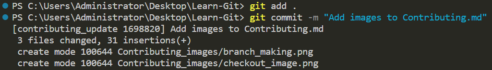

# Directives de contribution
Merci d'avoir envisagé de contribuer à Learn-Git ! Ce référentiel est destiné à être une ressource pour les personnes qui apprennent Git, et vos contributions peuvent contribuer à l'améliorer encore.

Si vous souhaitez contribuer à ce référentiel en améliorant le didacticiel ou en le traduisant potentiellement dans une autre langue, veuillez créer un nouveau problème avec cette idée ou cette amélioration, et si l'idée est suffisamment bonne, moi ou potentiellement des membres de ce référentiel l'approuverons. À ce stade, vous pourrez créer la modification, puis créer une demande d'extraction.

## Code de conduite
Avant de commencer, veuillez lire et respecter le code de conduite. Nous souhaitons maintenir une communauté respectueuse et accueillante pour tous les participants.

## Premiers pas
Voici les étapes de base pour contribuer à Learn-Git :

- **Forker le dépôt**


- **Créer une nouvelle branche pour vos modifications**

```
git branch "branch-name"
```
### Image de référence


Ensuite, activez cette branche en utilisant la syntaxe suivante :

### Syntaxe
```
git checkout "branch-name"
```

### Image de référence


- **Apportez vos modifications et validez-les dans votre branche**

Utilisez cette commande dans le terminal après avoir effectué une modification ou un ajout
```bash
git add .
```
Syntaxe pour valider cette modification ou cet ajout

```bash
git commit -m "Une brève description des modifications apportées"
```

### Image de référence


- **Envoyez vos modifications à votre fork**
Envoyez les modifications à GitHub : après avoir validé les modifications dans votre référentiel local, vous devrez les envoyer à GitHub. Cela mettra à jour la copie du référentiel dans votre compte GitHub avec les modifications que vous avez apportées. Pour envoyer les modifications, utilisez la commande suivante :

```bash
git push origin branch-name

```
### Image de référence


- **Créer une demande d'extraction**

Après avoir envoyé les modifications à GitHub, lorsque vous rechargez le référentiel forké, vous verrez l'option permettant de créer une demande d'extraction. Cliquez sur ce bouton pour créer une demande d'extraction.

### Image de référence


Cela vous amènera à une page où vous pourrez consulter les modifications que vous avez apportées et fournir une description de votre demande d'extraction.

Assurez-vous d'inclure une description claire et concise des modifications que vous avez apportées et des raisons pour lesquelles vous les avez apportées.

Si le propriétaire du référentiel doit être au courant de problèmes ou de préoccupations, assurez-vous de les mentionner dans la description de la demande d'extraction.

Une fois que vous êtes satisfait de la description, cliquez sur le bouton « Créer une demande d'extraction ».


Attendez les commentaires : après avoir créé la demande d'extraction, le propriétaire du référentiel examinera vos modifications et fournira des commentaires.

## Comment contribuer
Nous acceptons les contributions sous les formes suivantes :

### Corrections
Si vous trouvez des erreurs ou des inexactitudes dans le contenu existant, veuillez ouvrir un problème, veuillez décrire les erreurs ou les inexactitudes en détail. Si l'exactitude de ces erreurs ou inexactitudes est vérifiée, vous pouvez ouvrir une demande d'extraction avec ces modifications. Veuillez faire preuve de diligence et lier le problème à votre demande d'extraction. Veuillez également garder à l'esprit que la préférence personnelle en matière de grammaire ne constitue pas nécessairement un changement nécessaire.

### Ajouts
Si vous avez une idée de **nouveau contenu** qui, selon vous, serait utile aux personnes apprenant Git, **veuillez ouvrir un ticket pour en discuter d'abord.** Une fois qu'il a été approuvé, n'hésitez pas à créer une demande d'extraction avec votre nouveau contenu.

### Améliorations
Si vous avez des suggestions pour améliorer le contenu existant, veuillez **ouvrir un ticket pour en discuter d'abord**. Une fois qu'il a été approuvé, n'hésitez pas à créer une demande d'extraction avec vos améliorations.

## Guide de style
Lorsque vous contribuez à Learn-Git, veuillez respecter le guide de style suivant :

- Utilisez un langage clair et concis
- Utilisez des titres et des sous-titres pour diviser les sections
- Utilisez des exemples et des visuels pour illustrer les concepts
- Incluez des liens vers des ressources pertinentes lorsque cela est approprié
- Utilisez l'orthographe et la grammaire appropriées utilisées tout au long de votre traduction donnée.

## Collaborateurs
Le rôle le plus important dans ce référentiel est celui d'un collaborateur sur ce projet. Pour être considéré pour le rôle de collaborateur, vous devez d'abord prouver votre volonté de travailler sur ce projet pour le maintenir et le maintenir à jour. Bien que nous soyons toujours à la recherche de futurs collaborateurs, n'oubliez pas que votre rôle pourrait être résilié dans ce référentiel si vous choisissez de ne plus participer à sa maintenance. Si vous ne contribuez pas de manière significative à ce référentiel, votre rôle de collaborateur peut être résilié sans avertissement.

# Conclusion
Merci d'avoir pris le temps de contribuer à Learn-Git ! Vos contributions peuvent contribuer à rendre Git plus accessible aux personnes qui débutent.