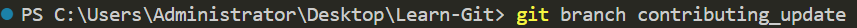
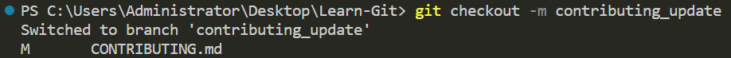
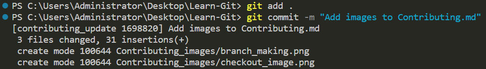
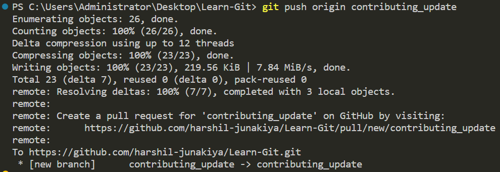
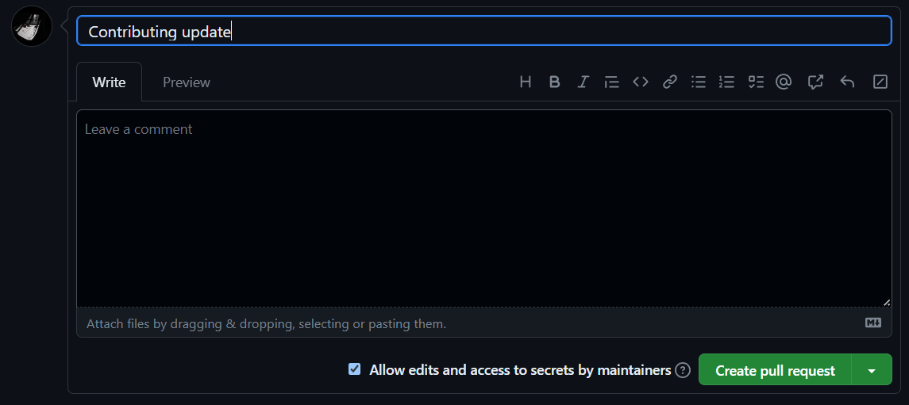

# Рекомендации по внесению вклада
Спасибо за рассмотрение возможности внести свой вклад в Learn-Git! Этот репозиторий предназначен для тех, кто изучает Git, и ваш вклад может помочь сделать его еще лучше.

Если вы хотите внести свой вклад в этот репозиторий, улучшив учебник или, возможно, переведя его на другой язык, создайте новый вопрос с этой идеей или улучшением, и если идея достаточно хороша, я или, возможно, участники этого репозитория одобрят ее. Затем вы можете внести изменения и создать запрос на включение (pull request).

## Кодекс поведения
Прежде чем начать, пожалуйста, ознакомьтесь и придерживайтесь кодекса поведения. Мы хотим поддерживать уважительное и дружелюбное сообщество для всех участников.

## Начало работы
Вот основные шаги для внесения вклада в Learn-Git:

- **Форкните репозиторий**


- **Создайте новую ветку для ваших изменений**

```bash
git branch "название-ветки"
```

### Изображение для справки


Затем переключитесь на эту ветку, используя следующий синтаксис:

### Синтаксис
```bash
git checkout "название-ветки"
```

### Изображение для справки


- **Внесите изменения и зафиксируйте их в вашей ветке**

Используйте эту команду в терминале после внесения любых изменений или добавлений:

```bash
git add .
```

Синтаксис для фиксации этих изменений или добавлений:

```bash
git commit -m "Краткое описание внесенных изменений"
```

### Изображение для справки


- **Отправьте свои изменения в ваш форк**
Отправьте изменения на GitHub: после фиксации изменений в вашем локальном репозитории вам нужно отправить их на GitHub. Это обновит копию репозитория в вашей учетной записи GitHub изменениями, которые вы внесли. Чтобы отправить изменения, используйте следующую команду:

```bash
git push origin название-ветки
```

### Изображение для справки


- **Создайте запрос на включение (pull request)**

После отправки изменений на GitHub, когда вы обновите форкнутый репозиторий, вы увидите опцию создания запроса на включение. Нажмите на эту кнопку, чтобы создать запрос на включение.

### Изображение для справки


Это перенесет вас на страницу, где вы сможете ознакомиться с внесенными изменениями и предоставить описание вашего запроса на включение.

Убедитесь, что включено четкое и краткое описание внесенных изменений и причин их внесения.

Если есть какие-либо вопросы или замечания, о которых должен знать владелец репозитория, укажите их в описании запроса на включение.

После удовлетворения описания, нажмите кнопку "Создать запрос на включение".



Дождитесь обратной связи: после создания запроса на включение владелец репозитория рассмотрит ваши изменения и предоставит обратную связь.

## Как внести вклад
Мы приветствуем вклад в следующих формах:

### Исправления
Если вы нашли ошибки или неточности в существующем содержимом, создайте вопрос и подробно опишите ошибки или неточности. Если точность этих ошибок или неточностей подтверждена, вы можете создать запрос на включение с этими изменениями. Старайтесь быть добросовестными и свяжите вопрос с вашим запросом на включение. Также помните, что личные предпочтения в грамматике не всегда означают необходимость изменения.

### Добавления
Если у вас есть идея для **нового контента**, который, по вашему мнению, был бы ценным для изучающих Git, **сначала создайте вопрос для обсуждения.** После его утверждения не стесняйтесь создавать запрос на включение с вашим новым контентом.

### Улучшения
Если у вас есть предложения по улучшению существующего контента, **сначала создайте вопрос для обсуждения.** После его утверждения не стесняйтесь создавать запрос на включение с вашими улучшениями.

## Руководство по ст

илю
При внесении вклада в Learn-Git, придерживайтесь следующего руководства по стилю:

- Используйте четкий и краткий язык.
- Используйте заголовки и подзаголовки для разделения разделов.
- Используйте примеры и визуальные элементы для пояснения концепций.
- Включайте ссылки на соответствующие ресурсы при необходимости.
- Используйте американское английское написание и грамматику.

# Заключение
Спасибо, что нашли время внести свой вклад в Learn-Git! Ваши усилия могут помочь сделать Git более доступным для тех, кто только начинает его изучать.
