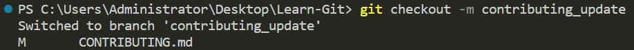
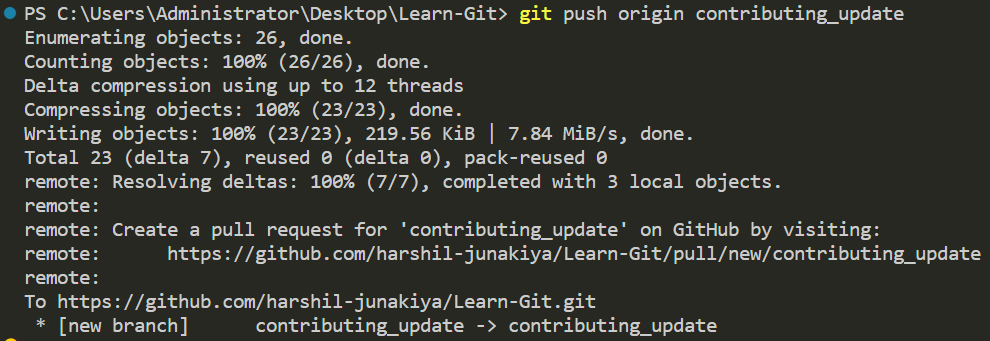

# شراکت کے رہنما اصول

Learn-Git میں شراکت پر غور کرنے کا شکریہ! یہ ذخیرہ ان لوگوں کے لیے ایک ذریعہ ہے جو Git سیکھ رہے ہیں، اور آپ کی شراکتیں اسے مزید بہتر بنانے میں مدد دے سکتی ہیں۔

اگر آپ اس ذخیرے میں بہتری لانے یا اسے کسی اور زبان میں ترجمہ کرنے کا ارادہ رکھتے ہیں، تو براہ کرم اس خیال یا بہتری کے ساتھ ایک نیا مسئلہ (issue) بنائیں، اور اگر خیال کافی اچھا ہو گا، تو میں یا اس ذخیرے کے ارکان اس کی منظوری دیں گے۔ اس کے بعد آپ تبدیلیاں کر سکتے ہیں اور پھر ایک پل ریکویسٹ (pull request) بنا سکتے ہیں۔

## ضابطہ اخلاق

شروع کرنے سے پہلے، براہ کرم ضابطہ اخلاق پڑھیں اور اس کی پیروی کریں۔ ہم تمام شرکاء کے لیے ایک احترام پر مبنی اور خوش آئند کمیونٹی برقرار رکھنا چاہتے ہیں۔

## شروعات کرنا

یہاں Learn-Git میں شراکت کے بنیادی مراحل درج ہیں:

- **ذخیرہ فورک کریں (Fork the repository)**

- **اپنی تبدیلیوں کے لیے ایک نئی برانچ بنائیں**

### حوالہ جاتی تصویر

پھر اس برانچ پر سوئچ کریں، درج ذیل syntax استعمال کریں:

### Syntax

### حوالہ جاتی تصویر

- **اپنی تبدیلیاں کریں اور انہیں اپنی برانچ میں commit کریں**

تبدیلیاں کرنے یا اضافے کے بعد، یہ کمانڈ ٹرمینل میں استعمال کریں:

Commit کرنے کا syntax:

### حوالہ جاتی تصویر

- **اپنی تبدیلیاں فورک پر push کریں**

GitHub پر تبدیلیاں push کریں: اپنی مقامی ذخیرے میں تبدیلیاں commit کرنے کے بعد، آپ کو انہیں GitHub پر push کرنے کی ضرورت ہوگی۔ یہ GitHub میں آپ کے ذخیرے کی نقل کو آپ کی کی ہوئی تبدیلیوں سے اپ ڈیٹ کر دے گا۔ تبدیلیاں push کرنے کے لیے درج ذیل کمانڈ استعمال کریں:

### حوالہ جاتی تصویر

- **ایک پل ریکویسٹ (Pull Request) بنائیں**

GitHub پر تبدیلیاں push کرنے کے بعد، جب آپ اپنے فورک شدہ ذخیرے کو دوبارہ لوڈ کریں گے تو آپ کو پل ریکویسٹ بنانے کا آپشن نظر آئے گا۔ پل ریکویسٹ بنانے کے لیے اس بٹن پر کلک کریں۔

### حوالہ جاتی تصویر

یہ آپ کو اس صفحہ پر لے جائے گا جہاں آپ اپنی کی ہوئی تبدیلیوں کا جائزہ لے سکتے ہیں اور اپنی پل ریکویسٹ کی وضاحت فراہم کر سکتے ہیں۔

براہ کرم اپنی کی ہوئی تبدیلیوں کی واضح اور مختصر وضاحت شامل کریں اور یہ بھی بتائیں کہ آپ نے یہ تبدیلیاں کیوں کی ہیں۔

اگر کوئی مسئلہ یا تشویش ہو جس سے ذخیرے کے مالک کو آگاہ ہونا چاہئے، تو اسے پل ریکویسٹ کی وضاحت میں ضرور ذکر کریں۔

جب آپ وضاحت سے مطمئن ہو جائیں، تو "Create pull request" بٹن پر کلک کریں۔

فیڈ بیک کا انتظار کریں: پل ریکویسٹ بنانے کے بعد، ذخیرے کا مالک آپ کی تبدیلیوں کا جائزہ لے گا اور فیڈ بیک فراہم کرے گا۔

## کیسے تعاون کریں

ہم درج ذیل شکلوں میں شراکت کا خیرمقدم کرتے ہیں:

### اصلاحات

اگر آپ کو موجودہ مواد میں کوئی غلطیاں یا غلط بیانی محسوس ہوتی ہیں، تو براہ کرم ایک مسئلہ کھولیں اور تفصیل سے وضاحت کریں۔ اگر یہ غلطیاں یا غلط بیانی تصدیق ہو جاتی ہیں، تو آپ ان تبدیلیوں کے ساتھ پل ریکویسٹ بنا سکتے ہیں۔ براہ کرم اپنے پل ریکویسٹ کو مسئلے کے ساتھ جوڑنے میں محنت کریں۔ یہ بھی یاد رکھیں کہ ذاتی ترجیحات کو درستگی کے طور پر نہیں سمجھا جائے گا۔

### اضافے

اگر آپ کے پاس کوئی نیا مواد شامل کرنے کا خیال ہو جو آپ کے خیال میں Git سیکھنے والوں کے لیے قیمتی ہو سکتا ہے، تو براہ کرم پہلے اسے بحث کے لیے ایک مسئلے کے طور پر کھولیں۔ جب اسے منظور کر لیا جائے، تو آپ اس نئے مواد کے ساتھ ایک پل ریکویسٹ بنا سکتے ہیں۔

### بہتریاں

اگر آپ کے پاس موجودہ مواد کو بہتر بنانے کے لیے تجاویز ہیں، تو براہ کرم پہلے اسے بحث کے لیے ایک مسئلے کے طور پر کھولیں۔ جب اسے منظور کر لیا جائے، تو آپ اس بہتری کے ساتھ ایک پل ریکویسٹ بنا سکتے ہیں۔

## اسٹائل گائیڈ

Learn-Git میں شراکت کرتے وقت براہ کرم درج ذیل اسٹائل گائیڈ پر عمل کریں:

- واضح اور مختصر زبان استعمال کریں
- عنوانات اور ذیلی عنوانات کا استعمال کر کے حصوں کو الگ کریں
- تصورات کو واضح کرنے کے لیے مثالوں اور تصویری مواد کا استعمال کریں
- جہاں مناسب ہو متعلقہ وسائل کے لنکس شامل کریں
- ترجمے میں درست املا اور گرامر کا استعمال کریں

## تعاون کنندگان

اس ذخیرے میں سب سے اہم کردار اس منصوبے کے تعاون کنندگان کا ہے۔ تعاون کنندہ بننے کے لیے، آپ کو پہلے اس منصوبے پر کام کرنے کی خواہش کا ثبوت دینا ہوگا تاکہ اسے برقرار رکھا جا سکے اور اپ ڈیٹ کیا جا سکے۔ ہم ہمیشہ نئے تعاون کنندگان کی تلاش میں رہتے ہیں، لیکن یاد رکھیں کہ اگر آپ اس ذخیرے کی دیکھ بھال میں حصہ لینے سے قاصر رہیں، تو آپ کا تعاون کنندہ کا کردار بغیر کسی انتباہ کے ختم کیا جا سکتا ہے۔

# نتیجہ

Learn-Git میں شراکت کرنے کے لیے آپ کا شکریہ! آپ کی شراکتیں Git کو ان لوگوں کے لیے زیادہ قابل رسائی بنا سکتی ہیں جو ابھی شروعات کر رہے ہیں۔
