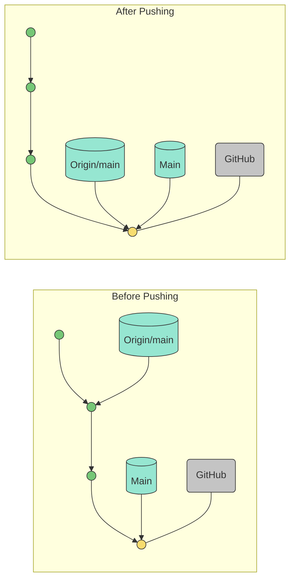
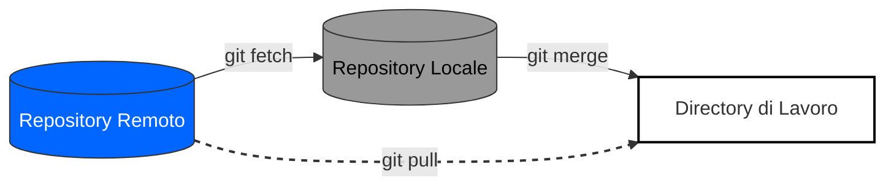
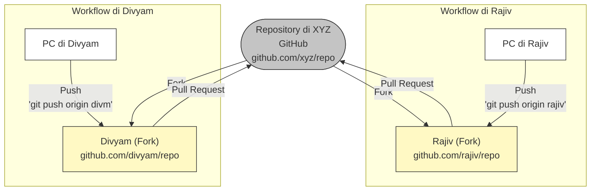
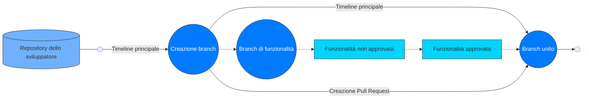

Ecco una traduzione professionale, accurata e completa in italiano del testo fornito:

---

# Collaborare con repository remoti

## Configurazione dei repository remoti (GitHub, GitLab, Bitbucket)

Nel mondo dello sviluppo software, i sistemi di controllo di versione svolgono un ruolo fondamentale nella gestione dei repository di codice, nel facilitare la collaborazione e nel garantire un flusso di lavoro efficiente tra i membri del team. I repository remoti, ospitati su piattaforme come GitHub, GitLab e Bitbucket, offrono agli sviluppatori una posizione centralizzata in cui archiviare, gestire e condividere il proprio codice. In questo articolo analizzeremo il processo passo dopo passo per configurare repository remoti su ciascuna di queste piattaforme.

### GitHub

GitHub è una delle piattaforme di hosting web più diffuse per il controllo di versione basato su Git. Ecco una guida dettagliata su come configurare un repository remoto su GitHub:

**Passo 1: Creare un account GitHub**
Se non ne possiedi già uno, visita github.com e registrati per creare un account GitHub.

**Passo 2: Creare un nuovo repository**
Una volta effettuato l’accesso, fai clic sul pulsante "+ New" nell’angolo in alto a destra della dashboard di GitHub. Fornisci un nome per il repository, una descrizione facoltativa e scegli se renderlo pubblico o privato.

**Passo 3: Inizializzare il repository**
Dopo aver creato il repository, hai la possibilità di inizializzarlo con un file README, operazione spesso consigliata. Il file README fornisce informazioni essenziali sul progetto e rappresenta un punto di partenza per i collaboratori.

**Passo 4: Clonare il repository (opzionale)**
Se desideri lavorare con il repository in locale sul tuo computer, puoi clonarlo utilizzando il comando Git:
`git clone <repository_url>`

---

### GitLab

GitLab è un altro gestore di repository Git basato sul web, ampiamente utilizzato e ricco di funzionalità. Ecco come configurare un repository remoto su GitLab:

**Passo 1: Creare un account GitLab**
Visita gitlab.com e crea un account se non ne possiedi già uno.

**Passo 2: Creare un nuovo progetto**
Dopo aver effettuato l’accesso, fai clic sul pulsante "New Project" nella dashboard. Fornisci un nome, una descrizione facoltativa e scegli il livello di visibilità (pubblico, interno o privato) per il progetto.

**Passo 3: Inizializzare il repository**
Analogamente a GitHub, puoi inizializzare il repository con un file README, pratica consigliata.

**Passo 4: Clonare il repository (opzionale)**
Se desideri lavorare con il repository in locale, puoi clonarlo utilizzando il comando Git:
`git clone <repository_url>`

---

### Bitbucket

Bitbucket, di proprietà di Atlassian, è un’altra piattaforma ampiamente utilizzata per ospitare repository Git. La configurazione di un repository remoto su Bitbucket prevede i seguenti passaggi:

**Passo 1: Creare un account Bitbucket**
Vai su bitbucket.org e registrati per creare un account, se non ne possiedi già uno.

**Passo 2: Creare un nuovo repository**
Dopo aver effettuato l’accesso, fai clic sul pulsante "Create repository" nella dashboard. Inserisci un nome, una descrizione facoltativa e seleziona il livello di accesso (pubblico o privato).

**Passo 3: Scegliere il tipo di repository**
Bitbucket consente di scegliere tra la creazione di un repository Git o Mercurial. Seleziona "Git" come tipo di repository.

**Passo 4: Inizializzare il repository**
Come su GitHub e GitLab, puoi inizializzare il repository con un file README per iniziare in modo ordinato.

**Passo 5: Clonare il repository (opzionale)**
Se desideri lavorare localmente, puoi clonare il repository utilizzando il comando:
`git clone <repository_url>`

---

Configurare repository remoti utilizzando GitHub, GitLab e Bitbucket è una competenza fondamentale per qualsiasi sviluppatore che utilizza sistemi di controllo di versione. Seguendo le guide passo dopo passo fornite in questo articolo, è possibile creare facilmente repository remoti, inizializzarli e iniziare a collaborare con i membri del team su progetti software. Indipendentemente dalla piattaforma scelta, ciascuna offre un insieme robusto di funzionalità per ottimizzare il flusso di sviluppo e migliorare la collaborazione sul codice.

---

## Invio e recupero delle modifiche dai repository remoti

I sistemi di controllo di versione sono strumenti essenziali per lo sviluppo collaborativo del software, poiché consentono ai team di gestire le modifiche al codice in modo efficiente. Git, uno dei sistemi di controllo di versione più diffusi, permette agli sviluppatori di lavorare contemporaneamente sullo stesso progetto inviando (push) e recuperando (pull) modifiche dai repository remoti. In questo articolo esploreremo i concetti di push e pull, la loro importanza e le migliori pratiche per garantire una collaborazione fluida all’interno di un team.

### Comprendere i repository remoti

Un repository remoto è una posizione condivisa e centralizzata in cui gli sviluppatori archiviano e gestiscono il codice del progetto. Quando si lavora in team, ogni membro dispone di una copia locale del repository sul proprio computer. Il repository remoto funge da punto di riferimento centrale per sincronizzare le modifiche apportate dai vari sviluppatori.

### Invio delle modifiche al repository remoto (push)

L’invio delle modifiche (push) si riferisce al processo di trasferimento delle modifiche locali dal repository locale a quello remoto. È fondamentale mantenere il repository remoto aggiornato con le modifiche più recenti effettuate dal team.

Ecco una guida passo dopo passo su come eseguire un push:

**Passo 1: Effettuare il commit delle modifiche in locale**
Prima di eseguire il push, è necessario registrare (commit) le modifiche in locale. Un commit rappresenta un’istantanea delle modifiche apportate ai file nel repository locale. È importante aggiungere un messaggio di commit descrittivo che spieghi le modifiche effettuate.

**Passo 2: Verificare il repository remoto**
Assicurati di avere configurato correttamente l’URL del repository remoto nel repository locale. Puoi utilizzare il seguente comando per verificare i repository remoti associati:

```bash
git remote -v
```

**Passo 3: Eseguire il push delle modifiche**
Utilizza il seguente comando per inviare le modifiche registrate al repository remoto:

```bash
git push <remote_name> <branch_name>
```

Ad esempio:

```bash
git push origin main
```

Questo comando invia le modifiche dal branch locale "main" al repository remoto denominato "origin".


Ecco la traduzione professionale, completa e accurata in italiano del testo fornito:

---

#### Recupero delle modifiche dal repository remoto

Il recupero delle modifiche (pull) si riferisce al processo di acquisizione e integrazione delle modifiche più recenti dal repository remoto nel repository locale. Questo garantisce che il codice locale sia aggiornato con gli sviluppi più recenti del progetto.

##### Segui questi passaggi per eseguire un pull:

**Passo 1: Effettuare il commit delle modifiche locali**
Prima di eseguire il pull, è consigliabile effettuare il commit delle modifiche locali per evitare conflitti durante il processo di integrazione.

**Passo 2: Recuperare le modifiche (fetch)**
Recupera le modifiche dal repository remoto utilizzando il seguente comando:

```bash
git fetch <remote_name>
```

Ad esempio:

```bash
git fetch origin
```

Questo comando recupera tutte le modifiche dal repository remoto senza unirle automaticamente al branch locale.

---

**Passo 3: Unire le modifiche (merge)**
Dopo aver recuperato le modifiche, è necessario unirle al branch locale. Utilizza il seguente comando:

```bash
git merge <remote_name>/<branch_name>
```

Ad esempio:

```bash
git merge origin/main
```



Questo comando unisce le modifiche dal branch remoto "main" al branch locale.

---

#### Gestione dei conflitti di merge

A volte, durante il pull delle modifiche, Git può incontrare conflitti se le stesse righe di codice sono state modificate sia nel repository remoto sia in quello locale. In questi casi, Git non è in grado di risolvere automaticamente le differenze e richiede un intervento manuale.

Quando si verifica un conflitto di merge, segui questi passaggi per risolverlo:

a. Apri i file in conflitto e individua i marcatori di conflitto, che indicano le modifiche in contrasto.

b. Modifica i file mantenendo le modifiche desiderate e rimuovi i marcatori di conflitto.

c. Effettua il commit delle modifiche risolte per completare il merge.

---

#### Buone pratiche

Per garantire una collaborazione fluida durante le operazioni di push e pull, considera le seguenti buone pratiche:

* **Eseguire sempre il pull prima del push:** Prima di inviare le modifiche, recupera gli aggiornamenti più recenti dal repository remoto per ridurre il rischio di conflitti.
* **Commit frequenti:** Effettua commit piccoli e logici, accompagnati da messaggi significativi per mantenere una cronologia chiara delle modifiche.
* **Utilizzare branch di funzionalità:** Quando lavori su nuove funzionalità o correzioni di bug, crea branch separati per evitare conflitti con il branch principale.
* **Code review:** Incoraggia la revisione del codice tra i membri del team per individuare eventuali problemi nelle prime fasi dello sviluppo.
* **Integrazione Continua (CI):** Implementa strumenti di CI per automatizzare il processo di test e integrazione delle modifiche nel branch principale.

---

L’invio e il recupero delle modifiche dai repository remoti sono concetti fondamentali in Git che facilitano lo sviluppo collaborativo del software. Seguendo le buone pratiche e comprendendo il flusso di lavoro, i team possono gestire efficacemente i propri progetti e garantire un’integrazione fluida delle modifiche al codice. L’esecuzione regolare di operazioni di push e pull mantiene il repository remoto aggiornato, riduce i conflitti e contribuisce a un processo di sviluppo più produttivo e coerente.

---

## Collaborare con altri sviluppatori utilizzando branch e pull request

Lo sviluppo collaborativo del software è un processo complesso e dinamico che coinvolge più sviluppatori impegnati contemporaneamente su funzionalità diverse. Per semplificare questo processo, sistemi di controllo di versione come Git offrono funzionalità come i branch e le pull request. In questo articolo analizzeremo l’importanza dell’utilizzo di branch e pull request nello sviluppo collaborativo ed esploreremo le migliori pratiche per favorire un lavoro di squadra efficace.

### Comprendere i branch

In Git, un branch è un puntatore leggero e mobile a un commit. Consente agli sviluppatori di lavorare su nuove funzionalità, correzioni di bug o esperimenti senza influenzare il branch principale di sviluppo (solitamente chiamato "master" o "main"). Ogni branch rappresenta una linea di sviluppo indipendente, permettendo agli sviluppatori di isolare le proprie modifiche e concentrarsi su attività specifiche.

L’utilizzo dei branch offre diversi vantaggi:

a. **Isolamento delle modifiche:** I branch consentono di isolare le modifiche, evitando conflitti con il lavoro degli altri sviluppatori fino al momento dell’integrazione.

b. **Sviluppo parallelo:** Più sviluppatori possono lavorare contemporaneamente su branch diversi, facilitando la gestione e il monitoraggio dei progressi.

c. **Sperimentazione di funzionalità:** Gli sviluppatori possono creare branch sperimentali per testare nuove idee senza compromettere la stabilità del codice principale.

---

### Collaborare con i branch

Esploriamo i passaggi per collaborare utilizzando i branch:

**Passo 1: Creare un nuovo branch**
Prima di iniziare un nuovo lavoro, crea un branch basato sul codice più recente del branch principale. Utilizza il seguente comando:

```bash
git checkout -b <branch_name>
```

Ad esempio:

```bash
git checkout -b feature/new-feature
```

Questo comando crea e passa a un nuovo branch chiamato "feature/new-feature".

---

**Passo 2: Lavorare sul branch**
Apporta le modifiche necessarie al codice ed esegui i commit sul branch appena creato. Effettua commit regolari per tracciare i progressi.

---

**Passo 3: Inviare il branch al repository remoto**
Per collaborare con altri, invia il branch al repository remoto:

```bash
git push origin <branch_name>
```

Ad esempio:

```bash
git push origin feature/new-feature
```

Questo comando invia il branch locale "feature/new-feature" al repository remoto.

---

**Passo 4: Collaborare con altri**
Una volta che il branch è disponibile nel repository remoto, altri sviluppatori possono esaminare le modifiche, fornire feedback o collaborare direttamente sullo stesso branch.

Ecco la traduzione professionale, completa e accurata in italiano del testo fornito:

---



---

## Comprendere le Pull Request

Una pull request (PR) è una funzionalità comunemente presente nelle piattaforme di hosting Git come GitHub e Bitbucket. Si tratta di una richiesta formale per unire le modifiche da un branch a un altro, tipicamente da un branch di funzionalità al branch principale.

### L’utilizzo delle pull request offre diversi vantaggi:

a. **Revisione del codice:** Le pull request forniscono una piattaforma per la revisione del codice tra pari, in cui altri sviluppatori possono esaminare le modifiche, suggerire miglioramenti e garantire la qualità del codice.

b. **Discussione e collaborazione:** Gli sviluppatori possono discutere le modifiche proposte direttamente all’interno della pull request, favorendo decisioni migliori e la collaborazione.

c. **Integrazione continua e testing:** Molte piattaforme consentono l’integrazione con strumenti di Continuous Integration (CI), automatizzando i test sulle pull request per garantire la qualità del codice.

---

### Collaborare con le pull request

Ecco una guida passo dopo passo per collaborare utilizzando le pull request:

**Passo 1: Creare una pull request**
Sulla piattaforma di hosting Git, vai al tuo branch e fai clic sul pulsante "Create Pull Request". Seleziona il branch di destinazione (solitamente il branch principale) nel quale desideri unire le modifiche.

**Passo 2: Descrivere le modifiche**
Scrivi un titolo chiaro e descrittivo e una descrizione dettagliata della pull request, indicando le modifiche apportate e lo scopo del branch.

**Passo 3: Richiedere revisori**
Seleziona i revisori appropriati per la pull request. In genere si tratta di altri sviluppatori che conoscono il codice e possono fornire feedback utile.

**Passo 4: Revisionare e iterare**
I revisori esamineranno le modifiche, lasceranno commenti e suggeriranno miglioramenti. È importante essere aperti al feedback e iterare sul codice finché non soddisfa gli standard del progetto.

**Passo 5: Unire la pull request**
Una volta approvata e risolte tutte le discussioni, la pull request può essere unita al branch di destinazione, solitamente il branch principale. Le modifiche diventano così parte del codice del progetto.

---

#### Buone pratiche

Per garantire una collaborazione efficace utilizzando branch e pull request, considera le seguenti buone pratiche:

a. **Utilizzare nomi descrittivi:** Assegna nomi chiari e descrittivi ai branch e alle pull request per facilitarne la comprensione.

b. **Mantenere le pull request piccole:** Crea pull request focalizzate su una singola funzionalità o correzione. Le pull request più piccole sono più facili da revisionare e gestire.

c. **Aggiornare regolarmente i branch:** Mantieni i branch di funzionalità aggiornati con le ultime modifiche del branch principale tramite merge o rebase regolari.

d. **Sfruttare le code review:** Promuovi la revisione del codice e partecipa attivamente alla revisione del codice altrui per mantenere alta la qualità e condividere conoscenze.

e. **Automatizzare pipeline CI/CD:** Implementa pipeline di Continuous Integration e Continuous Deployment (CI/CD) per automatizzare i processi di test e distribuzione attivati dalle pull request.

---

Collaborare con altri sviluppatori utilizzando branch e pull request è un aspetto fondamentale dello sviluppo software moderno. I branch consentono agli sviluppatori di lavorare in modo indipendente sulle funzionalità, mentre le pull request facilitano la revisione del codice, il feedback e l’integrazione fluida nel codice principale. Seguendo le buone pratiche e sfruttando efficacemente questi strumenti, i team possono migliorare produttività, qualità del codice e successo complessivo del progetto.

---

## Risoluzione dei conflitti nei repository remoti

Git e GitHub hanno rivoluzionato il controllo di versione e lo sviluppo collaborativo del software. Tuttavia, quando più sviluppatori lavorano contemporaneamente sullo stesso progetto, possono sorgere conflitti durante il tentativo di unire modifiche provenienti da branch o fork diversi. Risolvere questi conflitti in modo efficiente è essenziale per mantenere una base di codice pulita e funzionante. In questo articolo analizzeremo i passaggi per gestire i conflitti nei repository remoti utilizzando Git e GitHub.

### Comprendere i conflitti in Git

I conflitti si verificano quando Git non è in grado di unire automaticamente le modifiche a causa di sovrapposizioni nello stesso file o segmento di codice. Git evidenzia le aree in conflitto, lasciando allo sviluppatore il compito di risolverle manualmente.

---

### Creare un branch locale

Per gestire i conflitti, inizia creando un nuovo branch locale a partire dal branch del repository remoto su cui desideri lavorare. Utilizza il seguente comando:

```bash id="9rj6z2"
git checkout -b my-feature-branch origin/master
```

Questo comando crea un nuovo branch chiamato "my-feature-branch" a partire dal branch "master" del repository remoto.

---

### Apportare modifiche ed eseguire il commit

Lavora sul branch locale ed effettua le modifiche necessarie ai file. Una volta completate, esegui il commit delle modifiche:

```bash id="vxz6c7"
git add .
git commit -m "Implementazione della mia funzionalità"
```

---

### Recuperare le modifiche remote

Prima di eseguire il push delle modifiche, è fondamentale recuperare le ultime modifiche dal repository remoto. Questo garantisce che il branch locale sia aggiornato e riduce la probabilità di conflitti durante il push.

```bash id="n3pfxl"
git pull origin master
```

---

### Risolvere i conflitti

Durante il pull, Git potrebbe segnalare la presenza di conflitti. Apri i file interessati nell’editor di codice: vedrai sezioni evidenziate che indicano le modifiche in conflitto.

Modifica manualmente i file per decidere quali modifiche mantenere o come combinarle. Una volta risolti tutti i conflitti, salva i file.

---

### Segnare i file come risolti

Dopo aver risolto manualmente i conflitti, aggiungi i file modificati all’area di staging:

```bash id="u1ppld"
git add <filename>
```

---

### Effettuare il commit delle modifiche risolte

Crea un nuovo commit per salvare le modifiche dopo la risoluzione dei conflitti:

```bash id="m8o7c1"
git commit -m "Risoluzione dei conflitti"
```

---

### Inviare le modifiche

Ora che i conflitti sono stati risolti, invia il branch locale al repository remoto:

```bash id="9zh2v4"
git push origin my-feature-branch
```

---

### Creare una pull request

Dopo aver inviato le modifiche, visita il repository su GitHub e crea una pull request dal branch "my-feature-branch" verso il branch principale (ad esempio "master"). Questo consente ai membri del team di revisionare le modifiche prima dell’integrazione nel codice principale.



---

### Revisione e merge

La pull request mostrerà le modifiche effettuate e i membri del team potranno esaminarle. Se tutto è corretto, un responsabile o manutentore del progetto potrà unire la pull request nel branch principale.

---

La risoluzione dei conflitti nei repository remoti utilizzando Git e GitHub è una parte essenziale dello sviluppo collaborativo. Comprendendo il processo e seguendo i passaggi descritti in questo articolo, è possibile gestire efficacemente i conflitti e mantenere una base di codice pulita e funzionale. Adottare un approccio collaborativo e una comunicazione chiara tra i membri del team contribuisce ulteriormente a semplificare la risoluzione dei conflitti e a garantire flussi di lavoro efficienti.