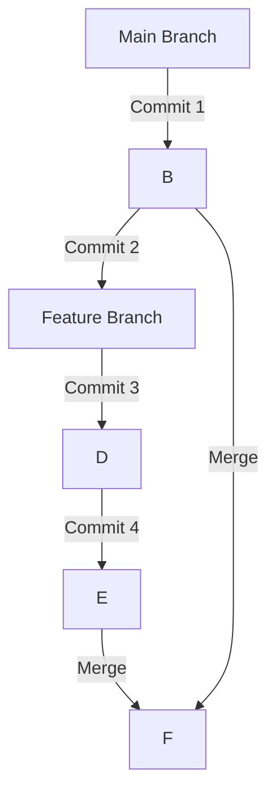

# Branching und Merging

## Einführung in Branches und ihren Zweck:

Im Bereich der Softwareentwicklung sind Git-Branches unverzichtbare Werkzeuge zur Verwaltung der Codeentwicklung und Zusammenarbeit. Ein Branch in Git ist im Wesentlichen ein leichtgewichtiger, verschiebbarer Zeiger auf einen bestimmten Commit in der Commit-Historie eines Repositories. Durch die Verwendung von Branches können Entwickler gleichzeitig an verschiedenen Aspekten eines Projekts arbeiten, neue Funktionen oder Fixes ausprobieren und Änderungen isolieren, ohne den Hauptcodebestand zu beeinträchtigen. Dieser Artikel wird in die Details von Git-Branches eintauchen und deren Erstellung, Wechsel, Verwaltung der Historie und Umgang mit Merge-Konflikten abdecken.

### Erstellen und Wechseln zwischen Branches:

Um einen neuen Branch in Git zu erstellen, können Entwickler den Befehl "git branch" verwenden, gefolgt vom gewünschten Branch-Namen. Zum Beispiel würde man den Befehl `git branch feature-branch` ausführen, um einen Branch namens "feature-branch" zu erstellen. Dies erstellt einen neuen Branch, aber der HEAD des Repositories (der aktuell aktive Branch) bleibt unverändert. Hier ist ein Beispiel:

```bash
git branch feature-branch
```

Um zum neu erstellten Branch zu wechseln, wird der Befehl "git checkout" verwendet. Durch Eingabe von `git checkout feature-branch` wird der HEAD aktualisiert, und der Entwickler arbeitet im Kontext von "feature-branch". Ein Beispiel wäre:

```bash
git checkout feature-branch
```

Alternativ führte Git 2.23 eine bequemere Möglichkeit ein, einen neuen Branch in einem Schritt zu erstellen und zu wechseln: `git checkout -b feature-branch`. Dieser Befehl erstellt den Branch und wechselt gleichzeitig zu ihm. Zum Beispiel:

```bash
git checkout -b feature-branch
```

### Verwaltung von Branch-Historie und Zusammenführen von Änderungen:

Branches dienen als isolierte Umgebungen, in denen Entwickler an bestimmten Funktionen oder Fehlerbehebungen arbeiten können. Während auf einem Branch können Entwickler Änderungen vornehmen, diese committen und die Commit-Historie des Branches unabhängig vom Hauptbranch oder anderen Branches aufbauen.

Wenn Änderungen auf einem Branch abgeschlossen und zur Integration bereit sind, kommt das Zusammenführen ins Spiel. Zusammenführen ist der Prozess, die in einem Branch vorgenommenen Änderungen in einen anderen Branch zu übernehmen. Um die Änderungen eines Branches (z.B. "feature-branch") in den Hauptbranch zu übernehmen, können Entwickler den Befehl `git merge feature-branch` ausführen, während sie sich im Hauptbranch befinden. Diese Aktion integriert die Änderungen von "feature-branch" in den Hauptbranch und kombiniert die Commit-Historien.



### Umgang mit Merge-Konflikten:

Merge-Konflikte treten auf, wenn Git bei einer Merge-Operation auf konflikthafte Änderungen zwischen dem Quell-Branch (z.B., "feature-branch") und dem Ziel-Branch (z.B. Hauptbranch) stößt. Konflikte treten in der Regel auf, wenn die gleichen Codezeilen auf unterschiedliche Weise in den beiden Branches geändert wurden.

Um Merge-Konflikte zu lösen, müssen Entwickler die konflikthafte Stellen manuell auflösen. Git stellt Marker in der konflikthaften Datei bereit, die die konflikthafte Stelle anzeigen, und Entwickler müssen die Datei bearbeiten, um die gewünschten Änderungen auszuwählen. Nach dem manuellen Lösen der Konflikte speichern Entwickler die Datei und schließen den Merge ab, indem sie die Änderungen hinzufügen und committen. Git markiert den Konflikt als gelöst und schließt die Merge-Operation ab.

In Fällen, in denen Konflikte schwer zu lösen sind, können Entwickler auf die Merge-Tools von Git zurückgreifen oder mit Teammitgliedern zusammenarbeiten, um geeignete Lösungen zu finden.

# Fazit:

Git-Branches sind unverzichtbare Werkzeuge zur Verwaltung der Codeentwicklung und zur Förderung der Zusammenarbeit in der Softwareentwicklung. Durch die Verwendung von Branches können Entwickler gleichzeitig an verschiedenen Funktionen oder Fehlerbehebungen arbeiten, ohne den Hauptcodebestand zu beeinträchtigen. Branches ermöglichen die unabhängige Entwicklung und Isolierung von Änderungen, die bei Bedarf in den Hauptbranch integriert werden können.

Mit einem klaren Verständnis für die Erstellung von Branches, den Wechsel zwischen ihnen, die Verwaltung der Historie und die Konfliktlösung können Entwickler Git-Branches effektiv nutzen, um einen strukturierten und effizienten Entwicklungsprozess aufrechtzuerhalten. Durch die Akzeptanz von Git-Branches können Softwareentwicklungsteams die Produktivität steigern, parallele Arbeiten ermöglichen und letztendlich qualitativ hochwertigen Code liefern.