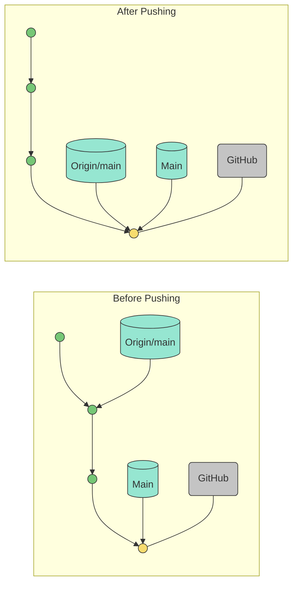
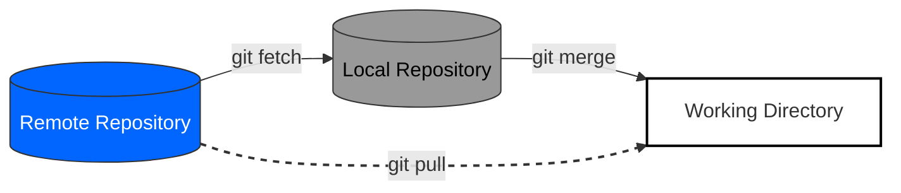
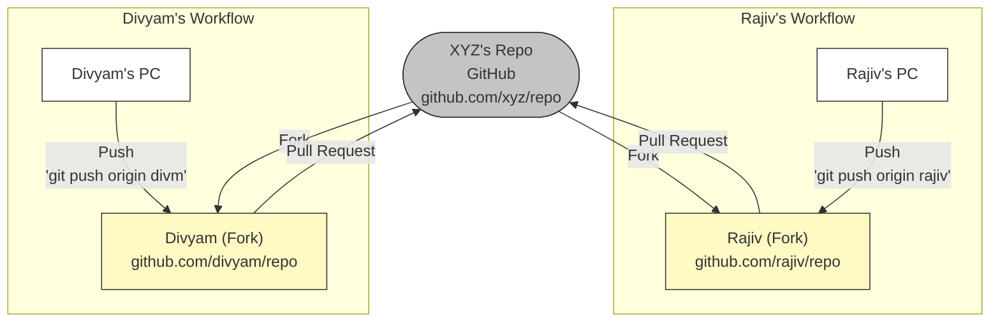
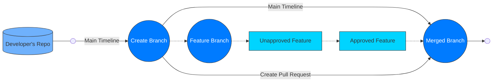

**Collaboration with Remote Repositories**

## Setting Up Remote Repositories (GitHub, GitLab, Bitbucket)

In the world of software development, version control systems play a crucial role in managing code repositories, fostering collaboration, and ensuring a smooth workflow among team members. Remote repositories hosted on platforms such as GitHub, GitLab, and Bitbucket provide developers with a central location to store, manage, and share their code. In this article, we will explore the step-by-step process of setting up remote repositories on each of these platforms.

### GitHub
GitHub is one of the most popular web-based hosting platforms for version control using Git. Here is a detailed guide on how to set up a remote repository on GitHub:

**Step 1: Create a GitHub account**  
If you do not already have one, visit github.com and sign up for a GitHub account.

**Step 2: Create a new repository**  
Once you are logged in, click the “+ New” button in the top-right corner of the GitHub dashboard. Enter a name for your repository, an optional description, and choose whether it should be public or private.

**Step 3: Initialize the repository**  
After creating the repository, you have the option to initialize it with a README file, which is often recommended. A README file contains essential information about your project and serves as a starting point for collaborators.

**Step 4: Clone the repository (optional)**  
If you want to work with the repository locally on your computer, you can clone it using the Git command: `git clone <repository_url>`.

### GitLab
GitLab is another widely used web-based Git repository manager that offers an extensive set of features. Here is how you can set up a remote repository on GitLab:

**Step 1: Create a GitLab account**  
Visit gitlab.com and create an account if you do not already have one.

**Step 2: Create a new project**  
Once you are logged in, click the “New project” button in the dashboard. Enter a name, an optional description, and select the visibility level (public, internal, or private) for your project.

**Step 3: Initialize the repository**  
Similar to GitHub, you have the option to initialize the repository with a README file, which is a good practice.

**Step 4: Clone the repository (optional)**  
If you want to work with the repository locally on your computer, you can clone it using the Git command: `git clone <repository_url>`.

### Bitbucket
Bitbucket, owned by Atlassian, is another widely used platform for hosting Git repositories. Setting up a remote repository on Bitbucket involves the following steps:

**Step 1: Create a Bitbucket account**  
Visit bitbucket.org and sign up for a Bitbucket account if you do not already have one.

**Step 2: Create a new repository**  
After logging in, click the “Create repository” button in the Bitbucket dashboard. Enter a name, an optional description, and select the access level of the repository (public or private).

**Step 3: Select the repository type**  
Bitbucket allows you to choose between creating a Git repository or a Mercurial repository. Select “Git” as the repository type.

**Step 4: Initialize the repository**  
As with GitHub and GitLab, you can initialize the repository with a README file for a smooth start.

**Step 5: Clone the repository (optional)**  
If you want to work with the repository locally on your computer, you can clone it using the Git command: `git clone <repository_url>`.

Setting up remote repositories with GitHub, GitLab, and Bitbucket is a fundamental skill for every developer working with version control systems. By following the step-by-step guides in this article, you can easily create, initialize, and collaborate with your team members on exciting software projects. Whether you choose GitHub, GitLab, or Bitbucket, each platform offers a robust set of features to optimize your development workflow and enhance code collaboration.

## Pushing and Pulling Changes from Remote Repositories

Version control systems are essential tools for collaborative software development, enabling teams to manage code changes efficiently. Git, one of the most popular version control systems, allows developers to work on the same project simultaneously by pushing (uploading) and pulling (downloading) changes from remote repositories. In this article, we will explore the concepts of pushing and pulling changes, their importance, and best practices for ensuring smooth collaboration within a team.

### Understanding Remote Repositories
A remote repository is a shared, central location where developers store and manage their project’s code. When working in a team, each member has a local copy of the repository on their computer. The remote repository serves as the central reference point for synchronizing changes made by different developers.

### Pushing Changes to the Remote Repository
Pushing changes refers to the process of sending local code changes from your local repository to the remote repository. It is important to keep the remote repository up to date so that it reflects the team’s latest changes.

Here is a step-by-step guide to pushing changes:

**Step 1: Commit your changes locally**  
Before pushing changes, you must commit them locally. A commit is a snapshot of the changes you have made to the files in your local repository. It is important to include a meaningful commit message that explains the changes made.

**Step 2: Verify the remote repository**  
Ensure that you have configured the correct remote repository URL in your local repository. You can use the following command to check the remote repositories associated with your local repository:

```bash
git remote -v
```

**Step 3: Push the changes**  
Use the following command to upload your committed changes to the remote repository:

```bash
git push <remote_name> <branch_name>
```

For example:

```bash
git push origin main
```

This command uploads the changes from the local “main” branch to the remote repository named “origin.”



### Pulling Changes from the Remote Repository
Pulling changes refers to the process of retrieving and integrating the latest changes from the remote repository into your local repository. This ensures that your local code is up to date with the latest developments in the project.

Follow these steps to download changes:

**Step 1: Commit local changes**  
Before pulling changes, it is best to commit your local changes to avoid conflicts during the pull process.

**Step 2: Fetch the changes**  
Fetch the changes from the remote repository using the following command:

```bash
git fetch <remote_name>
```

For example:

```bash
git fetch origin
```

This command retrieves all changes from the remote repository without automatically integrating them into your local branch.

**Step 3: Integrate the changes**  
After fetching the changes, you need to integrate them into your local branch. Use the following command:

```bash
git merge <remote_name>/<branch_name>
```

For example:

```bash
git merge origin/main
```



This command integrates the changes from the remote “main” branch into your local branch.

#### Handling Merge Conflicts
Sometimes when you pull changes, Git may encounter conflicts if the same lines of code have been modified in both the remote repository and your local repository. In such cases, Git cannot automatically resolve the differences and requires manual intervention.

If you encounter a merge conflict, follow these steps to resolve it:

a. Open the conflicting files and look for the conflict markers that indicate the conflicting sections.

b. Manually edit the files to select the desired changes. Git provides markers in the conflicting file to show where the conflicts occur.

c. Commit the resolved changes to complete the merge.

#### Best Practices
To ensure smooth collaboration when pushing and pulling changes, keep the following best practices in mind:

- Always pull before pushing: Before pushing your changes, pull the latest changes from the remote repository to minimize the chance of conflicts.
- Frequent commits: Make small, logical commits and include meaningful commit messages to maintain a clear history of changes.
- Use feature branches: When working on new features or bug fixes, create separate feature branches to avoid conflicts with the main development branch.
- Code reviews: Encourage code reviews among team members to identify potential issues early in the development process.
- Continuous Integration (CI): Implement CI tools to automate the process of testing and integrating code changes into the main branch.

Pushing and pulling changes from remote repositories are fundamental concepts in Git that facilitate collaborative software development. By following best practices and understanding the workflow, teams can manage their projects efficiently and ensure seamless integration of code changes. Regularly pushing and pulling changes keeps the remote repository up to date, minimizes conflicts, and leads to a more productive and cohesive development process.

## Collaborating with Other Developers Using Branches and Pull Requests

Collaborative software development is a complex and dynamic process that involves multiple developers working simultaneously on different features. To optimize this process, version control systems such as Git provide features like branches and pull requests. In this article, we will examine the importance of using branches and pull requests for collaborative development and explore best practices for fostering effective teamwork.

### Understanding Branches
In Git, a branch is a lightweight, movable pointer to a commit. It allows developers to work on new features, bug fixes, or experiments without affecting the main development branch (usually called “master” or “main”). Each branch represents an independent line of development, enabling developers to isolate their changes from others and work on specific tasks.

Using branches offers several advantages:

a. Isolation of changes: Branches allow developers to isolate their changes and prevent conflicts with other developers’ work until they are ready to be integrated.

b. Parallel development: Multiple developers can work on different branches at the same time, making it easier to manage and track progress.

c. Experimenting with features: Developers can create experimental branches to test new ideas without compromising the stability of the main codebase.

### Collaborating with Branches
Let’s explore the steps for collaborating using branches:

**Step 1: Create a new branch**  
Before starting work, create a new branch based on the latest code in the main branch. Use the following command:

```bash
git checkout -b <branch-name>
```

For example:

```bash
git checkout -b feature/new-feature
```

This command creates and switches to a new branch named “feature/new-feature.”

**Step 2: Work on the branch**  
Make the necessary code changes and commits in the newly created branch. Commit your changes regularly to track your progress.

**Step 3: Push the branch to the remote repository**  
To collaborate with others, push your branch to the remote repository:

```bash
git push origin <branch-name>
```

For example:

```bash
git push origin feature/new-feature
```

This command pushes your local “feature/new-feature” branch to the remote repository.

**Step 4: Collaborate with others**  
Once your branch is in the remote repository, other developers can review your changes, provide feedback, or even collaborate with you on the same branch.



### Understanding Pull Requests
A pull request (PR) is a feature commonly found in Git hosting platforms such as GitHub and Bitbucket. It is a formal request to merge changes from one branch into another, typically from a feature branch into the main branch.

### Advantages of Using Pull Requests

a. Code review: Pull requests provide a platform for peer code review, where other developers can examine the changes, suggest improvements, and ensure code quality.

b. Discussion and collaboration: Developers can discuss the proposed changes directly within the pull request, leading to better decisions and collaboration.

c. Continuous integration and testing: Many platforms allow integration with Continuous Integration (CI) tools to automatically run tests on pull requests and ensure code quality.

### Collaborating with Pull Requests
Here is a step-by-step guide to collaborating using pull requests:

**Step 1: Create a pull request**  
On the Git hosting platform, navigate to your branch and click the “Create pull request” button. Select the target branch (usually the main branch) into which you want to merge your changes.

**Step 2: Describe the changes**  
Write a clear and descriptive title and description for your pull request, explaining the changes made and the purpose of the branch.

**Step 3: Request reviewers**  
Select the appropriate reviewers for your pull request. These are typically other developers who are familiar with the code and can provide valuable feedback.

**Step 4: Review and iterate**  
The reviewers will examine your changes, leave comments, and suggest improvements. Be open to feedback and revise your code until it meets the project’s standards.

**Step 5: Merge the pull request**  
Once the pull request has been approved and all discussions have been resolved, it can be merged into the target branch, usually the main branch. The changes are now part of the project’s codebase.

#### Best Practices
To ensure smooth collaboration using branches and pull requests, keep the following best practices in mind:

a. Use meaningful names: Give branches and pull requests clear and meaningful names so that team members can easily understand their purpose.

b. Keep pull requests small: Create pull requests that focus on a specific feature or bug fix. Smaller pull requests are easier to review and manage.

c. Update branches regularly: Keep your feature branches up to date with the latest changes from the main branch by regularly merging or rebasing.

d. Leverage code reviews: Encourage code reviews and participate in reviewing others’ code to maintain code quality and share knowledge.

e. Automate CI/CD pipelines: Implement Continuous Integration and Continuous Deployment (CI/CD) pipelines to automate testing and deployment processes triggered by pull requests.

Collaborating with other developers using branches and pull requests is a fundamental aspect of modern software development. Branches allow developers to work independently on features, while pull requests facilitate code review, feedback, and seamless integration into the main codebase. By following best practices and effectively using these collaborative tools, teams can improve their productivity, code quality, and overall project success.

## Resolving Conflicts in Remote Repositories

Git and GitHub have revolutionized version control and collaborative software development. However, when multiple developers work on the same project simultaneously, conflicts can arise when attempting to merge changes from different branches or forks. Efficiently resolving these conflicts is crucial for maintaining a clean and functional codebase. In this article, we will explore the steps for resolving conflicts in remote repositories using Git and GitHub.

### Understanding Git Conflicts
Conflicts occur when Git cannot automatically merge changes due to overlapping modifications in the same file or code section. Git marks the conflicting areas, and it is the developer’s responsibility to resolve these conflicts manually.

### Creating a Local Branch
To resolve conflicts, start by creating a new local branch from the remote repository branch you want to work on. Use the following command:

```bash
git checkout -b my-feature-branch origin/master
```

This command creates a new branch named “my-feature-branch” from the “master” branch in the remote repository.

### Making and Committing Changes
Now work on your local branch and make the necessary changes to the files. Once finished, commit the changes:

```bash
git add .
git commit -m "Implement my feature"
```

### Pulling Remote Changes
Before pushing your changes, it is crucial to pull the latest changes from the remote repository. This ensures that your local branch is up to date and reduces the chance of conflicts when pushing.

```bash
git pull origin master
```

### Resolving Conflicts
When pulling changes from the remote repository, Git may inform you of conflicts. Open the conflicting files in your code editor, and you will see sections marked with conflict indicators.

Manually edit the file to decide which changes to keep or modify. After resolving all conflicts, save the file.

### Staging Resolved Files
After manually resolving the conflicts, stage the modified files:

```bash
git add <filename>
```

### Committing the Resolved Changes
Create a new commit to save the changes after resolving the conflicts:

```bash
git commit -m "Resolved conflicts"
```

### Pushing the Changes
After resolving the conflicts, push your local branch to the remote repository:

```bash
git push origin my-feature-branch
```

### Creating a Pull Request
After the changes have been pushed, visit the repository on GitHub and create a pull request from your “my-feature-branch” to the main branch (e.g., master). This allows your team members to review your changes before they are merged into the main codebase.



### Reviewing and Merging
The pull request displays the changes you made, and your team members can review the modifications. If everything looks good, a team lead or maintainer can merge the pull request into the main branch.

Resolving conflicts in remote repositories using Git and GitHub is an essential part of collaborative development. By understanding the process and following the steps described in this article, you can efficiently address conflicts and maintain a clean and functional codebase. A collaborative approach and clear communication among team members can further streamline the conflict resolution process and ensure a smooth development workflow.


