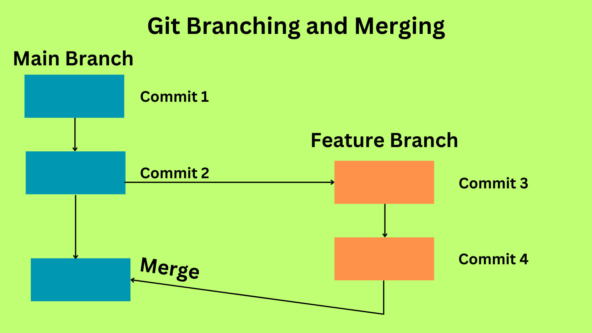

# Branches et merges

- [Introduction aux branches et leur utilité](#introduction-aux-branches-et-leur-utilité)
- [Créer et sélectionner une branche](#Créer-et-sélectionner-une-branche)
- [Gérer l'historique de branche et fusionner les changements](#gérer-lhistorique-de-branche-et-fusionner-les-changements)
-[Gérer les merge conflicts (problème de fusion)](#gérer-les-merge-conflicts-problème-de-fusion)
- [Conclusion](#conclusion)

## Introduction aux branches et leur utilité:

Dans le monde du dévellopement logiciel, les branches sont des outils indispensables pour contrôler l'évolution du code et la collaboration. Une branche git, en bref, c'est un pointeur vers un commit (un point de l'historique) d'un dépot. En utilisant les branches, les dévellopeurs peuvent travailler sur différents aspects d'un projet de manière simultanée. Ils peuvent également expérimenter sur de nouvelles fonctionnalités ou sur des moyens de régler des bugs, isoler les changements les uns des autres sans affecter le code de base. Cet article plonge en profondeur dans les entrailles des branches Git, en couvrant leur création, le changement de l'uneà l'autre, la gestion de l'historique, et comment régler les problèmes de merge (la remise en commun de différentes branches).

## Créer et sélectionner une branche:

Pour créer une nouvelle branche en Git, les dévellopeurs peuvent utiliser la commande "git branch", suivi du nom de branche désiré. Par exemple, pour créer une branche nommée "feature-branch", on utilise la commande: git branch feature branch. Cela créera une nouvelle branche, mais la HEAD du dépo (la branche active pour le moment) reste inchangée. Ci-dessous, un exemple:

```bash
git branch feature-branch
```

La commande "git checkout" permet de passer à la branche nouvellement créée. En tapant git checkout feature-branch, la HEAD va être updatée, et le dévellopeur pourra travailler sur la branche "feature-branch". Un exemple de ceci serait: 

```bash
git checkout feature-branch
```

Une autre manière de faire (disponible à partir de Git 2.23), rends plus pratique la création et le déplacement vers une nouvelle branche: git checkout -b feature-branch. Cette commande crée la branche et switch directement dessus.

```bash
git checkout -b feature-branch
```

## Gérer l'historique de branche et fusionner les changements:

Les branches sont des environnements isolés où vous pouvez travailler sur des fonctionnalités spécifiques ou du débogage. Tant qu'un développeur se trouve sur une branche, il peut apporter des modifications, les valider (commit) et construire l'historique indépendamment de la branche principale ou des autres branches.

Lorsque la fonctionnalité est opérationnelle ou que les bogues ont été corrigés, c'est le moment de la fusion (merge). La fusion permet de combiner les changements effectués dans une branche avec ceux effectués dans une autre branche. Pour fusionner les changements réalisés dans une branche (par exemple notre branche de fonctionnalité) dans la branche principale, un développeur peut exécuter la commande git merge feature-branch une fois sur la branche principale. Cette action intègre les changements effectués dans "feature-branch" dans la branche principale, combinant ainsi leurs historiques.



## Gérer les merge conflicts (problème de fusion):

Les conflits de fusion (merge conflicts) surviennent lorsque Git rencontre des changements conflictuels entre les branches source et cible pendant la fusion. Ces conflits sont généralement dus à des lignes de code modifiées de manière différente dans les deux branches.

Pour gérer ces conflits, il est nécessaire de les résoudre manuellement. Git insère des marqueurs à l'intérieur du fichier en conflit, indiquant les sections problématiques. Le développeur doit alors éditer le fichier et sélectionner les changements souhaités. Après avoir résolu manuellement les conflits, les modifications sont sauvegardées et il est possible de poursuivre la fusion. Git considère alors les conflits comme résolus et peut achever la fusion.

Dans le cas où les conflits sont difficiles à résoudre, un développeur peut chercher de l'aide avec l'outil de fusion Git ou collaborer avec d'autres membres de l'équipe pour trouver des solutions.

## Conclusion:

Les branches Git sont essentielles pour gérer l'évolution du code et faciliter la collaboration dans le développement de logiciels. Grâce aux branches, les développeurs peuvent travailler simultanément sur différentes parties du code, sans affecter le code principal. Les branches permettent un développement indépendant et l'encapsulation des modifications, qui peuvent ensuite être fusionnées dans la branche principale une fois finalisées.

En sachant comment créer une branche, comment passer de l'une à l'autre, comment gérer l'historique et la résolution des conflits, les développeurs peuvent utiliser les branches pour maintenir un processus de développement structuré et efficace. En adoptant les branches Git, les équipes de développement logiciel peuvent améliorer leur productivité, permettre le travail en parallèle et, en fin de compte, produire un code de haute qualité.
