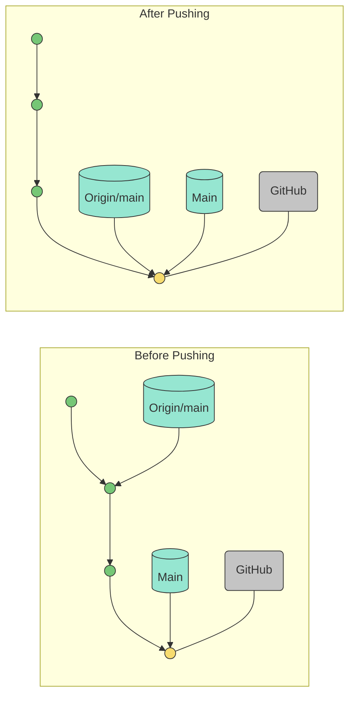
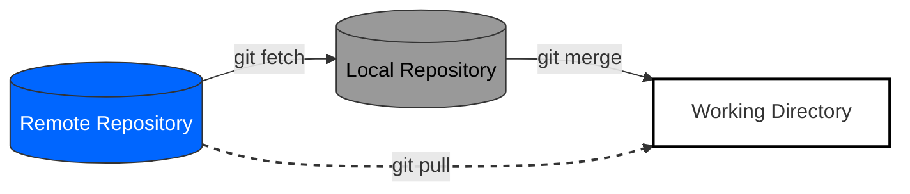
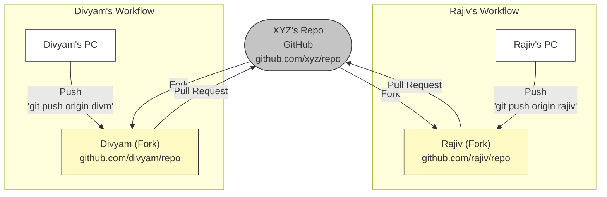
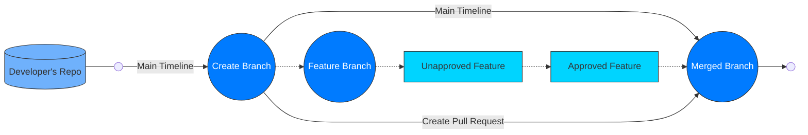

# Collaborer à l'aide de dépots distants

## Mise en place de dépôts à distance (Github, GitLab, Bitbucket)

Dans le monde du développement logiciel, les systèmes de contrôle de version jouent un rôle crucial dans la gestion des repositorys, la facilitation de la collaboration et la garantie d'un workflow fluide entre les membres de l'équipe. Les dépôts distants, hébergés sur des plateformes telles que GitHub, GitLab et Bitbucket, offrent aux développeurs un emplacement centralisé pour stocker, gérer et partager leur code. Dans cet article, nous allons nous pencher sur le processus étape par étape de mise en place de référentiels distants sur chacune de ces plateformes.

## GitHub

GitHub est l'une des plateformes d'hébergement en ligne les plus populaires pour les dépots de code à contrôle des versions. Voici un guide détaillé sur comment mettre en place un repository en ligne sur GitHub:

Etape 1: Créer un compte GitHub:
Si vous n'en avez pas encore un, allez sur github.com and créez un compte GitHub.

Etape 2: Créer un nouveau repository GitHub
Une fois connecté, cliquez sur le bouton "+ New" dans le coin supérieur droit de l'écran d'acceuil GitHub. Donnez un nom pour votre dépot, une description optionelle, et choisissez l'option public ou privé.

Etape 3: Initialisez le dépot
Après avoir créé le dépot, vous avez l'option de l'initialiser avec un fichier README, ce qui est souvent recommandé. Un fichier README fournit les informations essentielles à propos de votre projet et agit comme un point de déppart pour les collaborateurs.

Etape 4: Clone le répo (Optionel):
Si vous voulez travailler avec le dépot en local sur votre ordinateur, vous pouvez le cloner en utilisant la commande Git: git clone <repository_url>.

## GitLab
GitLab est un autre gestionnaire de dépôt Git, très répandu, qui offre un large éventail de fonctionnalités. Voici comment configurer un dépôt distant sur GitLab :

Étape 1 : Créer un compte GitLab
Visitez gitlab.com et créez un compte si vous n'en avez pas.

Étape 2 : Créer un nouveau projet
Une fois connecté, cliquez sur le bouton "New Project" sur le tableau de bord. Donnez un nom, une description optionnelle et choisissez le niveau de visibilité (public, interne ou privé) pour votre projet.

Étape 3 : Initialiser le référentiel
Comme pour GitHub, vous avez la possibilité d'initialiser le dépôt avec un fichier README, ce qui est une bonne pratique à suivre.

Étape 4 : Cloner le dépôt (optionnel)
Si vous souhaitez travailler avec le dépôt localement sur votre ordinateur, vous pouvez le cloner en utilisant la commande Git : git clone <repository_url>.


## Bitbucket
Bitbucket, propriété d'Atlassian, est une autre plateforme largement utilisée pour héberger des dépôts Git. La mise en place d'un dépôt distant sur Bitbucket implique les étapes suivantes :

Étape 1 : Créer un compte Bitbucket
Allez sur bitbucket.org et créez un compte Bitbucket si vous n'en avez pas.

Étape 2 : Créer un nouveau dépôt
Après vous être connecté, cliquez sur le bouton "Créer un référentiel" sur le tableau de bord Bitbucket. Fournissez un nom, une description optionnelle et sélectionnez le niveau d'accès du référentiel (public ou privé).

Étape 3 : Choisir le type de référentiel
Bitbucket vous permet de choisir entre la création d'un dépôt Git ou d'un dépôt Mercurial. Sélectionnez "Git" comme type de référentiel.

Étape 4 : Initialiser le référentiel
Comme GitHub et GitLab, vous pouvez initialiser le dépôt avec un fichier README pour un démarrage en douceur.

Etape 5 : Cloner le dépôt (Optionnel)
Si vous souhaitez travailler avec le dépôt localement sur votre ordinateur, vous pouvez le cloner en utilisant la commande Git : git clone <repository_url>.

La mise en place de dépôts distants à l'aide de GitHub, GitLab et Bitbucket est une compétence fondamentale pour tout développeur travaillant avec des systèmes de contrôle de version. En suivant les guides étape par étape fournis dans cet article, vous pouvez facilement créer vos dépôts distants, les initialiser et commencer à collaborer avec les membres de votre équipe sur des projets logiciels passionnants. Que vous choisissiez GitHub, GitLab ou Bitbucket, chaque plateforme offre un ensemble de fonctionnalités robustes pour rationaliser votre flux de développement et améliorer la collaboration sur le code.


## Push et pull des changements sur des dépots distants

Les systèmes de contrôle de versions sont des outils essentiels pour le développement logiciel colaboratif, permettant ainsi aux équipes de gérer les changements de code de manière efficace. Git, un des systèmes de contôle de version les plus populaires, permet aux dévelopeurs de travailler simultnément sur le même projet grâce aux push et aux pull des changements depuis les dépot distants. Dans cet article, nous allons explorer les concepts de push et pull de changements, leurs significations, et les bonnes pratiques pour assurer une collaboration fluide au sein d'une équipe.

### Understanding Remote Repositories

Un dépot distant (remote repository) est un endroit centralisé et partagé où les dévelopeurs stockent et gèrent le code de leurs projets. Lors d'un travail au sein d'une équipe, chaque membre possède une copie locale du dépot sur leur ordinateur. Le dépot en ligne sert de référence pour synchroniser les changements faits par les différents developeurs.

### Push les changements vers le dépot distant
Push les changements fait référence au processus d'envoi des modifications du code local depuis votre dépôt local vers le dépôt distant. Il est essentiel de garder le dépôt distant à jour avec les dernières modifications apportées par l'équipe.

Voici un guide étape par étape sur la manière d'envoyer des modifications :

Étape 1 : Validation (commit) des modifications au niveau local
Avant de transférer des modifications, vous devez les valider localement. Un commit est un instantané des modifications que vous avez apportées aux fichiers dans votre dépôt local. Il est essentiel d'ajouter un message de validation des modifications pour expliquer les changements effectués.

Étape 2 : Vérification du référentiel distant
Assurez-vous que l'URL du référentiel distant est correctement configurée dans votre référentiel local. Vous pouvez utiliser la commande suivante pour vérifier les référentiels distants associés à votre référentiel local :

```bash
git remote -v

```
Étape 3: Push les changements
Utilisez la commande suivante pour push les commit vers le dépot distant:
```bash
git push <remote_name> <branch_name>

```
Par exemple:

```bash
git push origin main

```
Cette commande pushles changements de la branche locale "main" vers le dépot nommé "origin".




### Extraire(Pull) des modifications du dépot distant
L'extraction des modifications fait référence au processus de récupération et d'intégration des dernières modifications du référentiel distant dans votre référentiel local. Cela permet de s'assurer que votre code local est à jour avec les développements les plus récents du projet.

Suivez les étapes suivantes pour extraire des modifications :

Étape 1 : Validation des modifications locales
Avant d'extraire des modifications, il est préférable de valider vos modifications locales afin d'éviter les conflits au cours du processus d'extraction.

Étape 2 : Récupérer les modifications
Récupérez les modifications du dépôt distant à l'aide de la commande suivante :

```bash
git fetch <remote_name>

```
Par exemple:
```bash
git fetch origin

```
Cette commande récupère toutes les modifications du référentiel distant sans les fusionner automatiquement dans votre branche locale.


Étape 3 : Fusionner les modifications
Après avoir récupéré les modifications, vous devez les fusionner dans votre branche locale. Utilisez la commande suivante :

```bash
git merge <remote_name>/<branch_name>

```
Par exemple:
```bash
git merge origin/main

```


Cette commande fusionne les modifications de la branche distante "main" dans votre branche locale.

## Gérer les merges conflicts
Parfois, lors de l'extraction des modifications, Git peut rencontrer des conflits si les mêmes lignes de code ont été modifiées à la fois dans le dépôt distant et dans votre dépôt local. Dans ce cas, Git n'est pas en mesure de résoudre automatiquement les différences et nécessite une intervention manuelle.

Lorsque vous êtes confronté à un conflit de fusion, suivez les étapes suivantes pour le résoudre :

a. Ouvrez le(s) fichier(s) en conflit et recherchez les marqueurs de conflit, qui indiquent les modifications en conflit.

b. Modifiez le(s) fichier(s) pour conserver les modifications souhaitées et supprimer les marqueurs de conflit.

c. Validez les modifications résolues pour achever la fusion.

## Bonnes habitudes
Pour garantir une collaboration harmonieuse lors de l'introduction et de l'extraction de modifications, il convient de prendre certaines bonnes habitudes suivantes :

- Toujours extraire avant d'introduire : avant d'introduire vos modifications, extrayez les dernières modifications du dépôt distant afin de réduire les risques de conflits.

- Effectuer des modifications fréquentes : Effectuez de petites modifications logiques et ajoutez des messages de modification significatifs afin de conserver un historique clair des modifications.

- Utiliser des branches de fonctionnalités : Lorsque vous travaillez sur de nouvelles fonctionnalités ou des corrections de bugs, créez des branches distinctes pour éviter les conflits avec la branche de développement principale.

- Révisions de code : Encouragez les révisions de code entre les membres de l'équipe afin de détecter les problèmes potentiels dès le début du processus de développement.

- Intégration continue (CI) : Mettre en œuvre des outils d'intégration continue pour automatiser le processus de test et d'intégration des modifications du code dans la branche principale.

L'envoi et l'extraction des changements depuis les dépots distincts sont des concepts fondamentaux dans Git et qui facilitent le travail collaboratif. En gardant ces bonnes habitudes et en comprenant le workflow, les équipes peuvent gérer efficacement leurs projets et assurer une intégration transparente des modifications du code. Le fait de push et de pull régulièrement des modifications permet de maintenir le dépôt distant à jour, de minimiser les conflits et d'aboutir à un processus de développement plus productif et plus cohérent.

## Collaborer avec d'autres developeurs en utilisant les branches et les pull requests

Le développement collaboratif de logiciels est un processus complexe et dynamique qui implique plusieurs développeurs travaillant simultanément sur différentes fonctionnalités. Pour optimiser ce processus, les systèmes de contrôle de version tels que Git proposent des fonctionnalités telles que les branches et les pull requests (demande d'intégration). Dans cet article, nous allons nous pencher sur l'importance de l'utilisation des branches et des pull requests pour le développement collaboratif et explorer les bonnes habitudes à garder en mémoire pour favoriser un travail d'équipe efficace.

Comprendre les branches
Dans Git, une branche est un pointeur léger et mobile vers un commit. Elle permet aux développeurs de travailler sur de nouvelles fonctionnalités, des corrections de bugs ou des expériences sans affecter la branche de développement principale (généralement appelée "master" ou "main"). Chaque branche représente une ligne de développement indépendante, ce qui permet aux développeurs d'isoler leurs modifications des autres et de travailler sur des tâches spécifiques.

L'utilisation de branches présente plusieurs avantages :

a. Encapsulation des modifications : Les branches permettent aux développeurs d'isoler leurs modifications, évitant ainsi les conflits avec le travail des autres développeurs jusqu'à ce qu'elles soient prêtes à être intégrées.

b. Développement parallèle : Plusieurs développeurs peuvent travailler simultanément sur différentes branches, ce qui facilite la gestion et le suivi des progrès.

c. Expérimentation des fonctionnalités : Les développeurs peuvent créer des branches expérimentales pour tester de nouvelles idées sans affecter la stabilité de la base de code principale.

### Collaborer avec les branches
Examinons les étapes de la collaboration à l'aide des branches :

Étape 1 : Créer une nouvelle branche
Avant de commencer tout nouveau travail, créez une nouvelle branche basée sur le dernier code de la branche principale. Utilisez la commande suivante :

```bash
git checkout -b <branch_name>

```
Par exemple:

```bash
git checkout -b feature/new-feature

```
Cette commande crée et bascule dans une nouvelle branche nommée "feature/new-feature".

Étape 2 : Travailler sur la branche
Effectuez les modifications de code et les validations nécessaires sur la branche nouvellement créée. Confirmez régulièrement vos modifications pour suivre votre progression.

Étape 3 : Transférer la branche vers un dépot distant
Pour collaborer avec d'autres personnes, transférez votre branche vers le dépôt distant :

```bash
git push origin <branch_name>

```
Par exemple:

```bash
git push origin feature/new-feature

```
Cette commande push votre branche locale "fonctionnalité/nouvelle-fonctionnalité" vers le dépôt distant.

Étape 4 : Collaborer avec d'autres
Une fois que votre branche est sur le référentiel distant, d'autres développeurs peuvent examiner vos modifications, fournir des commentaires ou même collaborer avec vous sur la même branche.



## Comprendre les pull requests
Une pull request (PR) est une fonctionnalité que l'on trouve couramment sur les plateformes d'hébergement Git telles que GitHub et Bitbucket. Il s'agit d'une demande formelle de fusionner des modifications d'une branche dans une autre, généralement d'une branche de fonctionnalités dans la branche principale.

L'utilisation des pull requests présente plusieurs avantages :

a. Review du code : Les demandes d'extraction fournissent une plateforme pour la révision du code par les autres collaborateurs, où d'autres développeurs peuvent examiner les modifications, suggérer des améliorations et assurer la qualité du code.

b. Discussion et collaboration : Les développeurs peuvent discuter des modifications proposées directement dans la pull request, ce qui permet de prendre de meilleures décisions et de favoriser la collaboration.

c. Intégration et test continus : De nombreuses plateformes permettent l'intégration avec des outils d'intégration continue, ce qui automatise les tests sur les demandes de pull requests afin de garantir la qualité du code.

## Collaborer avec des pull requests
Voici un guide étape par étape sur la collaboration par pull requests :

Étape 1 : Créer une pull request
Sur la plateforme d'hébergement Git, naviguez jusqu'à votre branche et cliquez sur le bouton "Create Pull Request". Sélectionnez la branche cible (généralement la branche principale) dans laquelle vous souhaitez fusionner vos modifications.

Étape 2 : Décrire les modifications
Rédigez un titre et une description clairs et descriptifs pour votre pull request, en soulignant les modifications apportées et l'objectif de la branche.

Étape 3 : Demander des réviseurs
Sélectionnez les réviseurs appropriés pour votre demande. Il s'agit généralement d'autres développeurs qui connaissent bien la base de code et qui peuvent fournir des commentaires utiles.

Étape 4 : Révision et itération
Les réviseurs examineront vos modifications, laisseront des commentaires et suggéreront des améliorations. Soyez ouvert aux commentaires et itérez sur votre code jusqu'à ce qu'il réponde aux normes du projet.

Étape 5 : Fusionner la demande d'extension
Une fois que la pull request a été approuvée et que toutes les discussions ont été résolues, elle peut être fusionnée dans la branche cible, généralement la branche principale. Les modifications font désormais partie de la base de code du projet.

### Bonnes habitudes
Pour garantir une collaboration harmonieuse à l'aide de branches et de pull requests, il convient d'adopter les bonnes habitudes suivantes :

a. Utiliser des noms descriptifs : Donnez aux branches et aux pull request des noms clairs et descriptifs afin que les membres de l'équipe comprennent plus facilement leur objectif.

b. Limitez les pull request : créez des pull request qui se concentrent sur une fonctionnalité ou une correction de bug spécifique. Les petites demandes sont plus faciles à examiner et à gérer.

c. Mettre à jour régulièrement les branches : Gardez vos branches de fonctionnalités à jour avec les dernières modifications de la branche principale en fusionnant ou en rebasant régulièrement.

d. Exploiter les revues de code : Encouragez les révisions de code et participez à la révision du code des autres afin de maintenir la qualité du code et de partager les connaissances.

e. Automatiser les pipelines CI/CD : Mettre en œuvre des pipelines d'intégration et de déploiement continus (CI/CD) pour automatiser les processus de test et de déploiement déclenchés par les pull requests.

La collaboration avec d'autres développeurs à l'aide de branches et de pull requests est un aspect fondamental du développement de logiciels modernes. Les branches permettent aux développeurs de travailler sur des fonctionnalités de manière indépendante, tandis que les pull requests facilitent la révision du code, le retour d'information et l'intégration transparente dans la base de code principale. En gardant en tête les bonnes habitudes citées plus haut et en exploitant efficacement ces outils de collaboration, les équipes peuvent améliorer leur productivité, la qualité du code et la réussite globale du projet.

## Résoudre les conflits dans les dépots distants

Git et GitHub ont révolutionné le contrôle des versions et le développement collaboratif de logiciels. Cependant, lorsque plusieurs développeurs travaillent simultanément sur le même projet, des conflits peuvent survenir lorsqu'ils essaient de fusionner des modifications provenant de branches ou de forks différentes. La résolution efficace de ces conflits est essentielle pour maintenir une base de code propre et fonctionnelle. Dans cet article, nous allons explorer les étapes pour résoudre les conflits dans les dépôts distants en utilisant Git et GitHub.

Comprendre les conflits Git :
Les conflits surviennent lorsque Git ne peut pas fusionner automatiquement les modifications en raison de modifications qui se chevauchent dans le même fichier ou segment de code. Git marque les zones de conflit et il incombe au développeur de résoudre ces conflits manuellement.

Création d'une branche locale :
Pour résoudre les conflits, commencez par créer une nouvelle branche locale à partir de la branche du dépôt distant sur laquelle vous souhaitez travailler. Utilisez la commande suivante :
```bash
git checkout -b my-feature-branch origin/master

```
Cette commande crée une nouvelle branche nommée "my-feature-branch" à partir de la branche "master" du référentiel distant.

Modifications et validation :
Travaillez maintenant sur votre branche locale et apportez les modifications nécessaires aux fichiers. Une fois que vous avez terminé, validez les modifications :

```bash
git add .
git commit -m "Implementing my feature"

```
Extraction des modifications à distance :
Avant de push vos modifications, il est essentiel de récupérer les dernières modifications du dépôt distant. Cela permet de s'assurer que la branche locale est à jour et de réduire les risques de conflits lors du push.

```bash
git pull origin master

```
Résoudre les conflits :
Lors de l'extraction des modifications depuis le serveur distant, Git peut vous notifier des conflits. Ouvrez les fichiers en conflit dans votre éditeur de code, et vous verrez les sections concernées.

Editez manuellement le fichier pour décider des changements à conserver ou à modifier. Une fois que vous avez résolu tous les conflits, enregistrez le fichier.

Marquage des fichiers résolus :
Après avoir résolu manuellement les conflits, ajouter les modifications des fichiers modifiés :

```bash
git add <filename>

```
Validation des modifications résolues :
Créez un nouveau commit pour enregistrer les modifications après avoir résolu les conflits :

```bash
git commit -m "Resolved conflicts"

```
Pousser les changements :
Maintenant que vous avez résolu les conflits, repoussez votre branche locale vers le dépôt distant

```bash
git push origin my-feature-branch

```
Créer une pull request :
Une fois que les changements sont push, consultez le dépôt sur GitHub et créez une pull request de votre branche "ma-fonctionnalité" vers la branche principale (par exemple, master). Cela permet à vos coéquipiers d'examiner vos modifications avant de les fusionner dans la base de code principale.



Review et Merge :
La pull request montrera les changements que vous avez faits, et les membres de votre équipe pourront examiner vos modifications. Si tout semble correct, un chef d'équipe ou un mainteneur peut fusionner la demande dans la branche principale.

La résolution des conflits dans les dépôts distants à l'aide de Git et GitHub fait partie intégrante du développement collaboratif. En comprenant le processus et en suivant les étapes décrites dans cet article, vous pouvez résoudre efficacement les conflits et maintenir une base de code propre et fonctionnelle. L'adoption d'une approche collaborative et d'une communication claire entre les membres de l'équipe permet de rationaliser davantage le processus de résolution des conflits et de garantir des flux de travail de développement fluides.