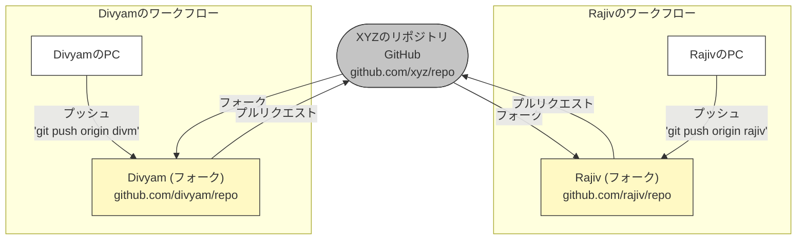

## リモートリポジトリでのコラボレーション

### リモートリポジトリのセットアップ（GitHub、GitLab、Bitbucket）

ソフトウェア開発の世界では、バージョン管理システムがコードリポジトリの管理、チームメンバー間のコラボレーションの促進、スムーズなワークフローの確保において重要な役割を果たします。GitHub、GitLab、Bitbucketなどのプラットフォームでホストされるリモートリポジトリは、開発者にコードを保存、管理、共有するための一元化された場所を提供します。この記事では、これらの各プラットフォームでリモートリポジトリをセットアップする手順を詳しく説明します。

#### GitHub
GitHubは、Gitを使用したバージョン管理のための最も人気のあるウェブベースのホスティングプラットフォームの1つです。GitHubでリモートリポジトリをセットアップする方法の詳細なガイドは次のとおりです：

**ステップ 1: GitHubアカウントを作成する**
まだお持ちでない場合は、github.com にアクセスしてGitHubアカウントにサインアップしてください。

**ステップ 2: 新しいリポジトリを作成する**
ログインしたら、GitHubダッシュボードの右上隅にある「+ New」ボタンをクリックします。リポジトリの名前、オプションの説明を入力し、公開（public）または非公開（private）を選択します。

**ステップ 3: リポジトリを初期化する**
リポジトリを作成した後、READMEファイルで初期化するオプションがあります。これは推奨されることがよくあります。READMEファイルはプロジェクトに関する重要な情報を提供し、コラボレーターの出発点として機能します。

**ステップ 4: リポジトリをクローンする（オプション）**
リポジトリをローカルコンピューターで作業したい場合は、Gitコマンド: `git clone <リポジトリのURL>` を使用してクローンできます。

#### GitLab
GitLabも広く使用されているウェブベースのGitリポジトリマネージャーで、豊富な機能セットを提供しています。GitLabでリモートリポジトリをセットアップする方法は次のとおりです：

**ステップ 1: GitLabアカウントを作成する**
gitlab.com にアクセスし、アカウントを持っていない場合は作成してください。

**ステップ 2: 新しいプロジェクトを作成する**
ログインしたら、ダッシュボードの「New Project」ボタンをクリックします。プロジェクトの名前、オプションの説明を入力し、可視性レベル（public、internal、private）を選択します。

**ステップ 3: リポジトリを初期化する**
GitHubと同様に、READMEファイルでリポジトリを初期化するオプションがあります。これは良い習慣です。

**ステップ 4: リポジトリをクローンする（オプション）**
リポジトリをローカルコンピューターで作業したい場合は、Gitコマンド: `git clone <リポジトリのURL>` を使用してクローンできます。

#### Bitbucket
Atlassianが所有するBitbucketも、Gitリポジトリをホストするための広く使用されているプラットフォームです。Bitbucketでリモートリポジトリをセットアップする手順は次のとおりです：

**ステップ 1: Bitbucketアカウントを作成する**
bitbucket.org にアクセスし、Bitbucketアカウントをお持ちでない場合はサインアップしてください。

**ステップ 2: 新しいリポジトリを作成する**
ログインしたら、Bitbucketダッシュボードの「Create repository」ボタンをクリックします。名前、オプションの説明を入力し、リポジトリのアクセスレベル（publicまたはprivate）を選択します。

**ステップ 3: リポジトリの種類を選択する**
Bitbucketでは、GitリポジトリとMercurialリポジトリのどちらを作成するかを選択できます。リポジトリの種類として「Git」を選択します。

**ステップ 4: リポジトリを初期化する**
GitHubやGitLabと同様に、スムーズなスタートのためにREADMEファイルでリポジトリを初期化できます。

**ステップ 5: リポジトリをクローンする（オプション）**
リポジトリをローカルコンピューターで作業したい場合は、Gitコマンド: `git clone <リポジトリのURL>` を使用してクローンできます。

GitHub、GitLab、Bitbucketを使用したリモートリポジトリのセットアップは、バージョン管理システムを扱う開発者にとって基本的なスキルです。この記事で提供されたステップバイステップのガイドに従うことで、リモートリポジトリを簡単に作成し、初期化し、チームメンバーとエキサイティングなソフトウェアプロジェクトでコラボレーションを開始できます。GitHub、GitLab、Bitbucketのいずれを選択しても、各プラットフォームは開発ワークフローを合理化し、コードコラボレーションを強化するための堅牢な機能セットを提供します。

### リモートリポジトリからの変更の送信と受信

バージョン管理システムは、共同ソフトウェア開発に不可欠なツールであり、チームがコードの変更を効率的に管理できるようにします。最も人気のあるバージョン管理システムの1つであるGitは、開発者がリモートリポジトリから変更をプッシュおよびプルすることで、同じプロジェクトで同時に作業できるようにします。この記事では、プッシュとプルの概念、その重要性、およびチーム内でのスムーズなコラボレーションを確保するためのベストプラクティスについて説明します。

#### リモートリポジトリについて
リモートリポジトリは、開発者がプロジェクトのコードを保存および管理する共有の一元化された場所です。チームで作業する場合、各メンバーは自分のコンピューターにリポジトリのローカルコピーを持っています。リモートリポジトリは、さまざまな開発者によって行われた変更を同期するための中央リファレンスポイントとして機能します。

#### リモートリポジトリへの変更の送信
変更を送信するとは、ローカルリポジトリからリモートリポジトリにローカルコードの変更を送信するプロセスです。 チームによって行われた最新の変更でリモートリポジトリを最新の状態に保つことが重要です。

プッシュ方法のステップバイステップガイドは次のとおりです：

**ステップ 1: ローカルで変更をコミットする**
変更をプッシュする前に、ローカルで変更をコミットする必要があります。コミットは、ローカルリポジトリ内のファイルに加えた変更のスナップショットです。行った変更を説明するために、説明的なコミットメッセージを追加することが重要です。

**ステップ 2: リモートリポジトリを確認する**
ローカルリポジトリに正しいリモートリポジトリのURLが設定されていることを確認します。次のコマンドを使用して、ローカルリポジトリに関連付けられているリモートリポジトリを確認できます：

```bash
git remote -v
```

**ステップ 3: 変更をプッシュする**
次のコマンドを使用して、コミットした変更をリモートリポジトリにプッシュします：
```bash
git push <リモートリポジトリの名前> <プッシュするブランチの名前>
```

例：
```bash
git push origin main
```
このコマンドは、ローカルブランチ「main」から「origin」という名前のリモートリポジトリに変更をプッシュします。


#### リモートリポジトリからのプル
プルとは、リモートリポジトリから最新の変更を取得してローカルリポジトリに統合するプロセスを指します。これにより、ローカルコードがプロジェクトの最新の開発内容と最新の状態に保たれます。

##### プルの手順は次のとおりです：

**ステップ 1: ローカルの変更をコミットする**
プルする前に、プルプロセス中の競合を避けるためにローカルの変更をコミットすることをお勧めします。

**ステップ 2: 変更をフェッチする**
次のコマンドを使用して、リモートリポジトリから変更をフェッチします：
```bash
git fetch <リモートリポジトリの名前>
```

例：
```bash
git fetch origin
```
このコマンドは、リモートリポジトリからすべての変更を取得しますが、ローカルブランチに自動的にマージしません。

**ステップ 3: 変更をマージする**
変更をフェッチした後、それらをローカルブランチにマージする必要があります。次のコマンドを使用します：
```bash
git merge <リモートリポジトリの名前>/<プッシュするブランチの名前>
```

例：
```bash
git merge origin/main
```


このコマンドは、リモートブランチ「main」からの変更をローカルブランチにマージします。

#### マージ競合の処理
プルするときに、リモートリポジトリとローカルリポジトリの両方で同じコード行が変更された場合、Gitは競合に遭遇することがあります。このような場合、Gitは自動的に差異を解決できず、手動による介入が必要です。

マージ競合に直面した場合は、次の手順に従って解決します：

a. 競合しているファイルを開き、競合マーカーを探します。これらは競合する変更を示しています。

b. ファイルを編集して、目的の変更を保持し、競合マーカーを削除します。

c. 解決された変更をコミットしてマージを完了します。

#### ベストプラクティス
プッシュとプルを行う際にスムーズなコラボレーションを確保するには、次のベストプラクティスを考慮してください：

- **プッシュする前に必ずプルする**：変更をプッシュする前に、リモートリポジトリから最新の変更をプルして、競合の可能性を最小限に抑えます。
- **頻繁にコミットする**：小さな論理的なコミットを作成し、意味のあるコミットメッセージを追加して、変更履歴を明確に保ちます。
- **フィーチャーブランチを使用する**：新機能やバグ修正に取り組む際は、メインの開発ブランチとの競合を避けるために、別のフィーチャーブランチを作成します。
- **コードレビューを奨励する**：チームメンバー間でのコードレビューを奨励し、開発プロセスの早い段階で潜在的な問題を発見します。
- **継続的インテグレーション（CI）**：CIツールを導入して、コードの変更をメインブランチにテストおよび統合するプロセスを自動化します。

リモートリポジトリからの変更の送受信は、共同ソフトウェア開発を容易にする基本的なGitの概念です。ベストプラクティスに従い、ワークフローを理解することで、チームはプロジェクトを効率的に管理し、コード変更のシームレスな統合を確保できます。定期的なプッシュとプルにより、リモートリポジトリが最新の状態に保たれ、競合が最小限に抑えられ、より生産的で結束力のある開発プロセスにつながります。

### ブランチとプルリクエストを使用した他の開発者とのコラボレーション

共同ソフトウェア開発は複雑で動的なプロセスであり、複数の開発者が同時に異なる機能に取り組みます。このプロセスを合理化するために、Gitなどのバージョン管理システムはブランチやプルリクエストなどの機能を提供します。この記事では、共同開発におけるブランチとプルリクエストの使用の重要性を掘り下げ、効果的なチームワークを促進するためのベストプラクティスを探ります。

#### ブランチについて
Gitでは、ブランチはコミットへの軽量な可動ポインタです。これにより、開発者はメインの開発ブランチ（通常「master」または「main」と呼ばれる）に影響を与えることなく、新機能、バグ修正、または実験に取り組むことができます。各ブランチは独立した開発ラインを表し、開発者は自分の変更を他の開発者から隔離して特定のタスクに取り組むことができます。

ブランチを使用することにはいくつかの利点があります：

a. **変更の分離**：ブランチにより、開発者は自分の変更を分離でき、統合の準備が整うまで他の開発者の作業との競合を防ぎます。

b. **並行開発**：複数の開発者が異なるブランチで同時に作業できるため、進行状況の管理と追跡が容易になります。

c. **機能の実験**：開発者は実験用ブランチを作成して、メインコードベースの安定性に影響を与えずに新しいアイデアをテストできます。

#### ブランチを使用したコラボレーション
ブランチを使用してコラボレーションする手順を見てみましょう：

**ステップ 1: 新しいブランチを作成する**
新しい作業を開始する前に、メインブランチの最新コードに基づいて新しいブランチを作成します。次のコマンドを使用します：
```bash
git checkout -b <プッシュするブランチの名前>
```

例：
```bash
git checkout -b feature/new-feature
```
このコマンドは、「feature/new-feature」という名前の新しいブランチを作成し、切り替えます。

**ステップ 2: ブランチで作業する**
新しく作成したブランチで必要なコード変更とコミットを行います。進行状況を追跡するために、変更を定期的にコミットします。

**ステップ 3: ブランチをリモートリポジトリにプッシュする**
他の人とコラボレーションするには、ブランチをリモートリポジトリにプッシュします：
```bash
git push origin <プッシュするブランチの名前>
```

例：
```bash
git push origin feature/new-feature
```
このコマンドは、ローカルブランチ「feature/new-feature」をリモートリポジトリにプッシュします。

**ステップ 4: 他の人とコラボレーションする**
ブランチがリモートリポジトリにプッシュされると、他の開発者はあなたの変更をレビューし、フィードバックを提供したり、同じブランチであなたとコラボレーションしたりできます。



#### プルリクエストについて
プルリクエストは、GitHubやBitbucketなどのGitホスティングプラットフォームで一般的に見られる機能です。これは、あるブランチから別のブランチ（通常はフィーチャーブランチからメインブランチ）への変更をマージする正式なリクエストです。

プルリクエストを使用することにはいくつかの利点があります：

a. **コードレビュー**：プルリクエストはピアコードレビューのプラットフォームを提供し、他の開発者が変更を吟味し、改善点を提案し、コード品質を確保できます。

b. **議論とコラボレーション**：開発者はプルリクエスト内で提案された変更について直接議論でき、より良い意思決定とコラボレーションの促進につながります。

c. **継続的インテグレーションとテスト**：多くのプラットフォームは継続的インテグレーションツールとの統合を可能にし、プルリクエストで自動テストを実行してコード品質を確保します。

#### プルリクエストを使用したコラボレーション
プルリクエストを使用したコラボレーションのステップバイステップガイドは次のとおりです：

**ステップ 1: プルリクエストを作成する**
Gitホスティングプラットフォームで、自分のブランチに移動し、「Create Pull Request」ボタンをクリックします。変更をマージするターゲットブランチ（通常はメインブランチ）を選択します。

**ステップ 2: 変更内容を説明する**
プルリクエストの明確で説明的なタイトルと説明を書き、行った変更とブランチの目的を概説します。

**ステップ 3: レビューアーをリクエストする**
プルリクエストに適切なレビューアーを選択します。これらは通常、コードベースに精通しており、貴重なフィードバックを提供できる他の開発者です。

**ステップ 4: レビューと反復**
レビューアーは変更を吟味し、コメントを残し、改善点を提案します。フィードバックを受け入れ、コードがプロジェクトの基準を満たすまで反復します。

**ステップ 5: プルリクエストをマージする**
プルリクエストが承認され、すべての議論が解決されたら、ターゲットブランチ（通常はメインブランチ）にマージできます。変更はプロジェクトのコードベースの一部になります。

#### ベストプラクティス
ブランチとプルリクエストを使用したスムーズなコラボレーションを確保するには、次のベストプラクティスを考慮してください：

a. **説明的な名前を使用する**：ブランチとプルリクエストに明確で説明的な名前を付け、チームメンバーがその目的を理解しやすくします。

b. **プルリクエストを小さく保つ**：特定の機能やバグ修正に焦点を当てたプルリクエストを作成します。小さなプルリクエストはレビューと管理が容易です。

c. **ブランチを定期的に更新する**：メインブランチからの最新の変更でフィーチャーブランチを最新の状態に保つために、定期的にマージまたはリベースします。

d. **コードレビューを活用する**：コードレビューを奨励し、他の人のコードのレビューに参加して、コード品質を維持し、知識を共有します。

e. **CI/CDパイプラインを自動化する**：プルリクエストによってトリガーされるテストとデプロイプロセスを自動化するために、継続的インテグレーションと継続的デプロイメントパイプラインを実装します。

ブランチとプルリクエストを使用した他の開発者とのコラボレーションは、現代のソフトウェア開発の基本的な側面です。ブランチにより開発者は機能に独立して取り組むことができ、プルリクエストはコードレビュー、フィードバック、およびメインコードベースへのシームレスな統合を促進します。ベストプラクティスに従い、これらのコラボレーションツールを効果的に活用することで、チームは生産性、コード品質、およびプロジェクト全体の成功を向上させることができます。

### リモートリポジトリでの競合解決

GitとGitHubは、バージョン管理と共同ソフトウェア開発に革命をもたらしました。しかし、複数の開発者が同じプロジェクトで同時に作業するため、異なるブランチやフォークからの変更をマージしようとすると競合が発生する可能性があります。これらの競合を効率的に解決することは、クリーンで機能的なコードベースを維持するために不可欠です。この記事では、GitとGitHubを使用してリモートリポジトリの競合に対処する手順を説明します。

#### Gitの競合について
競合は、同じファイルまたはコードセグメントでの重複する変更によりGitが自動的にマージできない場合に発生します。Gitは競合領域をマークし、開発者はこれらの競合を手動で解決する責任があります。

#### ローカルブランチの作成
競合に対処するには、まず作業したいリモートリポジトリのブランチから新しいローカルブランチを作成します。次のコマンドを使用します：
```bash
git checkout -b my-feature-branch origin/master
```
このコマンドは、リモートリポジトリの「master」ブランチから「my-feature-branch」という名前の新しいブランチを作成します。

#### 変更とコミット
次に、ローカルブランチで作業し、必要なファイルの変更を行います。変更が完了したら、コミットします：
```bash
git add .
git commit -m "Implementing my feature"
```

#### リモートの変更をプル
変更をプッシュする前に、リモートリポジトリから最新の変更をプルすることが重要です。これにより、ローカルブランチが最新の状態になり、プッシュ中の競合の可能性が減少します。
```bash
git pull origin master
```

#### 競合の解決
リモートからの変更をプルすると、Gitが競合について通知する場合があります。競合しているファイルをコードエディタで開くと、次のようなセクションが表示されます：
```
<<<<<<< HEAD
ローカルでの変更
=======
リモートでの変更
>>>>>>> origin/master
```
ファイルを手動で編集して、どの変更を保持または変更するかを決定します。すべての競合を解決したら、ファイルを保存します。

#### 解決済みファイルのマーク
競合を手動で解決した後、変更したファイルをステージングします：
```bash
git add <ファイル名>
```

#### 解決済みの変更をコミット
競合を解決した後、変更を保存するための新しいコミットを作成します：
```bash
git commit -m "Resolved conflicts"
```

#### 変更のプッシュ
競合を解決したので、ローカルブランチをリモートリポジトリにプッシュします：
```bash
git push origin my-feature-branch
```

#### プルリクエストの作成
変更がプッシュされたら、GitHubでリポジトリにアクセスし、「my-feature-branch」からメインブランチ（例：master）へのプルリクエストを作成します。これにより、チームメイトが変更をメインコードベースにマージする前にレビューできます。


#### レビューとマージ
プルリクエストには行った変更が表示され、チームメンバーは変更をレビューできます。すべてが良好であれば、チームリードまたはメンテナーがプルリクエストをメインブランチにマージできます。

GitとGitHubを使用したリモートリポジトリでの競合解決は、共同開発の不可欠な部分です。プロセスを理解し、この記事で概説された手順に従うことで、競合に効率的に対処し、クリーンで機能的なコードベースを維持できます。チームメンバー間の協力的なアプローチと明確なコミュニケーションを取り入れることで、競合解決プロセスをさらに合理化し、スムーズな開発ワークフローを確保できます。
