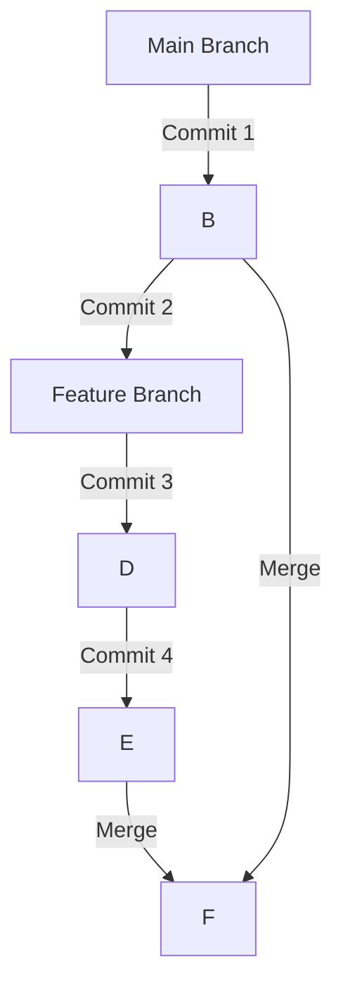

# Ветвление и слияние

## Введение в вевтви и их назначение:
В сфере разработки программного обеспечения ветви Git являются незаменимыми инструментами для управления эволюцией кода и совместной работы. Ветка в Git - это, по сути, легкий, подвижный указатель на конкретный коммит в истории коммитов репозитория. Используя ветви, разработчики могут одновременно работать над разными аспектами проекта, экспериментировать с новыми функциями или исправлениями и изолировать изменения, не затрагивая основную кодовую базу. В этой статье мы рассмотрим тонкости работы с ветвями Git, их создание, переключение, управление историей и обработку конфликтов слияния.

### Создание и переключение между ветками:

Чтобы создать новую ветку в Git, разработчики могут использовать команду "git branch", за которой следует желаемое имя ветки. Например, чтобы создать ветвь с именем "feature-branch", нужно выполнить команду: git branch feature-branch. Это создаст новую ветку, но HEAD репозитория (текущая активная ветка) останется неизменным. Пример приведен здесь:

```bash
git branch feature-branch
```

Чтобы переключиться на вновь созданную ветку, используется команда "git checkout". Набрав git checkout feature-branch, HEAD будет обновлен, и разработчик будет работать в контексте "feature-branch". Примером может быть:

```bash
git checkout feature-branch
```

В качестве альтернативы в Git 2.23 появился более удобный способ создания и переключения на новую ветку за один шаг: git checkout -b feature-branch. Эта команда создает ветвь и одновременно переключается на нее. Например:

```bash
git checkout -b feature-branch
```

### Управление историей ветвей и слияние изменений:

Ветви служат изолированной средой, в которой разработчики могут работать над конкретными функциями или исправлениями ошибок. Находясь в ветке, разработчики могут вносить изменения, фиксировать их и формировать историю фиксации ветки независимо от основной ветви или других ветвей.

Когда изменения в ветке завершены и готовы к интеграции, в дело вступает слияние. Слияние - это процесс объединения изменений, сделанных в одной ветке, в другую. Чтобы объединить изменения из ветки (например, "feature-branch") с основной веткой, разработчики могут выполнить команду git merge feature-branch, находясь в основной ветке. Это действие интегрирует изменения из "feature-branch" в основную ветвь, объединяя истории коммитов.



### Обработка конфликтов слияния:

Конфликты слияния возникают, когда Git сталкивается с конфликтующими изменениями между исходной веткой (например, "feature-branch") и целевой веткой (например, основной веткой) во время операции слияния. Конфликты обычно возникают, когда одни и те же строки кода были по-разному изменены в двух ветках.

Чтобы устранить конфликты слияния, разработчикам необходимо вручную разрешить конфликтующие строки. Git предоставляет маркеры в конфликтующем файле, указывающие на конфликтующие секции, и разработчики должны отредактировать файл, чтобы выбрать нужные изменения. После ручного разрешения конфликтов разработчики сохраняют файл и завершают слияние, добавляя и фиксируя изменения. Git помечает конфликт как разрешенный и завершает операцию слияния

В тех случаях, когда разрешить конфликты оказывается сложно, разработчики могут обратиться за помощью к инструментам слияния Git или совместно с членами команды найти подходящие решения.

# Заключение:

Ветви Git - незаменимый инструмент для управления эволюцией кода и облегчения сотрудничества при разработке программного обеспечения. Используя ветви, разработчики могут одновременно работать над различными функциями или исправлениями ошибок, не затрагивая основную кодовую базу. Ветви позволяют независимо разрабатывать и изолировать изменения, которые по мере готовности могут быть объединены в основную ветвь.

Имея четкое представление о создании, переключении, управлении историей и разрешении конфликтов ветвей, разработчики могут эффективно использовать ветви Git для поддержания структурированного и эффективного процесса разработки. Внедрение веток Git позволяет командам разработчиков программного обеспечения повысить производительность, обеспечить параллельную работу и в конечном итоге получить высококачественный код.