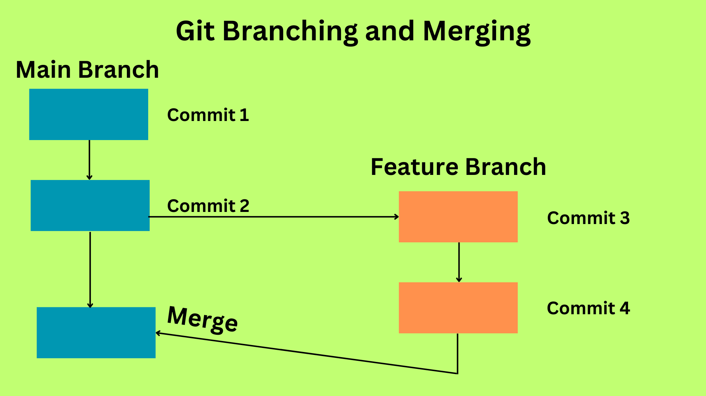

# Dallanma ve Birleştirme

- [Şubelerin giriş ve amaçları](#şubelerin-giriş-ve-amaçları)
- [Dallar arasında oluşturma ve geçiş yapma](#dallar-arasında-oluşturma-ve-geçiş-yapma)
- [Şube geçmişini yönetme ve değişiklikleri birleştirme](#şube-geçmişini-yönetme-ve-değişiklikleri-birleştirme)
- [Birleştirme çakışmalarının işlenmesi](#birleştirme-çakışmalarının-işlenmesi)
- [Sonuç](#sonuç)

# Şubelerin giriş ve amaçları

Yazılım geliştirme alanında Git dalları, kod evrimini ve işbirliğini yönetmek için vazgeçilmez araçlardır. Git'teki bir dal, esasen bir deponun kayıt geçmişindeki belirli bir kayıt için hafif, taşınabilir bir işaretçidir. Geliştiriciler dalları kullanarak, bir projenin farklı yönleri üzerinde aynı anda çalışabilir, yeni özellikler veya düzeltmeler deneyebilir ve ana kod tabanını etkilemeden değişiklikleri izole edebilir. Bu makale, Git dallarının karmaşıklıklarını inceleyecek ve bunların oluşturulmasını, değiştirilmesini, geçmiş yönetimini ve birleştirme çatışmalarının işlenmesini kapsayacaktır.

### Dallar arasında oluşturma ve geçiş yapma:

Git'te yeni bir dal oluşturmak için geliştiriciler "git branch" komutunu ve ardından istenen dal adını kullanabilirler. Örneğin, "feature-branch" adlı bir dal oluşturmak için şu komut çalıştırılır: git branch feature-branch. Bu yeni bir dal oluşturur ancak deponun HEAD'i (şu anda etkin olan dal) değişmeden kalır. Bir örnek burada verilmiştir:

```bash
git branch feature-branch
```

Yeni oluşturulan dala geçmek için "git checkout" komutu kullanılır. git checkout feature-branch yazıldığında, HEAD güncellenir ve geliştirici "feature-branch" bağlamında çalışır. Bir örnek şöyle olabilir:

```bash
git checkout feature-branch
```

Alternatif olarak, Git 2.23 tek bir adımda yeni bir dal oluşturmak ve ona geçmek için daha kullanışlı bir yol sunmuştur: git checkout -b feature-branch. Bu komut dalı oluşturur ve aynı anda ona geçer. Örneğin:
```bash
git checkout -b feature-branch
```

### Şube geçmişini yönetme ve değişiklikleri birleştirme:

Dallar, geliştiricilerin belirli özellikler veya hata düzeltmeleri üzerinde çalışabilecekleri izole ortamlar olarak hizmet eder. Geliştiriciler bir daldayken değişiklikler yapabilir, bunları kaydedebilir ve dalın kayıt geçmişini ana daldan veya diğer dallardan bağımsız olarak oluşturabilir.

Bir daldaki değişiklikler tamamlandığında ve entegrasyona hazır olduğunda, birleştirme devreye girer. Birleştirme, bir dalda yapılan değişiklikleri başka bir dalda birleştirme işlemidir. Bir daldaki değişiklikleri (örneğin, "feature-branch") ana dala birleştirmek için, geliştiriciler ana daldayken git merge feature-branch komutunu çalıştırabilir. Bu eylem, "feature-branch"teki değişiklikleri ana dala entegre ederek kayıt geçmişlerini birleştirir.



### Birleştirme çakışmalarının işlenmesi:

Birleştirme çakışmaları, Git birleştirme işlemi sırasında kaynak dal (örneğin, "özellik dalı") ile hedef dal (örneğin, ana dal) arasında çakışan değişikliklerle karşılaştığında meydana gelir. Çakışmalar genellikle iki dalda aynı kod satırları farklı şekillerde değiştirildiğinde ortaya çıkar.

Birleştirme çakışmalarını gidermek için geliştiricilerin çakışan satırları manuel olarak çözmeleri gerekir. Git, çakışan bölümleri belirten çakışan dosya içinde işaretleyiciler sağlar ve geliştiriciler istenen değişiklikleri seçmek için dosyayı düzenlemelidir. Çakışmaları manuel olarak çözdükten sonra geliştiriciler dosyayı kaydeder ve değişiklikleri ekleyerek ve kaydederek birleştirmeyi tamamlar. Git çakışmayı çözülmüş olarak işaretler ve birleştirme işlemini tamamlar.

Çakışmaların çözülmesinin zor olduğu durumlarda, geliştiriciler Git'in birleştirme araçlarından yardım alabilir veya uygun çözümler bulmak için ekip üyeleriyle iş birliği yapabilir.

# Sonuç:

Git dalları, kod evrimini yönetmek ve yazılım geliştirmede iş birliğini kolaylaştırmak için vazgeçilmez araçlardır. Dalları kullanarak geliştiriciler, ana kod tabanını etkilemeden aynı anda farklı özellikler veya hata düzeltmeleri üzerinde çalışabilirler. Dallar, hazır olduğunda ana dala birleştirilebilen değişikliklerin bağımsız olarak geliştirilmesine ve izole edilmesine olanak tanır.

Dal oluşturma, değiştirme, geçmiş yönetimi ve çakışma çözümü konusunda net bir anlayışa sahip olan geliştiriciler, yapılandırılmış ve verimli bir geliştirme sürecini sürdürmek için Git dallarından etkili bir şekilde yararlanabilirler. Git dallarını benimseyerek, yazılım geliştirme ekipleri üretkenliği artırabilir, paralel çalışmayı mümkün kılabilir ve nihayetinde yüksek kaliteli kod sunabilir.