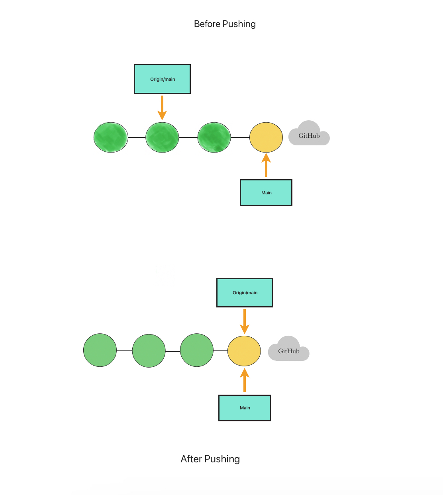
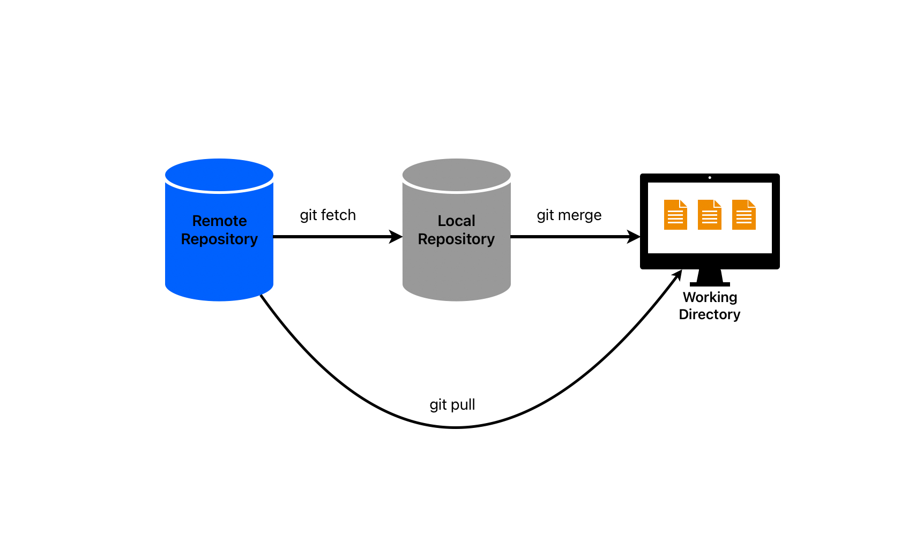
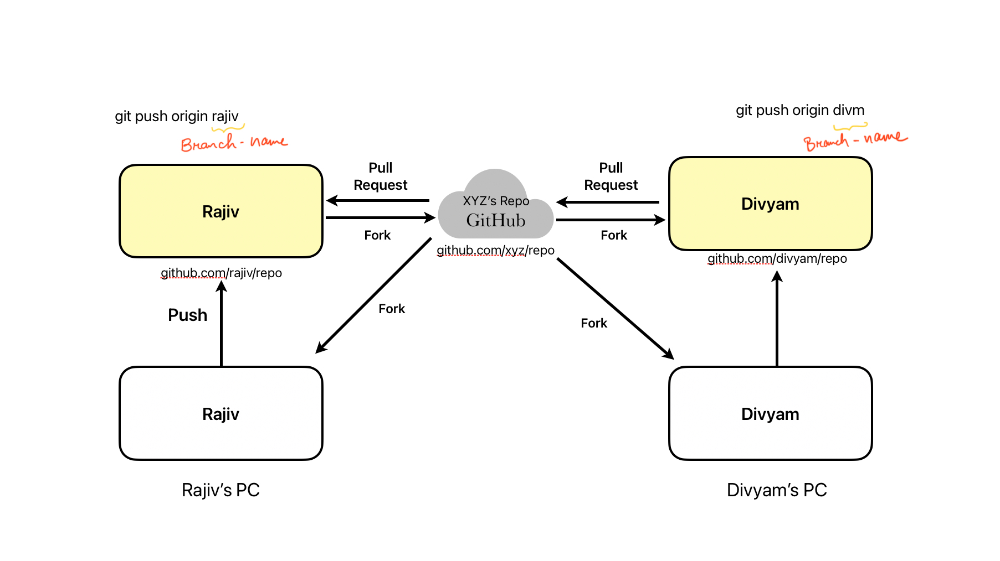
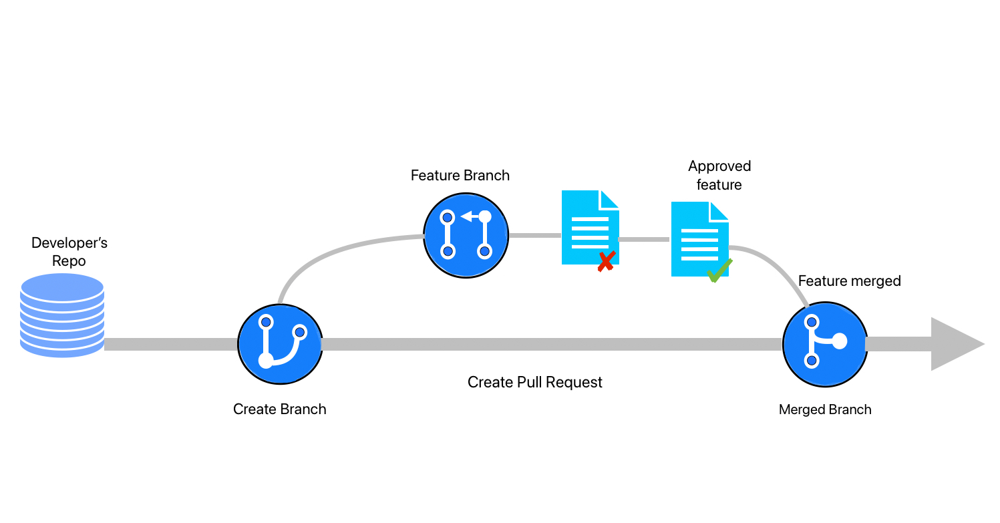

# 与远程存储库协作

## 设置远程存储库(Github,GitLab,Bitbucket)

在软件开发领域，版本控制系统在管理代码存储库、促进协作和确保团队成员之间顺畅的工作流程方面发挥着至关重要的作用。托管在GitHub，GitLab和Bitbucket等平台上的远程存储库为开发人员提供了一个集中的位置来存储，管理和共享他们的代码。在本文中，我们将深入研究在每个平台上设置远程存储库的分步过程。

### GitHub
GitHub is one of the most popular web-based hosting platforms for version control using Git. Here's a detailed guide on how to set up a remote repository on GitHub:

GitHub 是使用 Git 进行版本控制的最受欢迎的基于 Web 的托管平台之一。以下是有关如何在 GitHub 上设置远程仓库的详细指南：

步骤 1：创建 GitHub 帐户 如果您还没有帐户，请访问 github.com 并注册 GitHub 帐户。

步骤 2：创建新存储库 登录后，单击 GitHub 仪表板右上角的“+ 新建”按钮。提供存储库的名称、可选描述，并选择它是公共的还是私有的。

步骤 3：初始化存储库 创建存储库后，您可以选择使用 README 文件对其进行初始化，通常建议使用该文件。自述文件提供有关项目的基本信息，并充当协作者的起点。

步骤 4：克隆存储库（可选） 如果要在计算机上本地使用存储库，可以使用 Git 命令：git clone <repository_url> 克隆它。

### GitLab
GitLab 是另一个广泛使用的基于 Web 的 Git 存储库管理器，它提供了一组广泛的功能。以下是在 GitLab 上设置远程存储库的方法：

第 1 步：创建 GitLab 帐户 访问 gitlab.com 并创建一个帐户（如果您没有帐户）。

步骤 2：创建新项目 登录后，单击仪表板上的“新建项目”按钮。提供名称、可选描述，并为项目选择可见性级别（公共、内部或专用）。

步骤 3：初始化存储库 与 GitHub 类似，您可以选择使用 README 文件初始化存储库，这是一种很好的做法。

步骤 4：克隆存储库（可选） 如果要在计算机上本地使用存储库，可以使用 Git 命令：git clone <repository_url> 克隆它。

### Bitbucket
Bitbucket 由 Atlassian 拥有，是另一个广泛使用的托管 Git 存储库的平台。在 Bitbucket 上设置远程存储库涉及以下步骤：

第 1 步：创建 Bitbucket 帐户 如果您没有 Bitbucket 帐户，请转到 bitbucket.org 并注册一个帐户。

步骤 2：创建新存储库 登录后，单击 Bitbucket 仪表板上的“创建存储库”按钮。提供名称、可选描述，并选择存储库的访问级别（公共或私有）。

步骤 3：选择存储库类型 Bitbucket 允许您在创建 Git 存储库或 Mercurial 存储库之间进行选择。选择“Git”作为存储库类型。

步骤 4：初始化存储库 与 GitHub 和 GitLab 一样，您可以使用自述文件初始化存储库，以便顺利启动。

步骤 5：克隆存储库（可选） 如果您希望在计算机上本地使用存储库，可以使用 Git 命令：git clone <repository_url> 克隆它。

使用 GitHub、GitLab 和 Bitbucket 设置远程存储库是任何使用版本控制系统的开发人员的基本技能。按照本文提供的分步指南，您可以轻松创建远程存储库，对其进行初始化，并开始与团队成员协作开展令人兴奋的软件项目。无论您选择 GitHub、GitLab 还是 Bitbucket，每个平台都提供了一组强大的功能来简化您的开发工作流程并增强代码协作。


## 从远程存储库推送和拉取更改
版本控制系统是协作软件开发的重要工具，使团队能够有效地管理代码更改。Git 是最流行的版本控制系统之一，它允许开发人员通过从远程存储库推送和拉取更改来同时处理同一项目。在本文中，我们将探讨推送和拉动更改的概念、它们的重要性以及确保团队内顺利协作的最佳实践。

了解远程存储库 远程存储库是开发人员存储和管理其项目代码的共享集中位置。在团队中工作时，每个成员的计算机上都有存储库的本地副本。远程存储库充当同步不同开发人员所做的更改的中心参考点。

将更改推送到远程存储库 推送更改是指将本地代码修改从本地存储库发送到远程存储库的过程。必须使远程存储库与团队所做的最新更改保持同步。

下面是有关如何推送更改的分步指南：

步骤 1：在本地提交更改 在推送更改之前，需要在本地提交更改。提交是您对本地存储库中的文件所做的更改的快照。必须添加描述性提交消息来解释所做的更改。

步骤 2：验证远程存储库 确保在本地存储库中配置了正确的远程存储库 URL。您可以使用以下命令检查与本地存储库关联的远程存储库：

```bash
git remote -v

```
步骤 3：推送更改 使用以下命令将提交的更改推送到远程存储库：

```bash
git push <remote_name> <branch_name>

```
例如：

```bash
git push origin main

```
此命令将更改从本地分支“main”推送到名为“origin”的远程存储库。



从远程存储库中提取更改 拉取更改是指从远程存储库检索最新更改并将其集成到本地存储库的过程。这可确保您的本地代码与项目的最新发展保持同步。

请按照以下步骤提取更改：

步骤 1：提交本地更改 在拉取更改之前，最好提交本地更改以避免在拉取过程中发生冲突。

第 2 步：获取更改 使用以下命令从远程存储库获取更改：

```bash
git fetch <remote_name>

```
例如：

```bash
git fetch origin

```
此命令从远程存储库检索所有更改，而不会自动将它们合并到本地分支中。



步骤 3：合并更改 获取更改后，需要将它们合并到本地分支中。使用以下命令：

```bash
git merge <remote_name>/<branch_name>

```
例如：

```bash
git merge origin/main

```
此命令将远程分支“main”中的更改合并到本地分支中。

#### 处理合并冲突
有时，在拉取更改时，如果在远程存储库和本地存储库中修改了相同的代码行，Git 可能会遇到冲突。在这种情况下，Git 无法自动解决差异，需要手动干预。

遇到合并冲突时，请按照以下步骤解决它：

一个。打开冲突文件并查找冲突标记，这些标记指示冲突的更改。

b.编辑文件以保留所需的更改并删除冲突标记。

c. 提交已解决的更改以完成合并。

#### 最佳实践
若要确保在推送和拉取更改时顺利协作，请考虑以下最佳做法：

始终先拉后推：在推送更改之前，请从远程存储库拉取最新更改，以最大程度地减少冲突的可能性。

频繁提交：进行小型逻辑提交并添加有意义的提交消息，以保持清晰的更改历史记录。

使用功能分支：在处理新功能或错误修复时，请创建单独的功能分支以避免与主开发分支发生冲突。

代码审查：鼓励团队成员进行代码审查，以便在开发过程的早期发现潜在问题。

持续集成 （CI）：实施 CI 工具以自动执行测试过程并将代码更改集成到主分支中。

从远程存储库推送和拉取更改是 Git 中促进协作软件开发的基本概念。通过遵循最佳实践并了解工作流，团队可以有效地管理其项目并确保代码更改的无缝集成。定期推送和拉取更改可使远程存储库保持最新状态，最大限度地减少冲突，并导致更高效、更有凝聚力的开发过程。

## 使用分支和拉取请求与其他开发人员协作

协作软件开发是一个复杂而动态的过程，涉及多个开发人员同时处理不同的功能。为了简化此过程，Git 等版本控制系统提供了分支和拉取请求等功能。在本文中，我们将深入探讨使用分支和拉取请求进行协作开发的重要性，并探索促进有效团队合作的最佳实践。

了解分支 在 Git 中，分支是指向提交的轻量级可移动指针。它允许开发人员处理新功能、错误修复或实验，而不会影响主开发分支（通常称为“master”或“main”）。每个分支代表一个独立的开发线，使开发人员能够将其更改与其他更改隔离并处理特定任务。

使用分支有几个好处：

一个。隔离更改：分支允许开发人员隔离其更改，防止与其他开发人员的工作发生冲突，直到它们准备好集成。

b. 并行开发：多个开发人员可以同时在不同的分支上工作，从而更容易管理和跟踪进度。

c. 功能实验：开发者可以创建实验分支来测试新的想法，而不会影响主代码库的稳定性。

与分支机构协作 让我们探索使用分支进行协作的步骤：

步骤 1：创建新分支 在开始任何新工作之前，请根据主分支中的最新代码创建一个新分支。使用以下命令：

```bash
git checkout -b <branch_name>

```
例如：

```bash
git checkout -b feature/new-feature

```
此命令创建并切换到名为“feature/new-feature”的新分支。

第 2 步：在分支上工作 对新创建的分支进行必要的代码更改和提交。定期提交更改以跟踪进度。

第 3 步：将分支推送到远程存储库 要与他人协作，请将您的分支推送到远程存储库：

```bash
git push origin <branch_name>

```
例如：

```bash
git push origin feature/new-feature

```
此命令将本地分支“feature/new-feature”推送到远程存储库。

第 4 步：与他人协作 一旦您的分支位于远程存储库中，其他开发人员就可以查看您的更改、提供反馈，甚至在同一分支上与您协作。



## 了解拉取请求
拉取请求 （PR） 是 GitHub 和 Bitbucket 等 Git 托管平台中常见的功能。它是将更改从一个分支合并到另一个分支的正式请求，通常是从功能分支合并到主分支。

### 使用拉取请求有几个好处：

a. 代码审查：拉取请求为同行代码审查提供了一个平台，其他开发人员可以在其中检查更改、提出改进建议并确保代码质量。

b.讨论和协作：开发人员可以直接在拉取请求中讨论建议的更改，从而做出更好的决策并促进协作。

c. 持续集成和测试：许多平台允许与持续集成 （CI） 工具集成，自动测试拉取请求以确保代码质量。

### 与拉取请求协作
以下是有关使用拉取请求进行协作的分步指南：

步骤 1：创建拉取请求 在 Git 托管平台上，导航到您的分支，然后单击“创建拉取请求”按钮。选择要将更改合并到的目标分支（通常是主分支）。

第 2 步：描述更改 为您的拉取请求编写清晰且描述性的标题和描述，概述所做的更改和分支的目的。

第 3 步：请求审阅者 为拉取请求选择适当的审阅者。这些人通常是熟悉代码库并能提供宝贵反馈的其他开发人员。

第 4 步：查看和迭代 审阅者将检查您的更改、发表评论并提出改进建议。对反馈持开放态度，并迭代代码，直到它符合项目标准。

第 5 步：合并拉取请求 一旦拉取请求获得批准并解决了所有讨论，就可以将其合并到目标分支（通常是主分支）中。这些更改现在是项目代码库的一部分。

#### 最佳实践
若要确保使用分支和拉取请求进行顺畅协作，请考虑以下最佳实践：

a. 使用描述性名称：为分支和拉取请求提供清晰的描述性名称，使团队成员更容易理解其用途。

b. 保持较小的拉取请求：创建专注于特定功能或 bug 修复的拉取请求。较小的拉取请求更易于查看和管理。

c. 定期更新分支：通过定期合并或变基，使功能分支与主分支的最新更改保持同步。

d. 利用代码审查：鼓励代码审查并参与审查他人的代码，以保持代码质量并分享知识。

e.自动化 CI/CD 管道：实施持续集成和持续部署 （CI/CD） 管道，以自动执行由拉取请求触发的测试和部署过程。

使用分支和拉取请求与其他开发人员协作是现代软件开发的一个基本方面。分支允许开发人员独立处理功能，而拉取请求则有助于代码审查、反馈和无缝集成到主代码库中。通过遵循最佳实践并有效利用这些协作工具，团队可以提高他们的生产力、代码质量和整体项目成功率。

## 解决远程存储库中的冲突

Git 和 GitHub 彻底改变了版本控制和协作软件开发。但是，由于多个开发人员同时处理同一个项目，因此在尝试合并来自不同分支或分支的更改时可能会出现冲突。有效地解决这些冲突对于维护干净且功能正常的代码库至关重要。在本文中，我们将探讨使用 Git 和 GitHub 解决远程存储库中冲突的步骤。

了解 Git 冲突： 当 Git 由于同一文件或代码段中的重叠修改而无法自动合并更改时，就会发生冲突。Git 标记了冲突区域，开发人员有责任手动解决这些冲突。

创建本地分支： 要解决冲突，首先从您要处理的远程存储库的分支创建一个新的本地分支。使用以下命令：

```bash
git checkout -b my-feature-branch origin/master

```
此命令从远程存储库中的“master”分支创建名为“my-feature-branch”的新分支。

进行更改和提交： 现在，在本地分支上工作，并对文件进行必要的更改。完成后，提交更改：

```bash
git add .
git commit -m "Implementing my feature"

```
拉取远程更改： 在推送更改之前，从远程存储库中提取最新更改至关重要。这可确保您的本地分支是最新的，并减少推送期间发生冲突的可能性。

```bash
git pull origin master

```
解决冲突： 从远程拉取更改后，Git 可能会通知您有关冲突的信息。在代码编辑器中打开冲突的文件，你将看到如下部分：

```
<<<<<<< HEAD
Your local changes
=======
Incoming changes from remote
>>>>>>> 29a9b23... Latest changes from master


```

手动编辑文件以决定要保留或修改哪些更改。解决所有冲突后，保存文件。

标记已解析的文件： 手动解决冲突后，暂存修改后的文件：

```bash
git add <filename>

```
提交已解决的更改： 在解决冲突后，创建一个新的提交以保存更改：

```bash
git commit -m "Resolved conflicts"

```
推动更改： 解决冲突后，将本地分支推送到远程存储库

```bash
git push origin my-feature-branch

```
推动更改： 解决冲突后，将本地分支推送到远程存储库


查看和合并： 拉取请求将显示您所做的更改，您的团队成员可以查看这些修改。如果一切正常，团队领导或维护者可以将拉取请求合并到主分支中。

使用 Git 和 GitHub 解决远程存储库中的冲突是协作开发不可或缺的一部分。通过了解该过程并遵循本文中概述的步骤，您可以有效地解决冲突并维护干净且功能正常的代码库。采用协作方法和团队成员之间的清晰沟通可以进一步简化冲突解决过程并确保顺利的开发工作流程。
