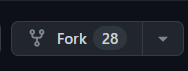
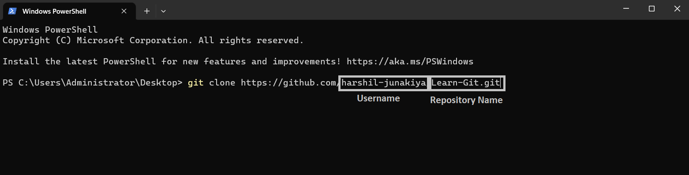
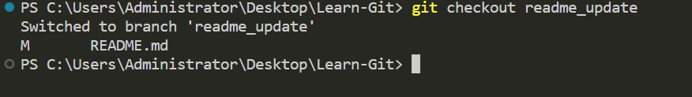
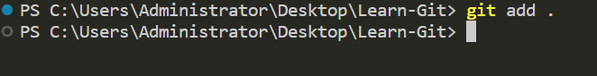
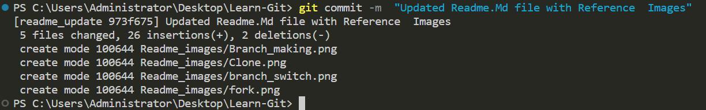
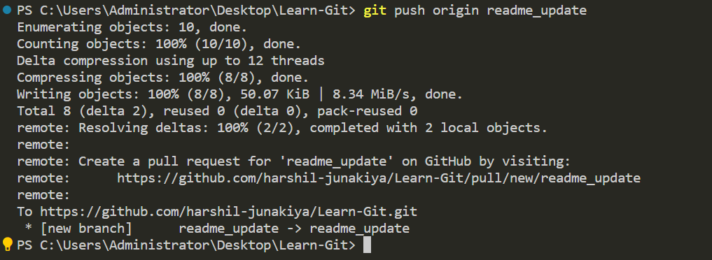
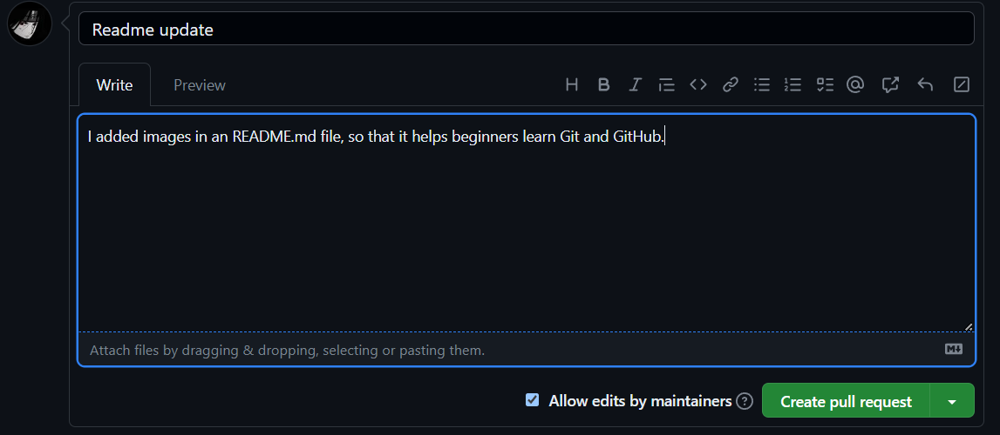

# Git суралцах нь

Энд миний YouTube сургалтын цувралд зориулсан жишээ репозиторийг олох болно. Хэрэв та энэ репозиторийг ашигтай гэж үзсэн бол бусдад илүү хялбар олохын тулд ⭐ өгч сонирхол татахыг бодоорой.

Түүнчлэн, миний [YouTube сувагт](https://www.youtube.com/@richardcallaby) бүртгүүлэх нь үнэгүй сургалт, бусад үнэгүй боловсролын нөөцүүдийг нийтэлдэг тул надад их тус болно.

## GitHub-д хувь нэмэр оруулах алхам алхмаар зааварчилгаа

GitHub данс үүсгэх: Хэрэв танд GitHub данс байхгүй бол та нэгийг үүсгэх хэрэгтэй. github.com руу орж, баруун дээд буланд байрлах "Sign up" товчийг дарна уу. Данс үүсгэх зааврыг дага.

Хувь нэмэр оруулах репозитор олох: GitHub данс үүсгэсний дараа та хувь нэмэр оруулахыг хүсэж буй репозиторийг хайж болно. GitHub хайлтын хэсэгт нэр эсвэл түлхүүр үгээр хайлт хийж болно.

Репозиторийг fork хийх: Хувь нэмэр оруулахыг хүсэж буй репозиторийг олсон бол та түүнийг fork хийх хэрэгтэй.

Fork хийх нь таны өөрийн GitHub дансанд репозиторийн хуулбарыг үүсгэж, эх репозиторид нөлөөлөхгүйгээр өөрчлөлт хийх боломжтой.

### Зураг
Доорх товчийг дарж, баруун дээд буланд байрлах репозиторийг fork хийнэ үү.



Fork хийсэн репозиторийг clone хийх: Репозиторийг fork хийсний дараа, та түүнийг өөрийн компьютерт clone хийх хэрэгтэй. Clone хийх нь репозиторийн хуулбарыг таны компьютерт үүсгэж, ажиллах боломжийг олгодог. Clone хийхийн тулд терминал цонхыг нээгээд дараах командыг оруулна уу:

```
git clone https://github.com/таны-username/репозиторийн-нэр.git
```
"таны-username" болон "репозиторийн-нэр"-ийг өөрийн GitHub хэрэглэгчийн нэр болон fork хийсэн репозиторийн нэрээр солихоо мартуузай.

### Зураг


Өөрчлөлт хийх салбар үүсгэх: Эх кодонд хийх өөрчлөлтүүдээ тусгахын тулд өвөрмөц нэртэй салбар үүсгээрэй. Салбар үүсгэхийн тулд дараах командыг ашиглана уу:

```
git branch "салбарын-нэр"
```
### Зураг


Тэр салбарт шилжихийн тулд дараах командыг ашиглана уу:
```
git checkout "салбарын-нэр"
```
### Зураг


Кодод өөрчлөлт оруулах: Репозиторийг өөрийн компьютер рүү clone хийсний дараа, та кодод өөрчлөлт оруулж болно. Өөрийн хүссэн текст засварлагч эсвэл IDE-г ашиглан файлуудыг засна уу.

Өөрчлөлтүүдийг commit хийх: Кодод өөрчлөлт оруулсны дараа, та түүнийг өөрийн локал репозиторид commit хийх хэрэгтэй. Үүний тулд терминал цонхыг нээгээд, clone хийсэн репозиторийн үндсэн хэсэгт очно уу. Өөрчлөлтүүдийг stage хийхийн тулд дараах командыг ашиглана уу:

```
git add .
```
### Зураг


Энэ нь репозиторийн бүх файлд оруулсан өөрчлөлтүүдийг stage хийнэ.

Дараа нь commit хийхийн тулд дараах командыг ашиглана уу:

```
git commit -m "Хийсэн өөрчлөлтүүдийн товч тайлбар"
```
### Зураг


Хийсэн өөрчлөлтүүдийн товч, ойлгомжтой тайлбарыг багтаахаа мартуузай.

Өөрчлөлтүүдийг GitHub руу push хийх: Өөрчлөлтүүдийг локал репозиторид commit хийсний дараа, тэдгээрийг GitHub руу push хийх хэрэгтэй. Энэ нь таны GitHub дансанд байгаа репозиторийн хуулбарыг шинэчилнэ. Push хийхийн тулд дараах командыг ашиглана уу:

```
git push origin салбарын-нэр
```
### Зураг


Pull request үүсгэх: Өөрчлөлтүүдийг GitHub руу push хийсний дараа, fork хийсэн репозиторийг дахин ачааллахад pull request үүсгэх сонголт гарч ирнэ. Тэр товчийг дарж pull request үүсгэнэ үү.

### Зураг


Энэ нь таны хийсэн өөрчлөлтүүдийг хянах, pull request-ийн тайлбарыг оруулах хуудсыг нээх болно.

Хийсэн өөрчлөлтүүд болон тэдгээрийн шалтгааныг тодорхой, товч тайлбар оруулахаа мартуузай.

Репозиторийн эзэнд мэдэгдэх шаардлагатай асуудлууд эсвэл санаа зовоосон зүйлүүд байгаа бол pull request-ийн тайлбарт дурдана уу.

Тайлбарт сэтгэл хангалуун болсны дараа "Create pull request" товчийг дарна уу.

### Зураг


Сэтгэгдэл хүлээх: Pull request үүсгэсний дараа репозиторийн эзэн таны өөрчлөлтүүдийг хянаж, сэтгэгдэл үлдээнэ.

Тэд нэмэлт өөрчлөлт хийхийг шаардах эсвэл таны өөрчлөлтийг эх репозиторид merge хийх боломжтой.

Энэ үе шатанд тэвчээртэй, хариуцлагатай байж, репозиторийн эзний өгсөн сэтгэгдэл эсвэл санаа зовоосон зүйлүүдийг шийдвэрлэхийг хичээгээрэй.

Fork хийсэн репозиторийг шинэчлэх: Хэрэв репозиторийн эзэн таны өөрчлөлтийг эх репозиторид merge хийвэл, та өөрийн fork хийсэн репозиторийг шинэчлэх шаардлагатай болно.

Үүний тулд өөрийн GitHub дээр байгаа fork хийсэн репозитор руу орж, "Fetch upstream" товчийг дарна уу.

Дараа нь, өөрийн локал репозиторид дараах командыг ажиллуулж шинэчлэлтийг татаж авна уу:

```
git pull
```

Энэ нь Git ашиглах талаар товч ойлголт өгч байгаа бөгөөд, энэ репозиторид үүсгэсэн хичээлүүдийг үзэж, илүү дэлгэрэнгүй тайлбар авах боломжтой.

## Эхний сайн асуудал

Энэ төслийг нээлттэй эхийн төслүүдэд хувь нэмэр оруулах эхний алхам болгон ашиглаж болно. Энэ нь **сайн эхний асуудал** байж болох юм, зөвхөн [CONTRIBUTORS.md](https://github.com/rcallaby/Learn-Git/blob/main/CONTRIBUTORS.md) файлыг өөрийн GitHub репозиторитой холбон засварлаарай. Файлд үзүүлсэн markdown ашиглана уу.

[First-Contributions](https://github.com/rcallaby/Learn-Git/tree/main/First-Contributions) директорийг үзэж, энэ репозиторид хэрхэн хувь нэмэр оруулах талаар алхам алхмаар зааварчилгаа аваарай.

### Агуулгын хүснэгт

- [Хэсэг 00 - Түүх ба Суурь](https://github.com/rcallaby/Learn-Git/blob/main/Lessons/MN/%D0%A5%D1%8D%D1%81%D1%8D%D0%B3-00%E2%80%93%D0%A2%D2%AF%D2%AF%D1%85-%D0%B1%D0%B0-%D0%A1%D1%83%D1%83%D1%80%D1%8C-%D0%BE%D0%B9%D0%BB%D0%B3%D0%BE%D0%BB%D1%82%D1%83%D1%83%D0%B4/git-%D0%B8%D0%B9%D0%BD-%D1%82%D2%AF%D2%AF%D1%85.md)
- [Хэсэг 01 - Үндсэн чиглүүлэлт](https://github.com/rcallaby/Learn-Git/blob/main/Lessons/MN/%D0%A5%D1%8D%D1%81%D1%8D%D0%B3-01%E2%80%93%D2%AE%D0%BD%D0%B4%D1%81%D1%8D%D0%BD-%D0%9D%D0%B0%D0%B2%D0%B8%D0%B3%D0%B0%D1%86%D0%B8/%D2%AF%D0%BD%D0%B4%D1%81%D1%8D%D0%BD-%D0%BD%D0%B0%D0%B2%D0%B8%D0%B3%D0%B0%D1%86%D0%B8.md)
- [Хэсэг 02 - Git эхлүүлэх](https://github.com/rcallaby/Learn-Git/blob/main/Lessons/MN/%D0%A5%D1%8D%D1%81%D1%8D%D0%B3-02%E2%80%93Git-%D0%B8%D0%B9%D0%B3-%D0%AD%D1%85%D0%BB%D2%AF%D2%AF%D0%BB%D1%8D%D1%85/%D1%8D%D1%85%D0%BB%D1%8D%D1%85.md)
- [Хэсэг 03 - Салбар үүсгэх ба нийлүүлэх](https://github.com/rcallaby/Learn-Git/blob/main/Lessons/MN/%D0%A5%D1%8D%D1%81%D1%8D%D0%B3-03%E2%80%93%D0%A1%D0%B0%D0%BB%D0%B0%D0%B0%D0%BB%D0%B0%D1%85-%D0%B1%D0%B0-%D0%9D%D1%8D%D0%B3%D1%82%D0%B3%D1%8D%D1%85/%D1%81%D0%B0%D0%BB%D0%B1%D0%B0%D1%80%D0%BB%D0%B0%D0%BB%D1%82-%D0%B1%D0%B0-%D0%BD%D1%8D%D0%B3%D1%82%D0%B3%D1%8D%D0%BB.md)
- [Хэсэг 04 - Алсын репозиторитой хамтран ажиллах](https://github.com/rcallaby/Learn-Git/blob/main/Lessons/MN/%D0%A5%D1%8D%D1%81%D1%8D%D0%B3-04%E2%80%93%D0%90%D0%BB%D1%81%D1%8B%D0%BD-%D0%A0%D0%B5%D0%BF%D0%BE%D0%B7%D0%B8%D1%82%D0%BE%D1%80%D1%82%D0%BE%D0%B9-%D0%A5%D0%B0%D0%BC%D1%82%D1%80%D0%B0%D0%BD-%D0%90%D0%B6%D0%B8%D0%BB%D0%BB%D0%B0%D1%85/%D0%B0%D0%BB%D1%81%D1%8B%D0%BD-%D1%80%D0%B5%D0%BF%D0%BE%D0%B7%D0%B8%D1%82%D0%BE%D1%80%D0%B8%D1%83%D0%B4%D1%82%D0%B0%D0%B9-%D1%85%D0%B0%D0%BC%D1%82%D1%80%D0%B0%D0%BD-%D0%B0%D0%B6%D0%B8%D0%BB%D0%BB%D0%B0%D1%85.md)
- [Хэсэг 05 - Нарийвчилсан Git ойлголтууд](https://github.com/rcallaby/Learn-Git/blob/main/Lessons/MN/%D0%A5%D1%8D%D1%81%D1%8D%D0%B3-05%E2%80%93Git-%D0%B8%D0%B9%D0%BD-%D0%90%D1%85%D0%B8%D1%81%D0%B0%D0%BD-%D0%A2%D2%AF%D0%B2%D1%88%D0%BD%D0%B8%D0%B9-%D0%9E%D0%B9%D0%BB%D0%B3%D0%BE%D0%BB%D1%82%D1%83%D1%83%D0%B4/%D0%B0%D1%85%D0%B8%D1%81%D0%B0%D0%BD-%D1%82%D2%AF%D0%B2%D1%88%D0%BD%D0%B8%D0%B9%20git.md)
- [Хэсэг 06 - Git ба GitHub ашиглан CI-CD](https://github.com/rcallaby/Learn-Git/blob/main/Lessons/MN/%D0%A5%D1%8D%D1%81%D1%8D%D0%B3-06%E2%80%93Git-%D0%B1%D0%B0-GitHub-%D0%B0%D1%88%D0%B8%D0%B3%D0%BB%D0%B0%D1%81%D0%B0%D0%BD-CI-CD/ci-cd-git-GitHub.md)
- [Хэсэг 07 - Git-ийн шилдэг туршлагууд ба зөвлөмжүүд](https://github.com/rcallaby/Learn-Git/blob/main/Lessons/MN/%D0%A5%D1%8D%D1%81%D1%8D%D0%B3-07%E2%80%93Git-%D0%B8%D0%B9%D0%BD-%D0%A8%D0%B8%D0%BB%D0%B4%D1%8D%D0%B3-%D0%A2%D1%83%D1%80%D1%88%D0%BB%D0%B0%D0%B3%D0%B0-%D0%B1%D0%B0-%D0%97%D3%A9%D0%B2%D0%BB%D3%A9%D0%BC%D0%B6%D2%AF%D2%AF%D0%B4/%D1%88%D0%B8%D0%BB%D0%B4%D1%8D%D0%B3-%D1%82%D1%83%D1%80%D1%88%D0%BB%D0%B0%D0%B3%D1%83%D1%83%D0%B4.md)
- [Хэсэг 08 - Agile хөгжүүлэлтийн Git ба GitHub](https://github.com/rcallaby/Learn-Git/blob/main/Lessons/MN/%D0%A5%D1%8D%D1%81%D1%8D%D0%B3-08%E2%80%93Agile-%D0%A5%D3%A9%D0%B3%D0%B6%D2%AF%D2%AF%D0%BB%D1%8D%D0%BB%D1%82-%D0%B4%D1%8D%D1%85-Git%20%D0%B1%D0%B0-GitHub/git-GitHub-%D1%83%D1%8F%D0%BD%20%D1%85%D0%B0%D1%82%D0%B0%D0%BD-%D1%85%D3%A9%D0%B3%D0%B6%D2%AF%D2%AF%D0%BB%D1%8D%D0%BB%D1%82.md)
- [Хэсэг 09 - GitHub ба Codespaces](https://github.com/rcallaby/Learn-Git/blob/main/Lessons/MN/%D0%A5%D1%8D%D1%81%D1%8D%D0%B3-09%E2%80%93GitHub-%D0%B1%D0%B0-Codespaces/GitHub-codespaces.md)
- [Хэсэг 10 - GitHub Actions](https://github.com/rcallaby/Learn-Git/blob/main/Lessons/MN/%D0%A5%D1%8D%D1%81%D1%8D%D0%B3-10%E2%80%93GitHub-Actions/GitHub-actions.md)
- [Хэсэг 11 - Нарийвчилсан GitHub Actions](https://github.com/rcallaby/Learn-Git/blob/main/Lessons/MN/%D0%A5%D1%8D%D1%81%D1%8D%D0%B3-11%E2%80%93GitHub-Actions-%D0%B8%D0%B9%D0%BD-%D0%90%D1%85%D0%B8%D1%81%D0%B0%D0%BD-%D0%A2%D2%AF%D0%B2%D1%88%D0%B8%D0%BD/%D0%B0%D1%85%D0%B8%D1%81%D0%B0%D0%BD-%D1%82%D2%AF%D0%B2%D1%88%D0%BD%D0%B8%D0%B9-GitHub-actions.md)
- [Хэсэг 12 - GitHub-д Jupyter Codespaces ашиглах нь](https://github.com/rcallaby/Learn-Git/blob/main/Lessons/MN/%D0%A5%D1%8D%D1%81%D1%8D%D0%B3-12%E2%80%93GitHub-%D0%B4%D0%B0%D1%85%D1%8C-Jupyter-Codespaces-%D0%B0%D1%88%D0%B8%D0%B3%D0%BB%D0%B0%D1%85/GitHub-jupyter%20-odespace.md)
- [Хэсэг 13 - GitHub-д C# Codespaces ашиглах нь](https://github.com/rcallaby/Learn-Git/blob/main/Lessons/MN/%D0%A5%D1%8D%D1%81%D1%8D%D0%B3-13%E2%80%93GitHub-%D0%B4%D0%B0%D1%85%D1%8C-C%23-Codespaces-%D0%B0%D1%88%D0%B8%D0%B3%D0%BB%D0%B0%D1%85/GitHub-CSharp-codespace.md)
- [Хэсэг 14 - GitHub-д React Codespaces ашиглах нь](https://github.com/rcallaby/Learn-Git/blob/main/Lessons/MN/%D0%A5%D1%8D%D1%81%D1%8D%D0%B3-14%E2%80%93GitHub-%D0%B4%D0%B0%D1%85%D1%8C-React-Codespaces-%D0%B0%D1%88%D0%B8%D0%B3%D0%BB%D0%B0%D1%85/GitHub-react-codespace.md)
- [Хэсэг 15 - GitHub-д Express Codespaces ашиглах нь](https://github.com/rcallaby/Learn-Git/blob/main/Lessons/MN/%D0%A5%D1%8D%D1%81%D1%8D%D0%B3-15%E2%80%93GitHub-%D0%B4%D0%B0%D1%85%D1%8C-Express-Codespaces-%D0%B0%D1%88%D0%B8%D0%B3%D0%BB%D0%B0%D1%85/GitHub-express-codespace.md)
- [Хэсэг 16 - GitHub-д Ruby on Rails Codespaces ашиглах нь](https://github.com/rcallaby/Learn-Git/blob/main/Lessons/MN/%D0%A5%D1%8D%D1%81%D1%8D%D0%B3-15%E2%80%93GitHub-%D0%B4%D0%B0%D1%85%D1%8C-Express-Codespaces-%D0%B0%D1%88%D0%B8%D0%B3%D0%BB%D0%B0%D1%85/GitHub-express-codespace.md)
- [Хэсэг 17 - GitHub-д Django Codespaces ашиглах нь](https://github.com/rcallaby/Learn-Git/blob/main/Lessons/MN/%D0%A5%D1%8D%D1%81%D1%8D%D0%B3-15%E2%80%93GitHub-%D0%B4%D0%B0%D1%85%D1%8C-Express-Codespaces-%D0%B0%D1%88%D0%B8%D0%B3%D0%BB%D0%B0%D1%85/GitHub-express-codespace.md)
- [Хэсэг 18 - GitHub төслийн удирдлагын хэрэгслүүд](https://github.com/rcallaby/Learn-Git/blob/main/Lessons/MN/%D0%A5%D1%8D%D1%81%D1%8D%D0%B3-15%E2%80%93GitHub-%D0%B4%D0%B0%D1%85%D1%8C-Express-Codespaces-%D0%B0%D1%88%D0%B8%D0%B3%D0%BB%D0%B0%D1%85/GitHub-express-codespace.md)
- [Хэсэг 19 - GitHub төслийн самбар ба тэмдэглэл](https://github.com/rcallaby/Learn-Git/blob/main/Lessons/MN/%D0%A5%D1%8D%D1%81%D1%8D%D0%B3-15%E2%80%93GitHub-%D0%B4%D0%B0%D1%85%D1%8C-Express-Codespaces-%D0%B0%D1%88%D0%B8%D0%B3%D0%BB%D0%B0%D1%85/GitHub-express-codespace.md)
