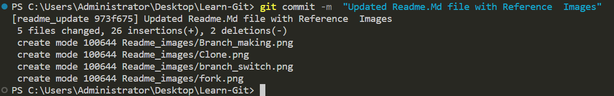
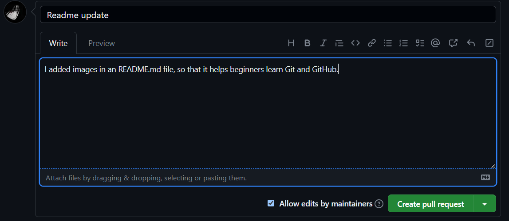

# Учим Git
Здесь вы найдете образец репозитория для моей серии учебных видеороликов по Git и Github на моем канале YouTube.
Если этот репозиторий оказался полезным, пожалуйста, подумайте о том, чтобы поставить ему звезду ⭐, так как это облегчит его поиск для других.

Кроме того, это сильно мне поможет, если вы подпишетесь на мой [канал YouTube](https://www.youtube.com/@richardcallaby), поскольку именно там я размещаю бесплатные учебные материалы и другие образовательные ресурсы.

## Вот пошаговый учебник по тому, как внести свой вклад в GitHub
Создайте учетную запись GitHub: Если у вас еще нет учетной записи GitHub, вам нужно ее создать. Перейдите на github.com и нажмите кнопку "Sign up" в верхнем правом углу. Следуйте инструкциям для создания своей учетной записи.

Найдите репозиторий для внесения вклада: После создания учетной записи GitHub вы можете искать репозитории, в которые хотите внести вклад. Используйте строку поиска GitHub для поиска репозиториев по имени или ключевому слову.

Сделайте форк репозитория: Как только вы нашли репозиторий, в который хотите внести вклад, вам нужно создать форк.

Форк создает копию репозитория в вашей учетной записи GitHub, которую вы можете изменять, не затрагивая оригинальный репозиторий.

### Ссылка на изображение
Нажмите на кнопку ниже, чтобы создать форк репозитория в верхнем правом углу.


Клонируйте форкнутый репозиторий: После создания форка репозитория вам нужно склонировать его на свой локальный компьютер. Клонирование создает копию репозитория на вашем компьютере, над которой вы сможете работать. Чтобы склонировать репозиторий, откройте терминальное окно и введите следующую команду:

```
git clone https://github.com/ваше-имя-пользователя/название-репозитория.git
```

Не забудьте заменить "ваше-имя-пользователя" и "название-репозитория" на ваше имя пользователя GitHub и имя репозитория, который вы форкнули.

### Ссылка на изображение


Убедитесь, что вы создаете ветку с уникальным именем, отражающим изменения, которые вы хотите внести в исходный код. Для создания ветки используйте следующий синтаксис:

```
git branch "имя-ветки"
```

### Ссылка на изображение


Для переключения на эту ветку используйте следующий синтаксис:
```
git checkout "имя-ветки"
```

### Ссылка на изображение


Внесите изменения в код: Как только у вас есть клонированный репозиторий на локальном компьютере, вы можете вносить изменения в код. Используйте ваш текстовый редактор или среду разработки для модификации файлов.

Зафиксируйте изменения: После внесения изменений в код, вам нужно зафиксировать их в вашем локальном репозитории. Для этого откройте терминальное окно и перейдите в корень клонированного репозитория. Используйте следующую команду для стагнации изменений:

```
git add .
```

### Ссылка на изображение


Это стагнизирует все внесенные изменения в файлах репозитория.

Затем зафиксируйте изменения с использованием следующей команды:

```
git commit -m "Краткое описание внесенных изменений"
```

### Ссылка на изображение


Обязательно включите краткое и информативное сообщение, описывающее внесенные изменения.

Отправьте изменения в GitHub: После фиксации изменений в вашем локальном репозитории вам нужно отправить их в GitHub. Это обновит копию репозитория в вашей учетной записи GitHub с внесенными вами изменениями. Для отправки изменений используйте следующую команду:

```
git push origin имя-ветки
```

### Ссылка на изображение


Создайте запрос на внесение изменений (pull request): После отправки изменений на GitHub, когда вы перезагрузите форкнутый репозиторий, вы увидите опцию создания запроса на извлечение. Нажмите на эту кнопку, чтобы создать запрос на внесение изменений(pull request).

### Ссылка на изображение


Это приведёт вас на страницу, где вы сможете просмотреть внесённые вами изменения и добавить описание к вашему pull request.

Обязательно включите чёткое и краткое описание внесенных изменений и объясните, почему вы их сделали.

Если есть какие-либо вопросы или моменты, о которых должен знать владелец репозитория, обязательно упомяните их в описании pull request.

Как только закончите работу над описанием, нажмите кнопку «Create pull request» (Создать pull request).

### Ссылка на изображение


Ожидайте обратной связи: После создания pull request владелец репозитория рассмотрит ваши изменения и предоставит обратную связь.

Он может попросить вас внести дополнительные изменения или объединить ваши изменения с оригинальным репозиторием.

Будьте терпеливы и отзывчивы в этом процессе, обязательно реагируйте на все замечания и вопросы, которые поднимает владелец репозитория.

Обновите свой форкнутый репозиторий: Если владелец репозитория объединит ваши изменения с оригинальным репозиторием, вам потребуется обновить свой форк, чтобы получить эти изменения.

Для этого перейдите в свой форкнутый репозиторий на GitHub и нажмите кнопку «Fetch upstream» (Получить из исходного репозитория).

Затем выполните в вашем локальном репозитории следующую команду, чтобы обновить его:

```
git pull
```

Это должно дать вам общее представление о том, как пользоваться Git. Конечно, вы можете ознакомиться с уроками, которые я создал в этом репозитории, чтобы получить более подробные объяснения.

## Good first issue(Хорошая первая задача)

Вы можете использовать этот проект как один из способов начать вносить вклад в проекты с открытым исходным кодом. Это может быть **good first issue** - просто измените файл [CONTRIBUTORS.md](https://github.com/rcallaby/Learn-Git/blob/main/CONTRIBUTORS.md) ,чтобы он содержал ссылку на ваш собственный репозиторий на GitHub. Используйте синтаксис markdown(md), как показано в этом файле.

Пожалуйста, ознакомьтесь с директорией [First-Contributions](https://github.com/rcallaby/Learn-Git/tree/main/First-Contributions) , где вы найдёте пошаговые инструкции о том, как внести вклад в этот репозиторий

### Оглавление

- [Часть 00 - История и Основы](https://github.com/rcallaby/Learn-Git/blob/main/Lessons/ru/Часть-00-История-и-Основы/история.md)
- [Часть 01 - Базовая Навигация](https://github.com/rcallaby/Learn-Git/blob/main/Lessons/ru/Часть-01-Базовая-Навигация/базовая-навигация.md)
- [Часть 02 - Инициализация Git](https://github.com/rcallaby/Learn-Git/blob/main/Lessons/ru/Часть-02-Инициализация-Git/начало-работы.md)
- [Часть 03 - Ветвление и Слияние](https://github.com/rcallaby/Learn-Git/blob/main/Lessons/ru/Часть-03-Ветвление-и-Слияние/ветвление-и-слияние.md)
- [Часть 04 - Совместная Работа с Удаленными Репозиториями](https://github.com/rcallaby/Learn-Git/tree/main/Lessons/ru/Часть-04-Совместная-Работа-с-Удаленными-Репозиториями/совместная-работа-с-удаленными-репозиториями.md)
- [Часть 05 - Продвинутые Концепции Git](https://github.com/rcallaby/Learn-Git/blob/main/Lessons/ru/Часть-05-Продвинутые-Концепции-Git/продвинутые-концепции-git.md)
- [Часть 06 - CI-CD с Git и Github](https://github.com/rcallaby/Learn-Git/blob/main/Lessons/ru/Часть-06-CI-CD-с-Git-и-Github/ci-cd-git-github.md)
- [Часть 07 - Git Лучшие Практики и Советы](https://github.com/rcallaby/Learn-Git/blob/main/Lessons/ru/Часть-07-Git-Лучшие-Практики-и-Советы/лучшие-практики-и-советы-git.md)
- [Часть 08 - Git и Github в Agile разработке](https://github.com/rcallaby/Learn-Git/blob/main/Lessons/ru/Часть-08-Git-и-Github-в-Agile-разработке/git-github-agile-разработка.md)
- [Часть 09 - Github и Codespaces](https://github.com/rcallaby/Learn-Git/blob/main/Lessons/ru/Часть-09-Github-и-Codespaces/github-codespaces.md)
- [Часть 10 - Github Actions](https://github.com/rcallaby/Learn-Git/blob/main/Lessons/ru/Часть-10-Github-Actions/github-actions.md)
- [Часть 11 - Расширенные возможности Github Actions](https://github.com/rcallaby/Learn-Git/blob/main/Lessons/ru/Часть-11-Расширенные-возможности-Github-Actions/расширенные-возможности-github-actions.md)
- [Часть 12 - Использование Jupyter Codespaces в Github](https://github.com/rcallaby/Learn-Git/blob/main/Lessons/ru/Часть-12-Использование-Jupyter-Codespaces-в-Github/github-jupyter-codespace.md)
- [Часть 13 - Использование Csharp Codespaces в Github](https://github.com/rcallaby/Learn-Git/blob/main/Lessons/ru/Часть-13-Использование-Csharp-Codespaces-в-Github/github-Csharp-codespace.md)
- [Часть 14 - Использование React Codespaces в Github](https://github.com/rcallaby/Learn-Git/blob/main/Lessons/ru/Часть-14-Использование-React-Codespaces-в-Github/github-react-codespace.md)
- [Часть 15 - Использование Express Codespaces в Github](https://github.com/rcallaby/Learn-Git/blob/main/Lessons/ru/Часть-15-Использование-Express-Codespaces-в-Github/github-express-codespace.md)
- [Часть 16 - Использование Ruby-on-Rails Codespaces](https://github.com/rcallaby/Learn-Git/blob/main/Lessons/ru/Часть-16-Использование-Ruby-on-Rails-Codespaces/github-rubyrails-codespace.md)
- [Часть 17 - Использование Django Codespaces в Github](https://github.com/rcallaby/Learn-Git/blob/main/Lessons/ru/Часть-17-Использование-Django-Codespaces-в-Github/github-django-codespace.md)
- [Часть 18 - Инструменты для Управления Проектами в Github](https://github.com/rcallaby/Learn-Git/blob/main/Lessons/ru/Часть-18-Инструменты-для-Управления-Проектами-в-Github/инструменты-для-управления-проектами-github.md)
- [Часть 19 - Доски и Заметки Проекта в Github](https://github.com/rcallaby/Learn-Git/blob/main/Lessons/ru/Часть-19-Доски-и-Заметки-Проекта-в-Github/доски-и-заметки-проекта-github.md)

#### Переводы этого руководства
Переводы этого руководства на многих языках вы можете найти ниже. Пожалуйста, имейте в виду, что некоторые из этих переводов находятся в стадии разработки и еще не полностью завершены.

- Chinese (Simplified)
- French
- German
- Hindi
- Italian
- Japanese
- Mongolian
- Russian
- Spanish
- Turkish
