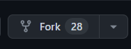
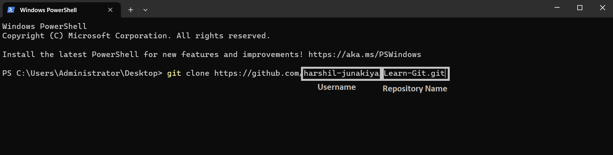
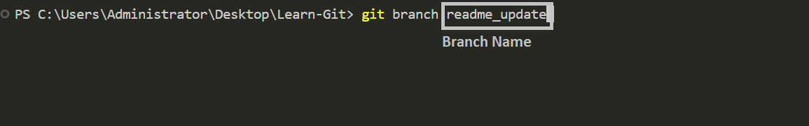
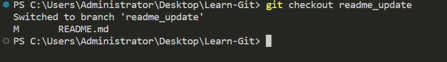
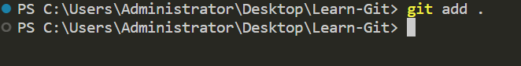
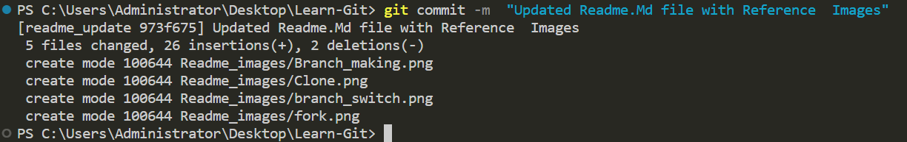
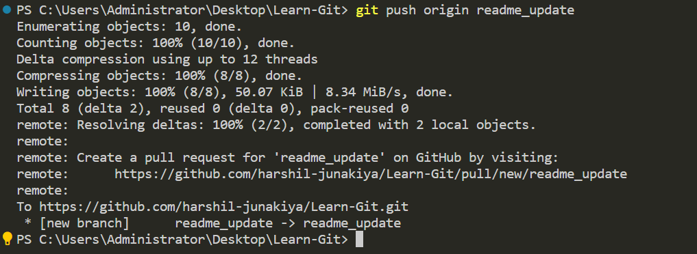
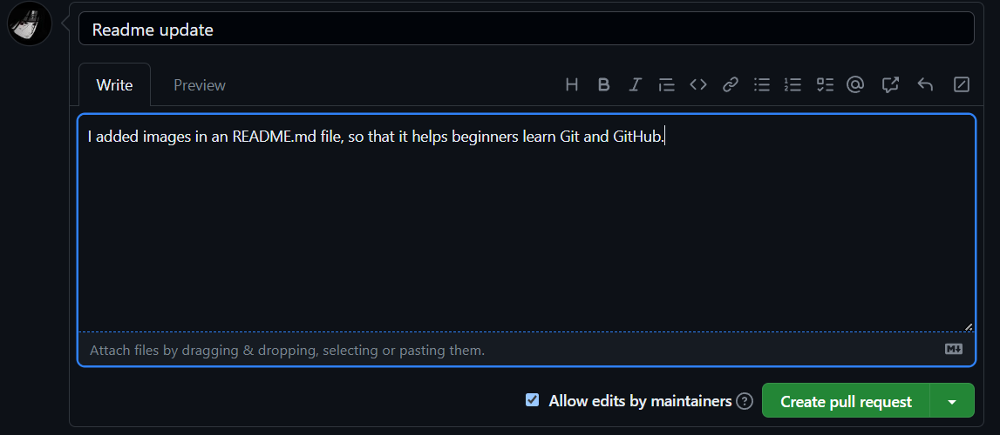

# Learn-Git
Burada Git ve Github Öğrenmek üzerine YouTube eğitim serim için bir örnek depo bulacaksınız.
Bu deponun faydalı olduğunu düşünüyorsanız, lütfen ona bir yıldız ⭐ vermeyi düşünün, çünkü başkalarının onu bulması daha kolay olacaktır.

Ayrıca, ücretsiz eğitimler ve diğer ücretsiz eğitim kaynakları yayınladığım yer olan [YouTube kanalıma](https://www.youtube.com/@richardcallaby) abone olursanız çok yardımcı olursunuz.

## GitHub'a nasıl katkıda bulunacağınıza dair adım adım bir eğitim burada
Bir GitHub hesabı oluşturun: Zaten bir GitHub hesabınız yoksa, bir tane oluşturmanız gerekir. github.com adresine gidin ve sağ üst köşedeki "Kaydol" düğmesine tıklayın. Hesabınızı oluşturmak için talimatları izleyin.

Katkıda bulunacağınız bir depo bulun: Bir GitHub hesabınız olduğunda, katkıda bulunmak istediğiniz depoları arayabilirsiniz. GitHub arama çubuğunu kullanarak ad veya anahtar kelimeye göre depoları arayabilirsiniz.

Depoyu çatallandırın: Katkıda bulunmak istediğiniz bir depo bulduğunuzda, onu çatallandırmanız gerekir.

Çatallandırma, kendi GitHub hesabınızda deponun bir kopyasını oluşturur ve bu kopyayı orijinal deponuzu etkilemeden değiştirebilirsiniz.

### Referans Görseli
Sağ üst köşede bulunan depoyu çatallandırmak için aşağıdaki düğmeye tıklayın.



Çatallandırılmış depoyu klonlayın: Depoyu çatallandırdıktan sonra, onu yerel makinenize klonlamanız gerekir. Klonlama, bilgisayarınızda üzerinde çalışabileceğiniz deponun bir kopyasını oluşturur. Depoyu klonlamak için bir terminal penceresi açın ve aşağıdaki komutu girin:

```
git clone https://github.com/your-username/repository-name.git
```
"your-username" ve "repository-name" ifadelerini GitHub kullanıcı adınız ve çatalladığınız deponun adıyla değiştirdiğinizden emin olun.

### Referans Görüntüsü


Kaynak kodunda yapmak istediğiniz değişiklikleri yansıtacak şekilde benzersiz bir şekilde adlandırılmış bir dal oluşturduğunuzdan emin olun. Bir dal oluşturmak için aşağıdaki sözdizimini kullanın:

```
git branch "branch-name"
```
### Referans Görüntüsü


Bu dalı açmak için aşağıdaki sözdizimini kullanın:
```
git checkout "branch-name"
```
### Referans Görüntüsü



Kodda değişiklikler yapın: Depoyu yerel makinenize kopyaladıktan sonra, kodda değişiklikler yapabilirsiniz. Dosyaları değiştirmek için tercih ettiğiniz metin düzenleyicisini veya IDE'yi kullanın.

Değişiklikleri kaydedin: Kodda değişiklikler yaptıktan sonra, bunları yerel deponuza kaydetmeniz gerekir. Bunu yapmak için bir terminal penceresi açın ve kopyalanan deponun köküne gidin. Değişiklikleri düzenlemek için aşağıdaki komutu kullanın:

```
git add .
```

### Referans Görüntüsü


Bu, depodaki dosyalarda yapılan tüm değişiklikleri aşamalandıracaktır.

Sonra, aşağıdaki komutu kullanarak değişiklikleri kaydedin:

```
git commit -m "Yapılan değişikliklerin kısa bir açıklaması"
```

### Referans Görüntüsü


Yaptığınız değişiklikleri açıklayan kısa ve bilgilendirici bir mesaj eklediğinizden emin olun.

Değişiklikleri GitHub'a gönderin: Değişiklikleri yerel deponuza gönderdikten sonra, bunları GitHub'a göndermeniz gerekir. Bu, GitHub hesabınızdaki deponun kopyasını yaptığınız değişikliklerle günceller. Değişiklikleri göndermek için aşağıdaki komutu kullanın:

```
git push origin branch-name
```

### Referans Görüntüsü


Bir çekme isteği oluşturun: Değişiklikleri GitHub'a gönderdikten sonra, çatallanmış deponuzu yeniden yüklediğinizde, bir çekme isteği oluşturma seçeneğini göreceksiniz. Bir çekme isteği oluşturmak için bu düğmeye tıklayın.

### Referans Görüntüsü


Bu sizi yaptığınız değişiklikleri inceleyebileceğiniz ve çekme isteğinizin bir açıklamasını sağlayabileceğiniz bir sayfaya götürecektir.

Yaptığınız değişikliklerin ve bunları neden yaptığınızın açık ve öz bir açıklamasını eklediğinizden emin olun.

Depo sahibinin farkında olması gereken herhangi bir sorun veya endişe varsa, bunlardan çekme isteği açıklamasında bahsettiğinizden emin olun.

Açıklamadan memnun kaldığınızda, "Çekme isteği oluştur" düğmesine tıklayın.

### Referans Görüntüsü


Geri bildirim bekleyin: Çekme isteğini oluşturduktan sonra, depo sahibi değişikliklerinizi inceleyecek ve geri bildirim sağlayacaktır.

Sizden ek değişiklikler yapmanızı isteyebilirler veya değişikliklerinizi orijinal depoya birleştirebilir.

Bu süreçte sabırlı ve duyarlı olun ve depo sahibinin dile getirdiği geri bildirimleri veya endişeleri ele aldığınızdan emin olun.

Çatallanmış deponuzu güncelleyin: Depo sahibi değişikliklerinizi orijinal depoya birleştirirse, çatallanmış deponuzu bu değişiklikleri yansıtacak şekilde güncellemeniz gerekir.

Bunu yapmak için GitHub'daki çatallanmış deponuza gidin ve "Yukarı akışa getir" düğmesine tıklayın.

Ardından, güncellemek için yerel deponuzda aşağıdaki komutu çalıştırın:

```
git pull
```

Bu size Git'i nasıl kullanacağınıza dair kısa bir fikir vermeli, elbette daha ayrıntılı açıklamalar için bu depoda oluşturduğum derslere bakabilirsiniz.

## İyi ilk sayı

Bu projeyi açık kaynaklı projelere katkıda bulunmaya başlamanın bir yolu olarak kullanabilirsiniz. Bu **iyi bir ilk sorun** olabilir, sadece [CONTRIBUTORS.md](https://github.com/rcallaby/Learn-Git/blob/main/CONTRIBUTORS.md) dosyasını kendi GitHub deponuza bağlanacak şekilde değiştirin. Dosyada gösterildiği gibi Markdown kullanın.

Lütfen bu depoya nasıl katkıda bulunacağınıza dair adım adım talimatlar için [First-Contributions](https://github.com/rcallaby/Learn-Git/tree/main/First-Contributions) dizinine bakın.
### İçindekiler

- [Bölüm 00 - Tarih ve Temel](https://github.com/rcallaby/Learn-Git/blob/main/Lessons/en/Part-00-History-and-Foundations/history-of-git.md)
- [Bölüm 01 - Temel Gezinme](https://github.com/rcallaby/Learn-Git/blob/main/Lessons/en/Part-01-Basic-Navigation/basic-navigation.md)
- [Bölüm 02 - Git'i Başlatma](https://github.com/rcallaby/Learn-Git/blob/main/Lessons/en/Part-02-Initializing-Git/getting-started.md)
- [Bölüm 03 - Dallanma ve Birleştirme](https://github.com/rcallaby/Learn-Git/blob/main/Lessons/en/Part-03-Branching-and-Merging/branching-and-merging.md)
- [Part 04 - Uzak Depolarla İşbirliği Yapma](https://github.com/rcallaby/Learn-Git/tree/main/Lessons/en/Part-04-Collaborating-with-Remote-Repositories/collaborating-with-remote-repos.md)
- [Part 05 - Gelişmiş Git Kavramları](https://github.com/rcallaby/Learn-Git/blob/main/Lessons/en/Part-05-Advanced-Git-Concepts/advanced-git.md)
- [Part 06 - Git ve Github](https://github.com/rcallaby/Learn-Git/blob/main/Lessons/en/Part-06-CI-CD-with-Git-and-Github/ci-cd-git-github.md)
- [Part 07 - Git En İyi Uygulamaları ve İpuçları](https://github.com/rcallaby/Learn-Git/blob/main/Lessons/en/Part-07-Git-Best-Practices-and-Tips/best-practices-tips.md)
- [Part 08 - Agile Geliştirmede Git ve Github](https://github.com/rcallaby/Learn-Git/blob/main/Lessons/en/Part-08-Git-and-Github-in-Agile-Development/git-github-agile-dev.md)
- [Part 09 - Github ve Codespaces](https://github.com/rcallaby/Learn-Git/blob/main/Lessons/en/Part-09-Github-and-Codespaces/github-codespaces.md)
- [Part 10 - Github Actions](https://github.com/rcallaby/Learn-Git/blob/main/Lessons/en/Part-10-Github-Actions/github-actions.md)
- [Part 11 - Advanced Github Actions](https://github.com/rcallaby/Learn-Git/blob/main/Lessons/en/Part-11-Advanced-Github-Actions/advanced-github-actions.md)
- [Part 12 - Jupyter Codespaces'i Kullanma Github](https://github.com/rcallaby/Learn-Git/blob/main/Lessons/en/Part-12-Using-Jupyter-Codespaces-in-Github/github-jupyter-codespace.md)
- [Part 13 - Github'da C# Codespaces Kullanımı](https://github.com/rcallaby/Learn-Git/blob/main/Lessons/en/Part-13-Using%20Csharp-Codespaces-in-Github/github-Csharp-codespace.md)
- [Part 14 - React Codespaces Kullanımı Github](https://github.com/rcallaby/Learn-Git/blob/main/Lessons/en/Part-14-Using-React-Codespaces-in-Github/github-react-codespace.md)
- [Part 15 - Github'da Express Codespaces Kullanımı](https://github.com/rcallaby/Learn-Git/blob/main/Lessons/en/Part-15-Using-Express-Codespaces-in-Github/github-express-codespace.md)
- [Part 16 - Ruby on Rails Codespaces Kullanımı](https://github.com/rcallaby/Learn-Git/blob/main/Lessons/en/Part-16-Using-Ruby-on-Rails-Codespaces/github-rubyrails-codespace.md)
- [Part 17 - Github'da Django Kod Alanlarını Kullanma](https://github.com/rcallaby/Learn-Git/blob/main/Lessons/en/Part-17-Using%20Django%20Codespaces-in-Github/github-django-codespace.md)
- [Part 18 - Github Proje Yönetim Araçları](https://github.com/rcallaby/Learn-Git/blob/main/Lessons/en/Part-18-Github-Project-Management-Tools/github-project-management-tools.md)
- [Part 19 - Github Proje Panoları ve Notlar](https://github.com/rcallaby/Learn-Git/blob/main/Lessons/en/Part-19-Github-Project-Boards-and-Notes/github-project-boards-and-notes.md)

#### Bu eğitimin çevirileri
Aşağıda bu eğitimin birçok farklı dildeki çevirilerini bulabilirsiniz. Lütfen bu çevirilerin bazılarının devam eden bir çalışma olduğunu ve henüz tam olarak tamamlanmadığını unutmayın.

- Çince (Basitleştirilmiş)
- Fransızca
- Almanca
- Rusça
- İspanyolca
- Hintçe
- İtalyanca
- Moğolca
- Japonca
- Malayalam
- fransız
