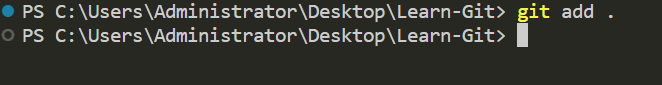

# Learn-Git
یہاں آپ کو میرے یوٹیوب ٹیوٹوریل سیریز "Learning Git and Github" کے لیے ایک نمونہ ریپوزٹری ملے گی۔
اگر آپ کو یہ ریپوزٹری مددگار ثابت ہوئی ہو تو براہ کرم اسے ستارہ ⭐ دیں تاکہ دوسروں کو اسے تلاش کرنا آسان ہو۔

اس کے علاوہ، میری بہت مدد ہوگی اگر آپ میرے [YouTube چینل](https://www.youtube.com/@richardcallaby) کو سبسکرائب کریں کیونکہ میں وہاں مفت ٹیوٹوریلز اور دیگر مفت تعلیمی وسائل پوسٹ کرتا ہوں۔

## GitHub پر تعاون کرنے کا مرحلہ وار ٹیوٹوریل
GitHub اکاؤنٹ بنائیں: اگر آپ کے پاس پہلے سے GitHub اکاؤنٹ نہیں ہے، تو آپ کو ایک بنانا ہوگا۔ github.com پر جائیں اور اوپری دائیں کونے میں "Sign up" بٹن پر کلک کریں۔ اپنا اکاؤنٹ بنانے کے لیے ہدایات پر عمل کریں۔

ایک ریپوزٹری تلاش کریں جس میں تعاون کیا جا سکے: ایک بار جب آپ کے پاس GitHub اکاؤنٹ ہو، تو آپ ریپوزٹریز تلاش کر سکتے ہیں جن میں آپ تعاون کرنا چاہتے ہیں۔ آپ GitHub سرچ بار کا استعمال کر کے نام یا کلیدی الفاظ کے ذریعے ریپوزٹریز تلاش کر سکتے ہیں۔

ریپوزٹری فورک کریں: ایک بار جب آپ کو کوئی ایسی ریپوزٹری مل جائے جس میں آپ تعاون کرنا چاہتے ہیں، تو آپ کو اسے فورک کرنا ہوگا۔

فورک کرنا آپ کے اپنے GitHub اکاؤنٹ میں ریپوزٹری کی ایک کاپی بناتا ہے، جسے آپ بغیر اصل ریپوزٹری کو متاثر کیے ترمیم کر سکتے ہیں۔

### حوالہ تصویر
نیچے دیے گئے بٹن پر کلک کریں تاکہ اوپری دائیں کونے میں موجود ریپوزٹری کو فورک کیا جا سکے۔

فورک کردہ ریپوزٹری کلون کریں: ریپوزٹری کو فورک کرنے کے بعد، آپ کو اسے اپنی مقامی مشین پر کلون کرنا ہوگا۔ کلون کرنا ریپوزٹری کی ایک کاپی آپ کے کمپیوٹر پر بناتا ہے جس پر آپ کام کر سکتے ہیں۔ ریپوزٹری کو کلون کرنے کے لیے، ایک ٹرمینل ونڈو کھولیں اور درج ذیل کمانڈ درج کریں:

یاد رکھیں کہ "your-username" اور "repository-name" کو اپنے GitHub صارف نام اور فورک کردہ ریپوزٹری کے نام سے تبدیل کریں۔

### حوالہ تصویر

یقینی بنائیں کہ آپ ان تبدیلیوں کی عکاسی کے لیے ایک منفرد شاخ بنائیں جو آپ ماخذ کوڈ میں کرنا چاہتے ہیں۔ شاخ بنانے کے لیے درج ذیل کمانڈ استعمال کریں:

### حوالہ تصویر

اس شاخ پر سوئچ کرنے کے لیے درج ذیل کمانڈ استعمال کریں:

### حوالہ تصویر

کوڈ میں تبدیلیاں کریں: ایک بار جب آپ نے ریپوزٹری کو اپنی مقامی مشین پر کلون کر لیا، تو آپ کوڈ میں تبدیلیاں کر سکتے ہیں۔ اپنی پسندیدہ ٹیکسٹ ایڈیٹر یا IDE کا استعمال کریں فائلوں میں ترمیم کرنے کے لیے۔

تبدیلیوں کو کمیٹ کریں: کوڈ میں تبدیلیاں کرنے کے بعد، آپ کو انہیں اپنی مقامی ریپوزٹری میں کمیٹ کرنا ہوگا۔ ایسا کرنے کے لیے، ایک ٹرمینل ونڈو کھولیں اور کلون کردہ ریپوزٹری کے روٹ میں جائیں۔ تبدیلیوں کو اسٹیج کرنے کے لیے درج ذیل کمانڈ استعمال کریں:

### حوالہ تصویر

یہ ریپوزٹری کی تمام فائلوں میں کی گئی تبدیلیوں کو اسٹیج کر دے گا۔

اس کے بعد، درج ذیل کمانڈ کا استعمال کرتے ہوئے تبدیلیوں کو کمیٹ کریں:

### حوالہ تصویر

یقینی بنائیں کہ کی گئی تبدیلیوں کی مختصر اور معلوماتی وضاحت شامل کریں۔

تبدیلیوں کو GitHub پر دھکیلیں: مقامی ریپوزٹری میں تبدیلیوں کو کمیٹ کرنے کے بعد، آپ کو انہیں GitHub پر دھکیلنے کی ضرورت ہوگی۔ اس سے آپ کے GitHub اکاؤنٹ میں موجود ریپوزٹری کی کاپی ان تبدیلیوں کے ساتھ اپ ڈیٹ ہو جائے گی جو آپ نے کیں۔ تبدیلیوں کو دھکیلنے کے لیے درج ذیل کمانڈ استعمال کریں:

### حوالہ تصویر

پُل درخواست بنائیں: GitHub پر تبدیلیاں دھکیلنے کے بعد، جب آپ فورک کردہ ریپوزٹری کو دوبارہ لوڈ کریں گے، تو آپ کو پُل درخواست بنانے کا آپشن نظر آئے گا۔ پُل درخواست بنانے کے لیے اس بٹن پر کلک کریں۔

### حوالہ تصویر

یہ آپ کو ایک ایسے صفحے پر لے جائے گا جہاں آپ اپنی کی گئی تبدیلیوں کا جائزہ لے سکتے ہیں اور اپنی پُل درخواست کی وضاحت فراہم کر سکتے ہیں۔

یقینی بنائیں کہ کی گئی تبدیلیوں کی وضاحت اور تبدیلی کی وجوہات صاف اور مختصر ہوں۔

اگر کوئی مسائل یا خدشات ہوں جن کے بارے میں ریپوزٹری کے مالک کو علم ہونا چاہیے، تو ان کا ذکر پُل درخواست کی وضاحت میں ضرور کریں۔

ایک بار جب آپ وضاحت سے مطمئن ہو جائیں، تو "پُل درخواست بنائیں" بٹن پر کلک کریں۔

### حوالہ تصویر

جواب کا انتظار کریں: پُل درخواست بنانے کے بعد، ریپوزٹری کا مالک آپ کی تبدیلیوں کا جائزہ لے گا اور فیڈبیک فراہم کرے گا۔

وہ آپ سے اضافی تبدیلیاں کرنے کا کہہ سکتے ہیں، یا وہ آپ کی تبدیلیوں کو اصل ریپوزٹری میں ضم کر سکتے ہیں۔

اس عمل کے دوران صبر کریں اور جواب دہ رہیں، اور اس بات کو یقینی بنائیں کہ جو بھی فیڈبیک یا خدشات ریپوزٹری کا مالک ظاہر کرے ان کا ازالہ کریں۔

فورک کردہ ریپوزٹری کو اپ ڈیٹ کریں: اگر ریپوزٹری کے مالک نے آپ کی تبدیلیوں کو اصل ریپوزٹری میں ضم کر دیا ہے، تو آپ کو اپنے فورک کردہ ریپوزٹری کو ان تبدیلیوں کے مطابق اپ ڈیٹ کرنا ہوگا۔

ایسا کرنے کے لیے، اپنے GitHub پر اپنی فورک کردہ ریپوزٹری پر جائیں اور "Fetch upstream" بٹن پر کلک کریں۔

اس کے بعد، اپنی مقامی ریپوزٹری میں درج ذیل کمانڈ چلائیں تاکہ اسے اپ ڈیٹ کیا جا سکے:

یہ آپ کو Git استعمال کرنے کا ایک مختصر آئیڈیا دے گا، آپ اس ریپوزٹری میں تخلیق کردہ اسباق کو مزید تفصیل میں دیکھ سکتے ہیں۔

## پہلا مسئلہ حل کریں

آپ اس پروجیکٹ کو اوپن سورس پروجیکٹس میں تعاون شروع کرنے کے طریقے کے طور پر استعمال کر سکتے ہیں۔ یہ ایک **اچھا پہلا مسئلہ** ہو سکتا ہے، بس [CONTRIBUTORS.md](https://github.com/rcallaby/Learn-Git/blob/main/CONTRIBUTORS.md) فائل کو اس طرح سے ترمیم کریں کہ یہ آپ کی اپنی GitHub ریپوزٹری سے منسلک ہو۔ فائل میں دکھائے گئے مارک ڈاؤن کا استعمال کریں۔

براہ کرم [First-Contributions](https://github.com/rcallaby/Learn-Git/tree/main/First-Contributions) ڈائریکٹری کو دیکھیں تاکہ اس ریپوزٹری میں تعاون کرنے کے لیے مرحلہ وار ہدایات مل سکیں۔

### مشمولات کی جدول

- [Part 00 - تاریخ اور بنیادیں](https://github.com/rcallaby/Learn-Git/blob/main/Lessons/en/Part-00-History-and-Foundations/history-of-git.md)
- [Part 01 - بنیادی نیویگیشن](https://github.com/rcallaby/Learn-Git/blob/main/Lessons/en/Part-01-Basic-Navigation/basic-navigation.md)
- [Part 02 - Git کی ابتدائی معلومات](https://github.com/rcallaby/Learn-Git/blob/main/Lessons/en/Part-02-Initializing-Git/getting-started.md)
- [Part 03 - برانچنگ اور مرجنگ](https://github.com/rcallaby/Learn-Git/blob/main/Lessons/en/Part-03-Branching-and-Merging/branching-and-merging.md)
- [Part 04 - ریموٹ ریپوزٹری کے ساتھ تعاون](https://github.com/rcallaby/Learn-Git/tree/main/Lessons/en/Part-04-Collaborating-with-Remote-Repositories/collaborating-with-remote-repos.md)
- [Part 05 - گٹ کے ایڈوانسڈ تصورات](https://github.com/rcallaby/Learn-Git/blob/main/Lessons/en/Part-05-Advanced-Git-Concepts/advanced-git.md)
- [Part 06 - گٹ اور گٹ ہب کے ساتھ CI-CD](https://github.com/rcallaby/Learn-Git/blob/main/Lessons/en/Part-06-CI-CD-with-Git-and-Github/ci-cd-git-github.md)
- [Part 07 - گٹ کی بہترین مشقیں اور تجاویز](https://github.com/rcallaby/Learn-Git/blob/main/Lessons/en/Part-07-Git-Best-Practices-and-Tips/best-practices-tips.md)
- [Part 08 - ایجائل ڈیولپمنٹ میں گٹ اور گٹ ہب کا استعمال](https://github.com/rcallaby/Learn-Git/blob/main/Lessons/en/Part-08-Git-and-Github-in-Agile-Development/git-github-agile-dev.md)
- [Part 09 - گٹ ہب اور کوڈ اسپیسز](https://github.com/rcallaby/Learn-Git/blob/main/Lessons/en/Part-09-Github-and-Codespaces/github-codespaces.md)
- [Part 10 - گٹ ہب ایکشنز](https://github.com/rcallaby/Learn-Git/blob/main/Lessons/en/Part-10-Github-Actions/github-actions.md)
- [Part 11 - گٹ ہب ایکشنز کا ایڈوانسڈ استعمال](https://github.com/rcallaby/Learn-Git/blob/main/Lessons/en/Part-11-Advanced-Github-Actions/advanced-github-actions.md)
- [Part 12 - گٹ ہب میں جیوپیٹر کوڈ اسپیسز کا استعمال](https://github.com/rcallaby/Learn-Git/blob/main/Lessons/en/Part-12-Using-Jupyter-Codespaces-in-Github/github-jupyter-codespace.md)
- [Part 13 - گٹ ہب میں C# کوڈ اسپیسز کا استعمال](https://github.com/rcallaby/Learn-Git/blob/main/Lessons/en/Part-13-Using%20Csharp-Codespaces-in-Github/github-Csharp-codespace.md)
- [Part 14 - گٹ ہب میں ریاکٹ کوڈ اسپیسز کا استعمال](https://github.com/rcallaby/Learn-Git/blob/main/Lessons/en/Part-14-Using-React-Codespaces-in-Github/github-react-codespace.md)
- [Part 15 - گٹ ہب میں ایکسپریس کوڈ اسپیسز کا استعمال](https://github.com/rcallaby/Learn-Git/blob/main/Lessons/en/Part-15-Using-Express-Codespaces-in-Github/github-express-codespace.md)
- [Part 16 - گٹ ہب میں روبی آن ریلز کوڈ اسپیسز کا استعمال](https://github.com/rcallaby/Learn-Git/blob/main/Lessons/en/Part-16-Using-Ruby-on-Rails-Codespaces/github-rubyrails-codespace.md)
- [Part 17 - گٹ ہب میں جانگو کوڈ اسپیسز کا استعمال](https://github.com/rcallaby/Learn-Git/blob/main/Lessons/en/Part-17-Using%20Django%20Codespaces-in-Github/github-django-codespace.md)
- [Part 18 - گٹ ہب پروجیکٹ مینجمنٹ ٹولز](https://github.com/rcallaby/Learn-Git/blob/main/Lessons/en/Part-18-Github-Project-Management-Tools/github-project-management-tools.md)
- [Part 19 - گٹ ہب پروجیکٹ بورڈز اور نوٹس](https://github.com/rcallaby/Learn-Git/blob/main/Lessons/en/Part-19-Github-Project-Boards-and-Notes/github-project-boards-and-notes.md)

#### اس ٹیوٹوریل کے تراجم
آپ نیچے دی گئی زبانوں میں اس ٹیوٹوریل کے تراجم تلاش کر سکتے ہیں۔ براہ کرم یہ ذہن میں رکھیں کہ ان میں سے کچھ تراجم ابھی زیر تکمیل ہیں اور مکمل نہیں ہوئے ہیں۔

- چینی (آسان)
- فرانسیسی
- جرمن
- روسی
- ہسپانوی
- ہندی
- اطالوی
- منگولین
- جاپانی

