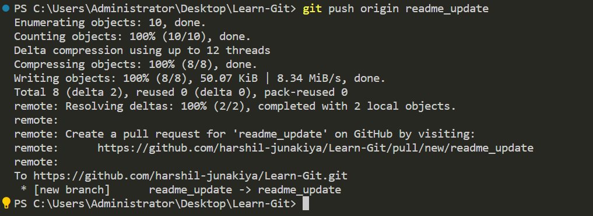

# 学习-Git
在这里，您可以找到我关于学习 Git 和 Github 的 YouTube 教程系列的示例存储库。 如果您发现此存储库有帮助，请考虑给它一颗星，⭐因为其他人更容易找到它。

## 以下是有关如何为 GitHub 做出贡献的分步教程
创建 GitHub 帐户：如果还没有 GitHub 帐户，则需要创建一个。转到 github.com 然后单击右上角的“注册”按钮。按照说明创建您的帐户。

查找要参与的存储库：拥有 GitHub 帐户后，可以搜索有兴趣参与的存储库。您可以使用 GitHub 搜索栏按名称或关键字搜索仓库。

复刻存储库：找到要贡献的存储库后，需要对其进行复刻。

分叉会在您自己的 GitHub 帐户中创建存储库的副本，您可以在不影响原始存储库的情况下对其进行修改。

### 参考图片
单击下面的按钮以分叉位于右上角的存储库。


克隆分叉的存储库：分叉存储库后，需要将其克隆到本地计算机。克隆会在计算机上创建存储库的副本，您可以处理该副本。要克隆存储库，请打开终端窗口并输入以下命令：

```
git clone https://github.com/your-username/repository-name.git
```
请务必将“your-username”和“repository-name”替换为您的 GitHub 用户名和您分叉的仓库的名称。

### 参考图片


请确保创建一个唯一命名的分支，以反映要对源代码进行的更改。若要创建分支，请使用以下语法：
```
git branch "branch-name"
```
### 参考图片


若要打开该分支，请使用以下语法：
```
git checkout "branch-name"
```
### 参考图片


对代码进行更改：将存储库克隆到本地计算机后，可以对代码进行更改。使用首选的文本编辑器或 IDE 修改文件。

提交更改：对代码进行更改后，需要将其提交到本地存储库。为此，请打开终端窗口并导航到克隆存储库的根目录。使用以下命令暂存更改：

```
git add .
```

### 参考图片


这将暂存对存储库中的文件所做的所有更改。

接下来，使用以下命令提交更改：

```
git commit -m "A brief description of the changes made"
```

### 参考图片


请务必包含一条简短、信息丰富的消息，描述您所做的更改。

将更改推送到 GitHub：将更改提交到本地存储库后，需要将其推送到 GitHub。这将使用您所做的更改更新 GitHub 帐户中存储库的副本。若要推送更改，请使用以下命令：

```
git push origin branch-name
```

### 参考图片




创建拉取请求：将更改推送到 GitHub 后，当您重新加载分叉的存储库时，您将看到创建拉取请求的选项。单击该按钮以创建拉取请求。

### 参考图片


这将带你进入一个页面，您可以在其中查看所做的更改并提供拉取请求的描述。

请务必清晰简洁地描述您所做的更改以及您进行更改的原因。

如果存储库所有者应该注意任何问题或疑虑，请务必在拉取请求描述中提及它们。

对描述感到满意后，单击“创建拉取请求”按钮。

### 参考图片


等待反馈：创建拉取请求后，存储库所有者将查看您的更改并提供反馈。

他们可能会要求您进行其他更改，或者可能会将您的更改合并到原始存储库中。

在此过程中要有耐心和响应，并确保解决存储库所有者提出的任何反馈或疑虑。

更新分叉仓库：如果仓库所有者将您的更改合并到原始仓库中，您需要更新分叉仓库以反映这些更改。

为此，请导航到 GitHub 上的分叉存储库，然后单击“获取上游”按钮。

然后，在本地存储库中运行以下命令以更新它：

```
git pull
```

这应该让你对如何使用 Git 有一个简要的了解，当然，你可以看看我在这个存储库中创建的课程，以获得更深入的解释。

## Good first issue

您可以使用此项目作为开始为开源项目做出贡献的一种方式。这可能是一个很好的第一个问题，只需修改 CONTRIBUTORS.md 文件，使其链接到您自己的 GitHub 存储库。使用 markdown，如文件中所示。

请查看 First-Contributions 目录，了解如何向此存储库做出贡献的分步说明。

### 目录

- [第 00 部分 - 历史与基础](https://github.com/rcallaby/Learn-Git/blob/main/Lessons/en/Part-00-History-and-Foundations/history-of-git.md)
- [第 01 部分 - 基本导航](https://github.com/rcallaby/Learn-Git/blob/main/Lessons/en/Part-01-Basic-Navigation/basic-navigation.md)
- [第 02 部分 - 初始化 Git](https://github.com/rcallaby/Learn-Git/blob/main/Lessons/en/Part-02-Initializing-Git/getting-started.md)
- [第 03 部分 - 分支与合并](https://github.com/rcallaby/Learn-Git/blob/main/Lessons/en/Part-03-Branching-and-Merging/branching-and-merging.md)
- [第 04 部分 - 与远程仓库协作](https://github.com/rcallaby/Learn-Git/tree/main/Lessons/en/Part-04-Collaborating-with-Remote-Repositories/collaborating-with-remote-repos.md)
- [第 05 部分 - Git 高级概念](https://github.com/rcallaby/Learn-Git/blob/main/Lessons/en/Part-05-Advanced-Git-Concepts/advanced-git.md)
- [第 06 部分 - 使用 Git 和 Github 进行 CI/CD](https://github.com/rcallaby/Learn-Git/blob/main/Lessons/en/Part-06-CI-CD-with-Git-and-Github/ci-cd-git-github.md)
- [第 07 部分 - Git 最佳实践与技巧](https://github.com/rcallaby/Learn-Git/blob/main/Lessons/en/Part-07-Git-Best-Practices-and-Tips/best-practices-tips.md)
- [第 08 部分 - Git 和 Github 在敏捷开发中的应用](https://github.com/rcallaby/Learn-Git/blob/main/Lessons/en/Part-08-Git-and-Github-in-Agile-Development/git-github-agile-dev.md)
- [第 09 部分 - Github 和 Codespaces](https://github.com/rcallaby/Learn-Git/blob/main/Lessons/en/Part-09-Github-and-Codespaces/github-codespaces.md)
- [第 10 部分 - Github Actions](https://github.com/rcallaby/Learn-Git/blob/main/Lessons/en/Part-10-Github-Actions/github-actions.md)
- [第 11 部分 - 高级 Github Actions](https://github.com/rcallaby/Learn-Git/blob/main/Lessons/en/Part-11-Advanced-Github-Actions/advanced-github-actions.md)
- [第 12 部分 - 在 Github 中使用 Jupyter Codespaces](https://github.com/rcallaby/Learn-Git/blob/main/Lessons/en/Part-12-Using-Jupyter-Codespaces-in-Github/github-jupyter-codespace.md)
- [第 13 部分 - 在 Github 中使用 C# Codespaces](https://github.com/rcallaby/Learn-Git/blob/main/Lessons/en/Part-13-Using%20Csharp-Codespaces-in-Github/github-Csharp-codespace.md)
- [第 14 部分 - 在 Github 中使用 React Codespaces](https://github.com/rcallaby/Learn-Git/blob/main/Lessons/en/Part-14-Using-React-Codespaces-in-Github/github-react-codespace.md)
- [第 15 部分 - 在 Github 中使用 Express Codespaces](https://github.com/rcallaby/Learn-Git/blob/main/Lessons/en/Part-15-Using-Express-Codespaces-in-Github/github-express-codespace.md)
- [第 16 部分 - 在 Github 中使用 Ruby on Rails Codespaces](https://github.com/rcallaby/Learn-Git/blob/main/Lessons/en/Part-16-Using-Ruby-on-Rails-Codespaces/github-rubyrails-codespace.md)
- [第 17 部分 - 在 Github 中使用 Django Codespaces](https://github.com/rcallaby/Learn-Git/blob/main/Lessons/en/Part-17-Using%20Django%20Codespaces-in-Github/github-django-codespace.md)
- [第 18 部分 - Github 项目管理工具](https://github.com/rcallaby/Learn-Git/blob/main/Lessons/en/Part-18-Github-Project-Management-Tools/github-project-management-tools.md)
- [第 19 部分 - Github 项目板与笔记](https://github.com/rcallaby/Learn-Git/blob/main/Lessons/en/Part-19-Github-Project-Boards-and-Notes/github-project-boards-and-notes.md)
